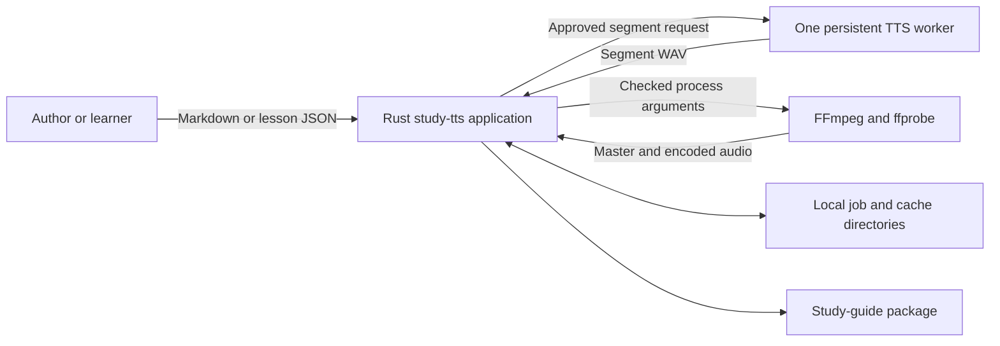
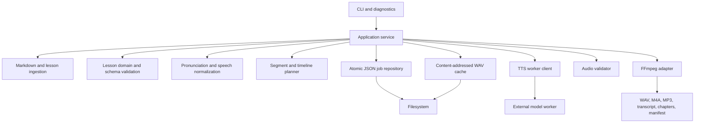
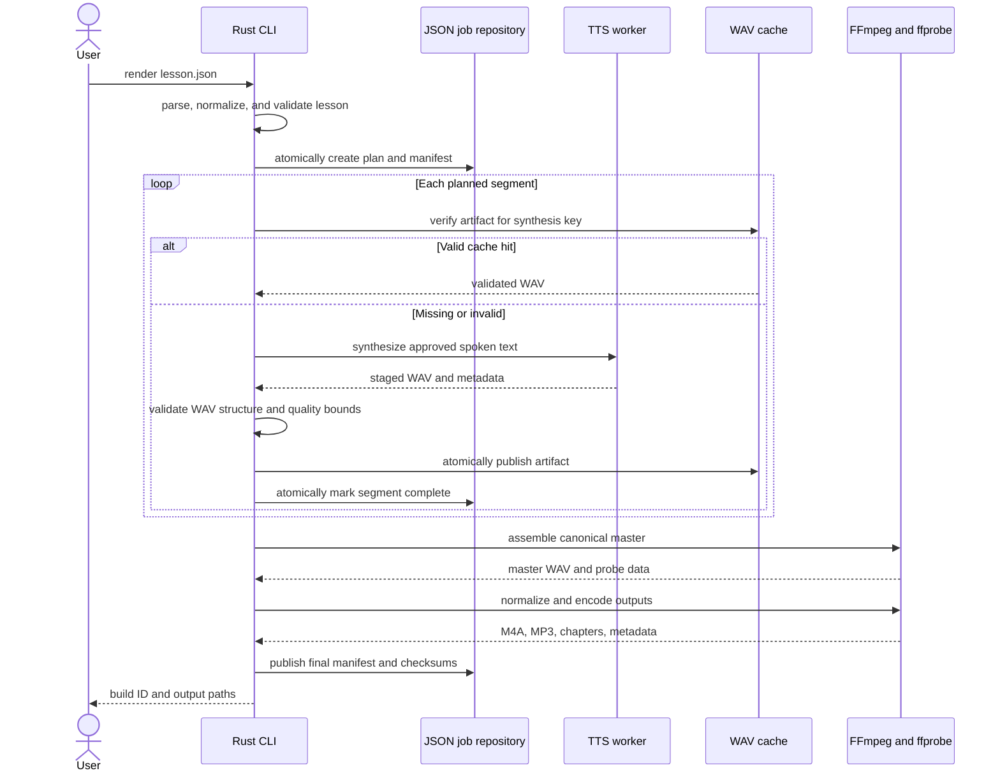
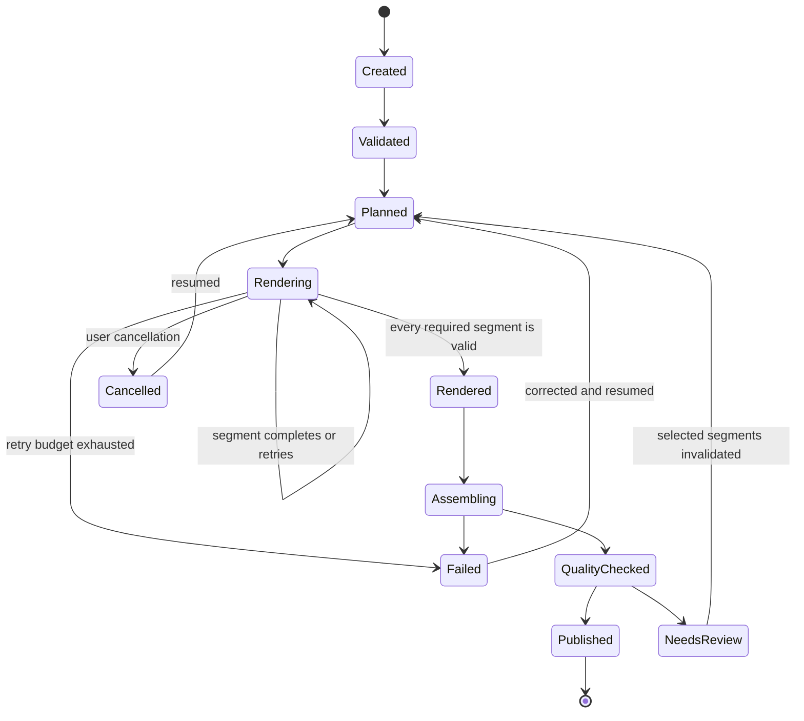
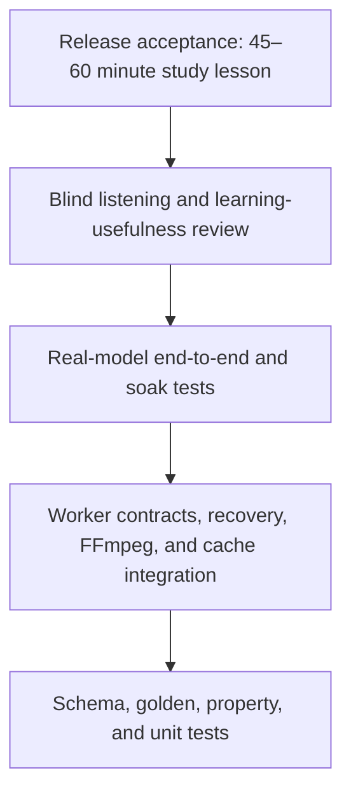

# ADR-0001: Minimal Production Architecture for a Rust Technical Study-Guide TTS Pipeline

- **Status:** Proposed
- **Date:** 2026-08-15
- **Decision owner:** Project maintainer
- **Development environment:** Ubuntu 24.04 under WSL2
- **Initial deployment:** Single-user, local-first WSL2 CLI
- **Review trigger:** Completion of the TTS bake-off, failure of the 60-minute soak test, or expansion beyond a single local user

## 1. Decision

Build the first production-capable version with four runtime elements:

1. **one Rust application** for ingestion, lesson validation, technical speech normalization, orchestration, caching, recovery, audio validation, and the CLI;
2. **one replaceable TTS worker** selected through a short model bake-off, with a persistent process and a versioned newline-delimited JSON protocol;
3. **the filesystem plus atomic JSON manifests** for job state, content-addressed segment caching, recovery, and provenance;
4. **FFmpeg and ffprobe** for canonical audio conversion, assembly, loudness normalization, inspection, and final encoding.

Do not implement SQLite, multiple installed TTS backends, Dia, LLM lesson generation, automatic speech recognition, a desktop interface, remote workers, or a distributed scheduler in the initial release. Preserve narrow extension points for them, but add each only after a measured need appears.

This is intentionally small. Production quality will come from explicit schemas, atomic writes, deterministic planning, cache correctness, process isolation, bounded retries, rigorous validation, complete manifests, and long-form listening tests rather than from a large toolchain.

## 2. Executive rationale

The product must generate long-form audio study guides that teach technical material accurately and remain comfortable during repeated listening. It does not need four speech models, a database, an LLM, and an ASR model to do that. Those tools expand failure modes before the core workflow has proved useful.

The controlling architecture therefore separates three responsibilities:

- the **lesson layer** decides what should be taught and how it should be spoken;
- the **TTS worker** turns one approved segment into speech;
- the **audio layer** controls pauses, sequencing, normalization, encoding, and output validation.

The Rust application owns every durable decision. The model worker remains replaceable because current high-quality open-source TTS implementations are Python-first, model APIs change quickly, and inference should not contaminate the domain model.

## 3. Context

### 3.1 Product objective

The program converts technical source material into audio study guides for:

- software-engineering concepts;
- programming languages and frameworks;
- algorithms and data structures;
- system design;
- cloud, security, networking, and platform engineering;
- technical interview preparation;
- repeated listening, retrieval practice, and memorization.

The intended result resembles a careful technical tutor. It does not read raw Markdown or source code mechanically, manufacture podcast banter, or optimize expressiveness at the expense of technical precision.

### 3.2 Default teaching format

Two stable speakers are supported at the lesson level even though the TTS worker is a single backend:

- **Nadia:** instructor, definition, explanation, example, correction, pseudocode, and synthesis.
- **Tom:** learner, interruption, challenge, plausible error, clarification, recap, and recall cue.

Each turn is rendered separately with a stable voice profile. The backend may support multiple voices, but the application still uses one backend implementation and one persistent worker process.

The default study sequence is:

```text
Problem
  -> prerequisite or definition
  -> conceptual explanation
  -> why it works
  -> concrete example
  -> challenge or plausible mistake
  -> correction
  -> spoken pseudocode
  -> concise recap
  -> compressed rule
  -> recall prompt, silence, and answer
```

Not every lesson needs every stage. The program will not add dialogue merely to satisfy a template.

### 3.3 Priority order

1. technical correctness;
2. comfortable long-form listening;
3. retention and retrieval practice;
4. stable voices;
5. reliable regeneration and recovery;
6. local privacy;
7. generation speed;
8. implementation simplicity.

### 3.4 Assumptions

- The first deployment has one user and one active render job.
- Ubuntu 24.04 under WSL2 is the first development and runtime environment.
- The repository lives in the WSL2 Linux filesystem rather than under `/mnt/c` because Rust builds and dependency-heavy worker environments perform better there.
- Native Linux compatibility is retained; native Windows packaging is deferred.
- English is the initial content language unless the model bake-off establishes another requirement.
- Source material and lesson text are available locally.
- A GPU may be available, but CPU fallback is part of model selection rather than a requirement to install two models.
- Model weights and worker dependencies may be installed before offline use.
- The user reviews lesson text before producing a final long-form build.

### 3.5 Development environment baseline

The project is developed under Ubuntu 24.04 in WSL2. Rust, Python, FFmpeg, model-worker dependencies, caches, fixtures, and build outputs are installed inside WSL2 rather than shared with Windows installations.

Required system packages:

- GCC and the standard Linux build toolchain;
- CMake;
- Python 3 and `venv` support;
- FFmpeg and ffprobe;
- Git, curl, `pkg-config`, Clang, and OpenSSL development headers.

The baseline environment check is:

```bash
gcc --version
cmake --version
python3 --version
ffmpeg -version
ffprobe -version
```

All five commands must succeed before the Rust workspace or model worker is diagnosed. The exact versions are recorded by `study-tts doctor` and included in diagnostic bundles; release manifests record versions that can affect generated artifacts.

GPU acceleration is not part of bootstrap. The first complete pipeline uses the fake worker, then evaluates Kokoro and Chatterbox Nano on CPU. AMD GPU or ROCm work requires a separate measured decision because WSL2 device access and model-runtime compatibility add an independent support surface.

## 4. Scope

### 4.1 Required capabilities

The first production release shall:

- accept UTF-8 Markdown and canonical lesson JSON;
- preserve source-code blocks, inline code, headings, lists, links, symbols, and identifiers during parsing;
- compile Markdown into a reviewable lesson draft without inventing new facts;
- validate a versioned lesson schema before rendering;
- separate readable transcript text from exact TTS input text;
- apply deterministic pronunciation and technical-normalization rules;
- support Nadia and Tom through stable voice profiles;
- render at the segment or short-paragraph level;
- cache every valid segment by its complete synthesis identity;
- resume after interruption without regenerating valid segments;
- regenerate one selected segment without invalidating unrelated audio;
- assemble pauses and speech into a canonical master WAV;
- export M4A/AAC and MP3 from that master;
- write chapters, transcript, captions where practical, quality results, and a complete provenance manifest;
- operate offline after installation;
- provide actionable diagnostics for missing models, incompatible devices, missing FFmpeg, invalid lessons, corrupt cache entries, and worker failures.

### 4.2 Quality attributes

- **Correctness:** spoken technical claims match the approved lesson.
- **Recoverability:** interruption loses at most the in-progress segment.
- **Auditability:** every output is traceable to source, lesson, rules, voice, model, worker, parameters, and tool versions.
- **Replaceability:** a different TTS worker can implement the same protocol without changing lesson or audio code.
- **Security:** untrusted input cannot escape managed directories or inject process arguments.
- **Privacy:** rendering uses no network after installation unless a later ADR explicitly changes the default.
- **Maintainability:** domain modules do not import Python, PyTorch, CUDA, FFmpeg bindings, or a specific model SDK.
- **Operability:** a failed build explains what failed, what remains valid, and the exact safe recovery command.

### 4.3 Explicitly deferred

| Capability | Initial decision | Evidence required before addition |
|---|---|---|
| Second production TTS backend | Do not build | Current backend fails a defined quality, hardware, or reliability requirement |
| Dia or dialogue-native generation | Do not build | Independent turns demonstrably fail conversational quality and block-level regeneration is acceptable |
| SQLite | Do not build | Multiple concurrent jobs, queryable history, UI state, or JSON recovery becomes materially unreliable |
| LLM lesson generation | Do not build | Authored/deterministic compilation is stable and review controls can prevent unsupported claims |
| Automatic speech recognition | Do not ship | Manual QA becomes the release bottleneck and ASR triage demonstrates useful precision |
| Desktop or web UI | Do not build | CLI workflow and schemas stabilize through real use |
| Remote workers or hosted TTS | Do not build | Local hardware cannot meet measured needs or remote deployment becomes an explicit product requirement |
| Native Rust model reimplementation | Do not build | Worker packaging becomes the dominant problem and a maintained native runtime proves parity |
| Database-backed queue | Do not build | More than one producer or consumer exists |

### 4.4 Non-goals

- public multi-tenant service;
- real-time voice conversation;
- arbitrary voice marketplace;
- automatic web scraping;
- automatic factual research;
- background music or entertainment sound design;
- mobile inference;
- training or fine-tuning TTS models;
- bit-identical model output across GPU models and driver versions;
- support for every technical notation in version 1.0.

## 5. Model-selection decision

The architecture selects one backend through a bake-off before model-specific integration begins. Candidate experiments may use existing upstream scripts, but only the winner becomes an application dependency.

### 5.1 Decided shortlist

| Candidate | Best reason to choose it | Principal risk |
|---|---|---|
| Chatterbox Nano | CPU-oriented, expressive English speech within the Chatterbox family | Voice and pacing must remain stable across hundreds of independent turns |
| Kokoro-82M ONNX | Small, fast, offline CPU inference with a mature ONNX path | Delivery may sound synthetic during extended explanations |

Relevant upstream references:

- [Chatterbox official repository](https://github.com/resemble-ai/chatterbox)
- [Kokoro ONNX model card](https://huggingface.co/onnx-community/Kokoro-82M-v1.0-ONNX)

Qwen3-TTS, Chatterbox Turbo, and Dia are not version 1 candidates. Qwen3-TTS and Chatterbox Turbo create a more demanding GPU/runtime path on the target WSL2 machine, while Dia changes the unit of retry, correction, cache invalidation, and quality review. None is justified before the CPU-oriented candidates have failed a measured requirement.

### 5.2 Selection procedure

Before integrating a worker, render the same reviewed 3–5 minute lesson through Kokoro and Chatterbox Nano using isolated worker environments. Normalize playback loudness and conceal model identities from listeners.

The fixture must include:

- ordinary technical prose;
- Nadia and Tom turns;
- acronyms and initialisms;
- camelCase, PascalCase, snake_case, dotted names, and generic types;
- numbers, versions, ranges, units, and equations;
- conceptual code explanation;
- one literal API-name explanation;
- correction and compressed recap;
- recall prompt and intentional silence;
- calm, emphatic, and deliberately slow delivery.

Hard gates:

- no omitted or added technical phrase;
- no persistent voice-identity failure;
- no severe pronunciation defect in a protected term;
- no backend failure across three complete renders;
- acceptable runtime on the target machine;
- compatible license and local/offline deployment.

Weighted decision criteria:

| Criterion | Weight |
|---|---:|
| Technical pronunciation and intelligibility | 25% |
| Long-listening naturalness and fatigue | 25% |
| Voice consistency | 15% |
| Pacing and instructional prosody | 15% |
| Reliability across repeated segments | 10% |
| Target-machine performance | 5% |
| Installation and maintenance cost | 5% |

The model that clears every hard gate and wins the weighted comparison becomes the only production backend. The losing model remains a benchmark fixture, not an installed runtime dependency. A follow-up ADR records the winner, immutable revision, runtime, voice policy, and target hardware.

## 6. System architecture

### 6.1 System context



Only the Rust application owns job state and final artifacts. The worker may write one staged WAV beneath a path assigned by the parent, while FFmpeg receives explicit input and output paths from the application.

### 6.2 Internal components



Dependency direction points toward the lesson and rendering domain. Infrastructure implements domain ports; the domain never imports infrastructure.

### 6.3 End-to-end processing sequence



### 6.4 Job state machine



## 7. Rust architecture

### 7.1 Workspace structure

Begin with a small workspace rather than one crate per conceptual component:

```text
technical-tts/
  Cargo.toml
  crates/
    study-tts-cli/        executable, commands, diagnostics, configuration
    study-tts-core/       lesson types, normalization, planning, cache keys
    study-tts-runtime/    filesystem state, worker client, FFmpeg adapter
    study-tts-testkit/    fixtures, fake worker, audio test helpers
  worker/
    pyproject.toml
    lockfile
    worker.py
  schemas/
    lesson-v1.schema.json
    worker-v1.schema.json
    manifest-v1.schema.json
  fixtures/
    lessons/
    pronunciation/
    audio/
  docs/
    adr/
    operations/
```

Split crates further only when compile times, dependency boundaries, ownership, or reuse justify it.

### 7.2 Candidate Rust dependencies

| Concern | Candidate | Reason |
|---|---|---|
| Async process and I/O | `tokio` | Persistent worker, cancellation, timeouts, bounded task orchestration |
| Serialization | `serde`, `serde_json` | Canonical lesson, protocol, job, and manifest formats |
| Schema generation | `schemars` | Keep Rust types and checked-in JSON Schema aligned |
| CLI | `clap` | Stable subcommands and non-interactive use |
| Errors | `thiserror`, `miette` | Typed internal errors and source-aware user diagnostics |
| Hashing | `blake3` | Fast content identities and cache keys |
| Logging | `tracing`, `tracing-subscriber` | Structured events with job and segment context |
| Temporary files | `tempfile` | Safe staged writes |
| WAV inspection | `hound` or equivalent | Narrow validation without invoking FFmpeg for every header check |
| Markdown parsing | `pulldown-cmark` or equivalent | Structural parsing rather than regular expressions |

Dependency versions are pinned through `Cargo.lock`. A crate is added only when it removes more risk than it introduces.

### 7.3 CLI

```text
study-tts doctor
study-tts lesson compile source.md --out lesson.json
study-tts lesson validate lesson.json
study-tts render lesson.json --format m4a
study-tts resume <job-id>
study-tts inspect <job-id>
study-tts invalidate <job-id> --segment seg-0042
study-tts export <job-id> --format wav,m4a,mp3
study-tts cache verify
study-tts cache prune --older-than 90d --dry-run
```

Every command supports human-readable output and `--json`. Exit-code classes distinguish invalid input, missing dependency, incompatible environment, worker failure, audio-quality failure, cancellation, and internal error.

### 7.4 Configuration hierarchy

Configuration precedence:

1. command-line option;
2. lesson profile;
3. project configuration;
4. user configuration;
5. compiled safe default.

Configuration files contain no secrets in version 1. Network credentials do not exist because normal rendering is offline.

## 8. Lesson representation

### 8.1 Canonical format

JSON is the canonical intermediate representation because it is explicit, diffable, schema-validatable, and language-neutral. Markdown is authoring input, not the render contract.

```json
{
  "schema_version": "1.0",
  "lesson_id": "excel-bijective-base-26",
  "title": "Excel Column Labels as Bijective Base Twenty-Six",
  "language": "en-US",
  "learning_objectives": [
    "Explain why the numeral system has no zero digit",
    "Reproduce the conversion recurrence"
  ],
  "source": {
    "content_hash": "...",
    "references": []
  },
  "speakers": {
    "nadia": { "voice_profile": "nadia-v1" },
    "tom": { "voice_profile": "tom-v1" }
  },
  "segments": [
    {
      "id": "seg-0001",
      "speaker": "nadia",
      "role": "explanation",
      "source_refs": ["block-001"],
      "display_text": "Excel column labels use bijective base 26.",
      "spoken_text": "Excel column labels use bijective base twenty-six.",
      "style": "calm_explanatory",
      "pause_after_ms": 550,
      "review_status": "approved"
    }
  ]
}
```

### 8.2 Invariants

- schema major version is supported;
- lesson and segment IDs are unique and stable;
- every segment references source material or is explicitly marked editorial;
- `display_text` and `spoken_text` are both present;
- `spoken_text` remains within the selected backend limit;
- speaker, role, style, and voice profile are declared;
- pause values remain within policy unless an override is annotated;
- recall prompts include a deliberate response interval;
- no segment marked unreviewed can enter a production build;
- canonical serialization produces a stable byte representation for hashing;
- unknown fields follow the declared minor-version compatibility policy.

### 8.3 Display text versus spoken text

`display_text` is the readable, faithful transcript. `spoken_text` is the exact content sent to the TTS worker. Keeping them separate prevents a pronunciation edit from hiding a semantic change.

Each transform can produce an audit record:

```json
{
  "rule": "identifier.conceptual",
  "before": "Number.MAX_SAFE_INTEGER",
  "after": "JavaScript's maximum safely representable integer",
  "source_ref": "block-017",
  "reason": "Conceptual explanation rather than API-name memorization"
}
```

## 9. Source ingestion and lesson compilation

### 9.1 Markdown parsing

Use a structural Markdown parser. Do not strip markup with regular expressions because fenced code, nested lists, inline code, links, and punctuation carry meaning.

The parser emits stable source blocks:

- heading;
- paragraph;
- list item;
- fenced code;
- inline-code span;
- quotation;
- link label and destination;
- table converted to a reviewable linear representation;
- explicit pronunciation directive.

### 9.2 Deterministic compilation only

Version 1 does not use an LLM. Markdown compilation performs only deterministic, reviewable operations:

- retain source order and block references;
- remove markup that should not be spoken;
- convert headings into section metadata rather than reading “heading level two”;
- preserve code separately from conceptual prose;
- split material into reviewable draft segments;
- apply configured learning-stage annotations only when supplied by the author;
- emit warnings for material that cannot be transformed safely.

The application may provide templates and prompts for a human author, but it does not invent explanations, examples, or technical claims.

### 9.3 Technical speech normalization

The normalizer handles:

- Unicode normalization;
- whitespace and punctuation suitable for speech;
- numbers, dates, versions, ranges, units, and symbols;
- acronyms and initialisms;
- camelCase, PascalCase, snake_case, kebab-case, dotted names, and namespaces;
- URLs by policy: omit, describe, or speak a short domain;
- code-specific literal reading versus conceptual explanation;
- exact project lexicon entries;
- protected phrases that must never be split;
- sentence segmentation that preserves abbreviations and technical tokens.

Examples:

| Source | Context | Spoken result |
|---|---|---|
| `charCodeAt(0)` | API memorization | “char code at, with index zero” |
| `charCodeAt(0)` | conceptual explanation | “get the character's numeric code” |
| `O(n log n)` | complexity | “order n log n” |
| `1..=10` | Rust syntax | “the inclusive range from one through ten” |
| `Result<T, E>` | Rust type | “Result of T or E” |
| `HTTP 429` | operations | “H T T P status four twenty-nine” |

The lexicon wins over generic rules. Conflicting exact rules fail validation rather than choosing silently.

## 10. TTS worker

### 10.1 Process boundary

The selected model runs as one persistent child process. For a Python-first model, it has its own locked Python environment and loads one pinned model revision once per worker lifetime.

Use newline-delimited JSON over standard input and standard output because a local HTTP server would add port allocation, firewall behavior, service ownership, authentication, and orphaned listeners without solving a current requirement.

Standard output is protocol-only. Structured diagnostics use standard error.

### 10.2 Protocol methods

- `initialize`: load model, voice profiles, device, and immutable revisions;
- `health`: report readiness and resource state;
- `capabilities`: report language, input limits, voice and style support, sample format, seed behavior, and device;
- `synthesize`: render one approved segment to an assigned staged path;
- `cancel`: request cancellation of the active synthesis;
- `shutdown`: unload and exit cleanly.

Example:

```json
{"v":1,"id":"req-42","method":"synthesize","params":{"text":"...","voice":"nadia-v1","style":"calm_explanatory","seed":42,"output":"C:\\jobs\\...\\staged.wav"}}
{"v":1,"id":"req-42","event":"progress","progress":0.6}
{"v":1,"id":"req-42","result":{"sample_rate":24000,"channels":1,"frames":187200,"model_revision":"..."}}
```

### 10.3 Protocol constraints

- UTF-8, one JSON object per line;
- maximum message length enforced;
- unique request ID per worker lifetime;
- protocol version required in every request;
- output paths canonicalized and confined to the assigned staging root;
- every success includes model, tokenizer/codec, worker, and voice-profile identities;
- heartbeat and synthesis deadlines detect hangs;
- parent owns process lifetime and terminates the full child process tree;
- one synthesis request at a time in version 1;
- worker restart after protocol corruption, timeout, GPU error, or repeated invalid audio;
- no network access during rendering;
- no untrusted pickle-style model loading when a safe format is available.

### 10.4 Backend abstraction

The Rust domain depends on capabilities rather than a model name:

```rust
pub trait TtsBackend {
    fn descriptor(&self) -> BackendDescriptor;
    fn validate(&self, request: &SynthesisRequest) -> Result<(), BackendError>;
    async fn synthesize(
        &mut self,
        request: SynthesisRequest,
        destination: &Path,
    ) -> Result<SynthesisReport, BackendError>;
}
```

Version 1 has one implementation. The trait exists to keep model-specific fields outside the lesson and planning layers, not to justify building unused adapters.

## 11. Segmentation and rendering

### 11.1 Semantic chunks

Render one complete thought at a time, normally five to twenty seconds. Apply the selected backend's measured hard and recommended limits after semantic segmentation.

Rules:

- never split inside protected phrases, numbers with units, inline code, or an identifier;
- prefer paragraph, sentence, then clause boundaries;
- do not send an entire lesson or chapter as one request;
- render Nadia and Tom turns independently;
- derive stable child IDs when a segment must be subdivided;
- reject a segment that cannot be split safely;
- retain source and parent-segment references for every child;
- avoid crossfades across ordinary speech turns because they can smear consonants;
- add silence explicitly through the timeline.

### 11.2 Voice stability

- Nadia and Tom use fixed voice-profile files;
- reference audio, if used, is immutable and checksum-pinned;
- model revision, seed, style, and decoding parameters are recorded;
- random voice selection is forbidden;
- periodic long-form review compares early, middle, and late segments;
- changing a voice profile invalidates every segment rendered with it.

### 11.3 Retry policy

Default per segment:

1. first synthesis attempt;
2. one retry in the same worker for a transient failure;
3. restart the worker and make one final retry;
4. fail the job while preserving every valid segment.

Invalid input, unsupported capabilities, checksum failure, unsafe path, and schema failure never retry. A fallback model does not exist in version 1, so the system cannot conceal a backend failure through an unreviewed voice change.

## 12. Filesystem state, cache, and recovery

### 12.1 Directory layout

```text
data/
  config.json
  voices/
    nadia-v1/
      profile.json
      reference.wav
    tom-v1/
      profile.json
      reference.wav
  models/
    <backend>/<immutable-revision>/
  cache/
    segments/<key-prefix>/<cache-key>/
      audio.wav
      artifact.json
  jobs/
    <job-id>/
      job.json
      lesson.json
      plan.json
      events.ndjson
      staging/
      output/
        lesson.wav
        lesson.m4a
        lesson.mp3
        transcript.txt
        transcript.vtt
        chapters.ffmetadata
        manifest.json
        quality-report.json
```

### 12.2 Atomic state writes

For every JSON state change:

1. serialize canonical JSON to a sibling temporary file;
2. flush file contents;
3. atomically replace the destination where the platform supports it;
4. flush the containing directory where supported;
5. append a diagnostic event after the authoritative state is durable.

Only one process may own a job. A per-job lock file contains process identity and creation metadata; stale-lock recovery verifies that the owner is gone before taking ownership.

### 12.3 Job document

`job.json` contains:

- job and build identity;
- state and last successful stage;
- lesson and plan hashes;
- selected worker and model identities;
- segment statuses, attempts, cache keys, and artifact hashes;
- final output identities;
- timestamps and application version;
- failure classification and safe recovery action.

### 12.4 Cache key

The cache key is BLAKE3 over canonical serialization of every speech-affecting input:

```text
cache schema version
render-planning version
worker adapter version
model repository and immutable revision
tokenizer or codec revision
voice-profile or approved reference-audio hash
language
exact spoken text
style and generation parameters
seed and determinism class
target intermediate sample format
```

It excludes display-only fields such as lesson title and source formatting.

### 12.5 Cache acceptance

A cache entry is used only when:

- artifact manifest parses and matches its directory key;
- stored audio checksum matches;
- WAV container and sample data validate;
- sample rate and channel count match the plan;
- duration, silence, peak, and finite-sample checks pass;
- model and worker identities match the request.

Invalid entries move to a quarantine directory. They are not overwritten or deleted automatically.

### 12.6 Recovery

On `resume`:

1. acquire the job lock;
2. parse and validate all authoritative JSON;
3. inspect staged files and published cache artifacts;
4. reconcile an artifact that was atomically published before `job.json` was updated;
5. mark an interrupted attempt abandoned;
6. verify every completed segment rather than trusting state alone;
7. continue from the first missing or invalid artifact;
8. rebuild final outputs if any segment or timeline identity changed.

The absence of SQLite is deliberate. Atomic documents are sufficient because one process owns one local job and job history does not require queries.

## 13. Audio architecture

### 13.1 Canonical intermediate

All worker output becomes:

- WAV container;
- mono PCM;
- one project sample rate selected after the model bake-off;
- 24-bit integer or 32-bit float during assembly;
- no lossy intermediate encoding.

If the worker already emits the canonical format, no conversion occurs. Otherwise, FFmpeg converts once before cache publication.

### 13.2 Timeline plan

Rust produces an explicit edit-decision list containing:

- ordered cache artifact paths;
- expected artifact checksums;
- start and end calculations;
- pauses after segments;
- optional gain corrections;
- chapter boundaries;
- transcript and caption timing;
- complete plan hash.

Default pause ranges:

| Boundary | Default range |
|---|---:|
| Within thought | 100–250 ms |
| Sentence boundary | 250–500 ms |
| Speaker transition | 300–700 ms |
| New concept | 500–900 ms |
| Recall question | 1.5–4 seconds |
| Section boundary | 1–2 seconds |

Production builds use explicit selected values, not runtime randomness.

### 13.3 FFmpeg responsibilities

- convert backend WAV into the canonical intermediate when required;
- generate exact silence segments;
- concatenate canonical segments according to the plan;
- run measured loudness normalization;
- encode M4A/AAC and MP3 from the normalized master WAV;
- embed chapters and metadata where supported;
- provide probe results for structural validation.

FFmpeg is invoked without a shell. Every argument is a separate process argument, paths are canonicalized, and the exact executable version and effective arguments enter the build manifest.

### 13.4 Loudness

Begin evaluation around a podcast-oriented integrated target near `-16 LUFS`, with true peak no higher than `-1.5 dBTP`. The final target is established through listening tests and recorded in a follow-up audio-profile decision.

Use two-pass EBU R128 normalization on the assembled master. Do not normalize every segment aggressively because doing so can flatten intentional emphasis and amplify quiet artifacts.

### 13.5 Output package

- `lesson.wav`: normalized lossless master;
- `lesson.m4a`: default listening file;
- `lesson.mp3`: compatibility output;
- `transcript.txt`: readable speaker-labelled transcript;
- `transcript.vtt`: approximate segment-level captions;
- `chapters.ffmetadata`: chapter source metadata;
- `manifest.json`: provenance, inputs, tools, artifacts, and checksums;
- `quality-report.json`: automated checks and review status.

Never derive one lossy format from another.

### 13.6 FFmpeg licensing

FFmpeg build options determine distribution obligations. The first release should discover an external FFmpeg installation and document the supported version range. Bundling requires a separate license review and an intentionally selected build configuration.

## 14. Observability and diagnostics

Every event includes, where applicable:

- `job_id`;
- `stage`;
- `segment_id`;
- `attempt`;
- `worker_version`;
- `model_revision`;
- `voice_profile`;
- `duration_ms`;
- `error_class`.

Human terminal output remains concise. `events.ndjson` stores structured detail for inspection.

Required measurements:

- source, lesson, plan, and build hashes;
- model load duration;
- synthesis wall time and generated-audio duration;
- real-time factor;
- cache hits and misses;
- retry and restart counts;
- segment duration, peak, silence ratio, and clipping checks;
- assembly and encoding durations;
- output sizes and checksums;
- peak RAM and VRAM where the operating environment exposes them reliably.

`study-tts doctor` verifies:

- WSL2 and supported Ubuntu version;
- supported OS and architecture;
- writable job, cache, model, and output directories;
- free disk space;
- successful execution and parsed versions for `gcc`, `cmake`, and `python3`;
- FFmpeg and ffprobe presence and versions;
- worker runtime and locked dependencies;
- model and voice-profile checksums;
- GPU or CPU device compatibility;
- offline mode;
- short end-to-end smoke render.

Logs do not contain full source text, spoken text, or raw voice-reference paths by default.

## 15. Security, privacy, and voice policy

### 15.1 Threats

- malicious Markdown or JSON;
- path traversal, symlink escape, and unintended access through mounted Windows filesystems;
- command injection through file names or metadata;
- hostile or corrupted worker messages;
- executable or tampered model artifacts;
- denial of service through extreme input or output;
- source or voice leakage through logs;
- unauthorized voice cloning;
- orphaned child processes;
- unexpected worker network access.

### 15.2 Controls

- parse Markdown and JSON with bounded, maintained parsers;
- enforce file-size, segment-count, message-size, duration, retry, and disk limits;
- canonicalize managed paths and verify containment after resolution;
- reject symlink or reparse-point escapes;
- invoke worker and FFmpeg without a shell;
- treat worker responses as untrusted input;
- pin model and dependency revisions and verify checksums;
- prefer safe tensor formats where available;
- disable worker network access during rendering through configuration and test it;
- restrict voice-reference permissions;
- redact content from routine logs;
- terminate the complete worker process tree on shutdown or timeout;
- create an SBOM and run dependency, advisory, and license checks for releases.

### 15.3 Voice consent

A cloned voice profile requires:

- a declaration of ownership or documented subject consent;
- permitted-use scope;
- reference-audio checksum;
- creation date and consent status;
- an audit event for each build that uses it.

Default voices should be licensed built-in or synthetic designed voices. Public-figure cloning is prohibited. If the selected backend adds a watermark, postprocessing must not intentionally remove it.

### 15.4 Data retention

- source, voices, segments, and outputs remain local;
- cache retention is explicit and visible;
- prune operations are dry-run by default;
- published outputs are never pruned by a cache command;
- quarantined data requires explicit deletion;
- voice references never enter exported packages;
- secure deletion is described as best effort because filesystems and SSDs may retain blocks.

## 16. Failure handling

| Failure | Class | Behavior |
|---|---|---|
| Invalid lesson schema | Permanent input | Stop before worker startup and show field/source location |
| Missing model or checksum mismatch | Environment | Stop and provide repair instruction |
| Unsupported voice, style, or text length | Permanent request | Stop affected segment without retry |
| Worker timeout or exit | Transient/systemic | Retry, restart once, then fail while preserving valid cache |
| GPU out of memory | Resource | Restart once; fail with measured requirement rather than silently changing model |
| Empty, truncated, NaN, or clipped WAV | Invalid output | Quarantine and retry within budget |
| Pronunciation defect | Quality | Mark segment for review and invalidate only its cache identity |
| FFmpeg failure | Environment/output | Preserve master inputs and exact process diagnostic |
| Disk full | Resource | Stop new writes and preserve last durable job state |
| User cancellation | Expected | Terminate safely and leave job resumable |
| Corrupt job JSON | Integrity | Refuse automatic overwrite; recover from validated backup or event evidence |

Retries never continue indefinitely. Failure must remain visible.

## 17. Testing plan

The tests distinguish five questions:

1. Is the lesson technically correct?
2. Did deterministic normalization preserve meaning?
3. Did orchestration produce the requested segments and recover correctly?
4. Is the audio structurally valid?
5. Is the finished lesson natural and useful after extended listening?

No single metric answers all five.

### 17.1 Test layers



### 17.2 Unit tests

Test pure domain behavior:

- Markdown block classification;
- Unicode and whitespace normalization;
- acronym, number, unit, range, version, and identifier pronunciation;
- exact lexicon precedence and conflict rejection;
- protected-phrase handling;
- semantic chunk boundaries;
- pause-policy selection;
- stable segment IDs;
- canonical serialization;
- cache-key inclusion and exclusion rules;
- state-transition legality;
- retry classification;
- timeline arithmetic;
- output-name sanitation;
- manifest checksum generation;
- path containment.

### 17.3 Property-based tests

Use `proptest` or an equivalent framework:

- arbitrary valid Unicode never panics and remains valid UTF-8;
- normalization is idempotent;
- lesson serialization round-trips;
- chunk concatenation preserves normalized spoken text modulo declared boundary whitespace;
- chunks never exceed backend limits;
- IDs remain unique;
- changing any speech-affecting field changes the cache key;
- changing display-only metadata does not change the cache key;
- timeline starts are monotonic and non-overlapping;
- durations and pause sums do not overflow;
- managed artifact paths never escape their root;
- every legal state sequence preserves terminal-state invariants.

### 17.4 Schema and compatibility tests

- validate every lesson, worker, job, and manifest fixture against JSON Schema;
- reject unknown major versions;
- enforce the minor-version compatibility rule;
- preserve fixtures for every released schema;
- verify generated schemas match checked-in files;
- round-trip Rust structures through protocol fixtures;
- require a migration and ADR for a breaking change.

### 17.5 Golden normalization corpus

Maintain reviewed fixtures for:

- Rust lifetimes, traits, generics, macros, `Result<T, E>`, and ranges;
- JavaScript methods, promises, event-loop terms, and dotted properties;
- algorithms, recurrences, Big O, matrices, and equations;
- HTTP, TLS, DNS, IP addresses, status codes, URLs, and ports;
- AWS/Azure identifiers and region names;
- SQL, transactions, isolation levels, and query syntax;
- semantic versioning and package names;
- mixed prose and code;
- ambiguous acronyms requiring explicit lexicon entries.

Golden updates use an explicit review command and readable diff. Ordinary tests never rewrite expected output.

### 17.6 Fake worker

Create a deterministic test worker that:

- implements the complete protocol;
- produces short fixture WAVs or deterministic tones;
- can delay, fail, hang, corrupt JSON, truncate audio, emit stderr, and exit on command;
- records requests for assertions;
- requires no model download or GPU.

Most CI runs use the fake worker because orchestration correctness should not depend on stochastic inference.

### 17.7 Worker contract tests

Run the same black-box suite against the fake worker and selected real backend:

- initialization and capability report meet deadlines;
- unsupported requests fail deterministically;
- standard output contains protocol messages only;
- worker cannot write outside staging;
- immutable model and worker revisions are reported;
- valid requests produce valid WAV and matching metadata;
- multiple sequential requests do not corrupt state;
- cancellation and shutdown work;
- timeout causes process-tree termination;
- restart restores service;
- worker operates without network access;
- memory use does not grow without bound across a representative sequence.

### 17.8 Filesystem and recovery tests

- interruption before state-temp write;
- interruption after temp write but before atomic replacement;
- interruption after cache publication but before job update;
- stale lock with live owner and dead owner;
- malformed, truncated, or missing `job.json`;
- valid cache with missing job record;
- job record pointing to missing or corrupt cache;
- checksum mismatch;
- quarantine behavior;
- read-only directories;
- full disk and insufficient preflight space;
- Linux paths with spaces, Unicode, long components, and unusual but valid bytes;
- symlink and mounted-filesystem escape attempts;
- simultaneous attempts to own one job;
- cancellation followed by resume;
- one-segment invalidation followed by selective rebuild.

### 17.9 Cache tests

- identical input produces a hit;
- one spoken-text character change produces a miss;
- voice, style, seed, model, worker, tokenizer, sample format, or rule-version changes produce misses;
- lesson title and non-spoken notes do not invalidate segments;
- a corrupt WAV never produces a hit;
- a valid artifact not referenced by a job remains reusable;
- prune dry-run reports exact candidates without mutation;
- prune never touches job outputs or active artifacts;
- cache verification is repeatable.

### 17.10 FFmpeg integration tests

- detect supported and unsupported FFmpeg versions;
- invoke paths containing spaces and Unicode safely;
- convert worker output to canonical WAV;
- insert exact silence durations within tolerance;
- concatenate without missing or duplicated samples beyond format constraints;
- normalize using measured two-pass parameters;
- encode M4A and MP3 from the master;
- embed ordered chapters;
- probe and verify every output;
- fail safely when FFmpeg is absent, killed, or returns a nonzero code;
- never interpret metadata or paths through a shell.

### 17.11 Automated audio checks

Per segment:

- decodable WAV;
- expected sample rate, channel count, and sample type;
- finite samples only;
- nonzero duration;
- voiced content above a conservative energy threshold;
- leading and trailing silence within policy;
- peak below clipping;
- DC offset below threshold;
- broad duration expectation relative to text length;
- no unexpected multi-channel output.

Final package:

- expected codecs and containers;
- duration equals timeline within tolerance;
- chapter timestamps are ordered and within duration;
- transcript/caption timestamps are monotonic;
- integrated loudness and true peak meet the selected profile;
- no discontinuity or click at joins above the selected detection threshold;
- checksums match the manifest;
- each lossy output traces to the master WAV.

These checks detect broken audio. They do not establish naturalness.

### 17.12 Human model bake-off

At least three listeners score anonymized, loudness-matched samples from 1–5 on:

- technical pronunciation;
- intelligibility;
- naturalness;
- voice identity;
- pacing;
- emphasis and prosody;
- dialogue credibility;
- listening fatigue;
- study usefulness.

Record every defect against its lesson segment. Evaluate at least three complete renders per candidate because stochastic systems can hide instability in a single favorable sample.

### 17.13 Long-form soak test

Before release, render and review a 45–60 minute lesson with at least 150 segments.

Measure:

- completion and retry rates;
- cache correctness after intentional interruption;
- voice identity in the first, middle, and final deciles;
- speaking-rate and loudness drift;
- repeated, omitted, or inserted speech;
- model and worker memory growth;
- process, file-handle, RAM, and VRAM use;
- total render time and real-time factor;
- no-op rebuild time;
- one-segment rebuild time;
- listener fatigue at 10, 30, and 60 minutes.

No unbounded resource growth is acceptable. If the worker leaks materially but otherwise passes, controlled recycling may be added and documented without adding a second model.

### 17.14 Learning-usefulness pilot

After audio quality stabilizes:

1. select two similarly difficult, unfamiliar topics;
2. create ordinary narration and structured Nadia/Tom versions;
3. balance topic and format order across participants;
4. test immediate explanation and algorithm recall;
5. test delayed recall after 24–72 hours;
6. record listening effort separately from correctness;
7. treat small-sample results as directional.

The purpose is to remove pedagogical features that sound attractive but do not improve recall.

### 17.15 Performance tests

Track on named hardware:

- cold and warm worker startup;
- model load time;
- time to first completed segment;
- real-time factor by text length;
- peak RAM and VRAM;
- output size per audio hour;
- cache lookup and verification time;
- assembly and encoding time for 10, 30, and 60 minutes;
- no-op and one-segment rebuild time.

Initial budgets, subject to calibration:

- no-op rebuild of a cached 60-minute lesson: under 5 seconds;
- unexpected segment failure in the soak corpus: below 1 percent;
- cache and recovery correctness under fault injection: 100 percent;
- final assembly and encoding: under 0.25 times real time on the reference workstation;
- worker startup diagnostic: enough progress reporting that a user never sees unexplained silence beyond 10 seconds.

### 17.16 Security tests

- path traversal, absolute-path, UNC, symlink, and reparse-point attacks;
- command-injection characters in paths and metadata;
- oversized and deeply nested Markdown/JSON;
- excessive segment counts and text lengths;
- malformed, oversized, or hostile worker messages;
- tampered model, voice, and cache checksums;
- executable model formats rejected by policy;
- secret and source-content scanning in logs;
- offline test that denies worker egress;
- child-process cleanup after crash and cancellation;
- dependency advisory, license, and SBOM checks;
- scheduled parser and protocol fuzzing.

### 17.17 CI and release gates

Pull-request CI:

- format and lint;
- compile with warnings denied for project code;
- unit, property, schema, golden, fake-worker, recovery, and FFmpeg tests;
- Ubuntu 24.04 native and WSL2-compatible test environment;
- checked-in schema consistency;
- dependency advisory and license policy checks;
- no model download and no GPU requirement.

Scheduled CI:

- fuzz smoke tests;
- long fake-worker recovery scenarios;
- real-backend contract and short render on named hardware;
- performance trend capture;
- dependency and model revision review.

Release gate:

- every pull-request gate;
- clean Ubuntu 24.04 installation under WSL2;
- `doctor` passes;
- pinned model and worker install verifies checksums;
- 45–60 minute soak test passes;
- human review finds no technical omission, insertion, or protected-term error;
- loudness, chapters, transcripts, containers, and checksums pass;
- cancellation, crash recovery, and one-segment rebuild are demonstrated;
- SBOM, licenses, model terms, voice consent, and FFmpeg policy are complete;
- signed application binaries and published checksums;
- rollback to the previous application/worker/model bundle is rehearsed.

## 18. Acceptance criteria

Version 1.0 is ready when:

- a reviewed 60-minute technical lesson builds on the reference WSL2 system;
- interruption loses no completed valid segment;
- the same build reuses every valid segment;
- editing one segment regenerates only that segment and final assembled outputs;
- no raw Markdown syntax is spoken accidentally;
- no unapproved claim enters the lesson through compilation;
- no omitted, duplicated, inserted, or materially mispronounced technical content survives review;
- Nadia and Tom remain recognizable throughout the lesson;
- automated audio checks pass for every segment and export;
- output packages contain valid manifests and checksums;
- offline rendering is verified;
- the selected model, dependencies, voices, and FFmpeg use have complete license and consent records;
- installation, rendering, inspection, recovery, pruning, and uninstall documentation pass on a clean machine.

## 19. Implementation plan

### Phase 0: Model and audio evidence

- verify the WSL2 Ubuntu environment and target CPU hardware;
- run `gcc --version`, `cmake --version`, `python3 --version`, `ffmpeg -version`, and `ffprobe -version`;
- create the reviewed bake-off lesson;
- test Chatterbox Nano and Kokoro through isolated CPU worker environments;
- select one backend and two stable voices;
- verify licenses, immutable revisions, offline operation, and hardware requirements;
- choose the initial sample rate and listening formats.

**Exit:** one model and voice configuration pass the hard gates. Record them in ADR-0002.

### Phase 1: Deterministic walking skeleton

- create the Rust workspace and CLI;
- implement lesson schema and canonical serialization;
- implement job directories, locks, atomic JSON state, event log, and manifests;
- implement the fake worker protocol;
- implement deterministic segment planning and cache keys;
- assemble fixture WAVs with FFmpeg;
- emit a complete output package.

**Exit:** a fake-worker lesson builds, fails, cancels, resumes, invalidates one segment, and rebuilds correctly.

### Phase 2: Technical lesson pipeline

- parse Markdown structurally;
- implement technical normalization and pronunciation lexicon;
- implement display/spoken text audit records;
- add Nadia/Tom roles, pause policy, progressive recap, and recall-prompt representation;
- create the golden technical corpus.

**Exit:** reviewed Markdown compiles into a valid, predictable lesson without an LLM.

### Phase 3: Selected model worker

- create the locked worker environment;
- implement initialization, capabilities, synthesis, cancellation, health, and shutdown;
- add model, voice, and device verification;
- enforce offline rendering and staging containment;
- pass the shared worker contract suite.

**Exit:** a complete short study guide renders through the selected backend.

### Phase 4: Audio and recovery hardening

- implement WAV validation and quarantine;
- implement canonical conversion, timeline, silence, two-pass loudness normalization, chapters, M4A, and MP3;
- complete atomic recovery and fault-injection tests;
- add `doctor`, inspection, cache verification, and pruning.

**Exit:** forced crashes and corrupt artifacts recover without losing valid work.

### Phase 5: Production qualification

- run the long-form soak test;
- tune segment size, pauses, loudness, voices, and model parameters;
- conduct blind listening and learning-usefulness review;
- complete SBOM, licenses, consent records, signing, installation, rollback, and operations documentation.

**Exit:** every version 1.0 acceptance criterion passes.

### Phase 6: Evidence-based extensions

Consider one change at a time:

- second backend;
- SQLite;
- ASR triage;
- LLM lesson drafting;
- UI;
- remote execution;
- Dia dialogue blocks;
- native Rust inference.

Each requires a separate ADR that identifies the observed limitation, measures the proposed improvement, and accounts for added operational cost.

## 20. Options considered

### 20.1 Full multi-backend architecture at launch

**Rejected.** It multiplies worker environments, model storage, device cases, voice differences, cache identities, test matrices, and fallback behavior before one backend has proved inadequate.

### 20.2 SQLite job database at launch

**Rejected.** One process owns one local job, and the application does not need concurrent writers or queries across job history. Atomic JSON is easier to inspect, repair, test, and back up.

### 20.3 Pure Rust inference

**Deferred.** It could simplify packaging for an ONNX-compatible model, but tokenization, phonemization, codecs, model parity, hardware execution, and runtime distribution remain part of the problem. A bounded spike is justified only after worker packaging becomes a measured bottleneck.

### 20.4 Python-only application

**Rejected.** It is the fastest model prototype, but it does not satisfy the Rust-program objective and places durable orchestration inside the least stable dependency environment. Python remains appropriate inside one isolated worker if the selected model requires it.

### 20.5 FFmpeg replacement with Rust audio crates

**Rejected for version 1.** Pure Rust can cover WAV processing and some codecs, but replacing FFmpeg also assumes responsibility for AAC/M4A, MP3, chapters, probing, resampling, loudness normalization, and cross-platform container compatibility. FFmpeg is one external dependency with a narrow, testable boundary.

### 20.6 LLM-generated lesson scripts

**Deferred.** An LLM can improve drafting speed and dialogue structure, but it introduces unsupported claims, source-alignment problems, nondeterminism, another model runtime, and a separate review workflow. It should not obscure whether the TTS product itself works.

### 20.7 Hosted TTS

**Rejected as default.** It reduces local setup but adds cost, quotas, network dependency, privacy exposure, and vendor lock-in. It conflicts with the free, open, local-first objective.

### 20.8 Entire chapter per TTS request

**Rejected.** Long requests increase drift and retry cost, prevent targeted pronunciation fixes, and make one failure invalidate too much work.

## 21. Consequences

### Positive

- the initial system has few runtime dependencies;
- the selected model receives focused integration and testing;
- all durable state is inspectable without database tooling;
- segment caching makes long-form iteration and recovery practical;
- a model can be replaced without changing lesson or audio formats;
- the test matrix remains small enough to run consistently;
- technical correctness remains separate from stochastic speech generation;
- later complexity requires evidence.

### Negative

- no automatic fallback exists when the model fails;
- one model may not provide the best voice for every lesson role;
- JSON job history becomes awkward if concurrency or a UI appears;
- Python packaging may remain necessary;
- FFmpeg installation is an external prerequisite;
- manual listening remains part of release qualification;
- lesson creation is authored or deterministic rather than automatically generated.

### Accepted risks

- upstream model packages may change; immutable pins and contract tests limit impact;
- AMD GPU acceleration under WSL2 may remain difficult and is not required for version 1;
- stochastic speech may vary across hardware even with a fixed seed;
- independent speaker turns may sound less conversational than a dialogue-native model;
- filesystem recovery code requires the same rigor normally expected from a database;
- FFmpeg distribution and model/voice licensing require explicit review.

## 22. Extension thresholds

Add SQLite only if at least one becomes true:

- multiple concurrent jobs or writers;
- job-history queries become a primary workflow;
- a UI requires indexed state;
- atomic JSON recovery produces repeated real defects;
- remote execution requires leasing or coordination.

Add a second backend only if the selected model:

- cannot run on required hardware;
- fails an agreed voice or pronunciation requirement;
- exceeds an agreed render-time budget;
- becomes unavailable or incompatible;
- cannot support a required language;
- loses a necessary license or distribution property.

Add an LLM only if:

- manual lesson drafting is the dominant measured cost;
- a source-alignment schema and human review gate exist;
- the system can prove that no unapproved claim reaches production;
- local versus hosted privacy and licensing are decided separately.

Add ASR only if:

- the manual defect rate and review time are measured;
- a pinned ASR model detects relevant omissions or insertions reliably;
- false-positive handling routes to review rather than blocking valid audio blindly.

## 23. Follow-up decisions

1. **ADR-0002:** selected TTS model, immutable revision, runtime, target hardware, voices, and measured bake-off result.
2. **ADR-0003:** canonical sample rate, loudness target, codecs, and supported FFmpeg versions.
3. **ADR-0004:** voice consent, reference storage, watermark, and permitted-use policy.
4. **ADR-0005:** first evidence-based extension, only when an extension threshold is met.

## 24. Implementation rules

- Build one backend, not a backend collection.
- Keep model-specific fields outside the lesson schema.
- Do not start the worker until lesson validation passes.
- Do not cache output until audio validation passes.
- Include every speech-affecting field in the cache key.
- Never use a cache entry without checksum and media validation.
- Never construct process commands through a shell string.
- Never permit worker writes outside the assigned staging root.
- Never send raw Markdown directly to TTS.
- Never read source code mechanically when the lesson requires a conceptual explanation.
- Never use a voice clone without a consent record.
- Never derive one lossy export from another.
- Never retry indefinitely or hide a failure.
- Never promote an unreviewed lesson to a production build.
- Never add a deferred tool without measured evidence and a decision record.
- Never release without the long-form listening test.

## 25. Final recommendation

Start with a CPU bake-off between Kokoro and Chatterbox Nano under WSL2, then build the deterministic Rust walking skeleton around the winner. The first meaningful milestone is not a sophisticated model router; it is one reviewed technical lesson that can be rendered, interrupted, resumed, corrected at one segment, rebuilt without unnecessary inference, and listened to for an hour without technical or acoustic failure.

That establishes the product. Everything else is an extension.
