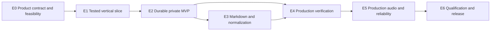

# `technical-tts` Delivery Plan

- **Status:** Approved implementation backlog
- **Architecture authority:** `ADR-0001-production-rust-study-guide-tts.md`
- **Delivery model:** One engineer plus a project owner performing content, evidence, and approval work
- **MVP target:** Private, usable preview in weeks 4–5
- **Version 1.0 target:** Production qualification in weeks 10–12, reforecast after G0

## 1. Purpose and controlling decisions

This plan converts ADR-0001 into an executable, test-first backlog. ADR-0001 remains authoritative for architecture, production invariants, and version 1.0 acceptance. This plan controls sequencing, milestones, ownership, and delivery evidence.

The first usable product is a private preview, not a production release. It accepts reviewed canonical lesson JSON with hand-authored `spoken_text`, produces the complete audio package, records advisory ASR evidence, and requires human approval. General Markdown authoring, calibrated ASR release control, frozen loudness references, configurable parallel synthesis, and production publication follow the private MVP.

The private and production workflows must remain mechanically distinct:

- private outputs are written under `previews/` and declare `release_status: private_preview`;
- private preview may use an implicit generated take-zero selection, but the manifest must identify it as non-production;
- `publish` is a production-only operation and must reject missing or failed gates;
- a private preview must never be represented as verified, production approved, or releasable;
- human review is the private-MVP correctness authority;
- ASR becomes a production release control only after ADR-0005 passes every calibration gate.

## 2. Delivery model

### 2.1 Work-in-progress policy

The engineer maintains one active implementation story at a time. A second story may be opened only when the active story is blocked by an external approval and contains no remaining unblocked engineering task.

The project owner works concurrently on:

- voice sources, consent, and permitted-use evidence;
- reviewed qualification and MVP lesson content;
- listener recruitment and review scheduling;
- human adjudication and protected-term pattern approval;
- sign-offs and explicit risk acceptance.

External work does not consume the engineering work-in-progress slot. Missing external evidence must be escalated on its stated deadline rather than discovered at the release gate.

### 2.2 Milestones

| Gate | Target | Outcome | Release status |
|---|---:|---|---|
| **G0 — Feasibility** | End week 1 | Real Chatterbox smoke render, voice rights, reference hardware, FFmpeg/WAV compatibility, and initial RTF evidence | Evidence only |
| **G1 — Vertical slice** | End week 2 | Reviewed lesson JSON renders three real segments into a complete private-preview package | Engineering preview |
| **M2 — Private MVP** | Weeks 4–5 | Five-minute lesson, full package, cache, resume, retake, advisory ASR, and mandatory human approval | Private use only |
| **G3 — Production candidate** | Weeks 8–9 | Markdown authoring, calibrated ASR, frozen loudness references, and production state transitions | Release candidate |
| **M3 — Version 1.0** | Weeks 10–12 | Every ADR acceptance gate, long-form soak, licensing, documentation, recovery, and release record passes | Production release |

Calendar targets are planning ranges, not promises. Reforecast after G0 using measured model performance, environment findings, and resolved voice availability.

### 2.3 Capability matrix

| Capability | G1 | M2 | G3 | M3 |
|---|:---:|:---:|:---:|:---:|
| Canonical reviewed lesson JSON | Required | Required | Required | Required |
| General Markdown compilation | — | — | Required | Required |
| Real Chatterbox, pool size one | Required | Required | Required | Required |
| Configurable parallel pool | — | — | Required | Qualified |
| Validated content-addressed cache | Required | Required | Required | Qualified |
| Atomic resume and recovery | Basic | Required | Required | Soak-tested |
| Explicit accepted production takes | — | Preview-compatible | Required | Required |
| Master WAV, M4A, MP3 | Required | Required | Required | Required |
| Chapters, transcript, captions, manifest | Required | Required | Required | Required |
| Advisory ASR | — | Required | Superseded | — |
| Calibrated ASR release control | — | — | Required | Qualified |
| Human review | Required | Required | Required for findings | Required for findings |
| Provisional loudness measurements | Required | Required | — | — |
| Frozen voice/style loudness references | — | — | Required | Qualified |
| `publish` operation | Refused | Refused | Candidate only | Enabled after gates |
| 45–60 minute soak | — | — | Scheduled | Required |

## 3. Test and evidence policy

### 3.1 TDD boundary

TDD applies to deterministic product code. Each implementation task begins with a failing test that demonstrates the intended behavior, followed by the minimum implementation and refactoring with the suite green.

Experiments, listening panels, performance measurements, and legal reviews use a written protocol, recorded inputs, acceptance criteria, and an immutable evidence artifact. They are not mislabeled as automated tests.

### 3.2 Test tiers

| Tier | Scope | PR policy | Target budget |
|---|---|---|---:|
| **T1 Unit** | Pure deterministic functions | Every PR | Under 30 seconds total |
| **T2 Property** | Serialization, identity, arithmetic, and parser invariants | Every PR | Under 2 minutes total |
| **T3 Schema/golden** | Schemas, fixtures, compatibility, normalization | Every PR | Under 30 seconds total |
| **T4 Integration** | Filesystem, fake worker, fixture audio, FFmpeg | Every PR | Under 5 minutes total |
| **T5 Qualification** | Real Chatterbox, real ASR, reference hardware | Scheduled or manually gated | Under 30 minutes unless declared |
| **T6 Acceptance** | Full lessons, listening, soak, clean-machine release | Scheduled and release | Hours |

Dependency restoration may use network access. After restoration, PR tests run offline and must not download models or other runtime artifacts. T5 and T6 run on the named self-hosted reference machine and never block ordinary PR feedback.

### 3.3 Story completion rules

A story is complete only when:

- its definition of ready was satisfied before implementation;
- every required task and acceptance criterion is complete;
- its named tests or evidence checks pass at the declared tier;
- no test is disabled, ignored, or weakened without an approved deviation;
- golden expectations were changed only through an explicit review operation;
- schemas and fixtures remain synchronized;
- provenance and recovery behavior are documented;
- any ADR deviation has an approved amendment rather than an undocumented workaround.

## 4. Dependency flow



The engineer follows this sequence. The owner-facing tasks in E0, E4, and E6 may run ahead when they do not require unfinished product behavior.

## EPIC E0 — Product Contract, Evidence, and Feasibility

**Goal:** eliminate risks capable of invalidating the schedule before substantial implementation.

### Story E0-S1 — MVP contract and governance

**Definition of ready:** ADR-0001 is accepted and the project owner is named.

**Tasks**

1. Define private-preview and production-release profiles and their permitted state transitions.
2. Check in the milestone capability matrix and assign one owner and approver to every gate.
3. Define evidence locations, retention, approval records, and escalation deadlines.
4. Establish definition of ready, definition of done, change control, and ADR-deviation handling.
5. Create the ADR requirement-to-story-to-test/evidence traceability matrix.

**Tests and evidence**

- `evidence_e0_milestone_matrix_has_one_owner_and_gate_per_requirement`
- `t3_e0_private_profile_cannot_report_production_release`
- `t3_e0_production_profile_rejects_missing_gate_evidence`
- `t3_e0_unknown_release_status_is_rejected`

**Acceptance:** no ADR-0001 production requirement lacks a delivering story and a validating test or evidence record.

### Story E0-S2 — Voice, model, and legal prerequisites

**Definition of ready:** intended use and distribution scope are documented.

**Tasks**

1. Record the Chatterbox code and model-weight licenses and confirm permitted use.
2. Acquire Nadia and Tom voice references with consent or license records.
3. Pre-authorize an owner-recorded single-instructor fallback if either voice is unavailable by the G0 deadline.
4. Record model, tokenizer, codec, voice, conditional, and license identities.
5. Define access, retention, deletion, and backup rules for voices and ASR corpora.
6. Identify the approver for any use not explicitly covered by the recorded terms.

**Tests and evidence**

- `evidence_e0_model_and_voice_rights_records_complete`
- `t4_e0_missing_voice_consent_blocks_profile_load`
- `t4_e0_unapproved_voice_profile_cannot_enter_preview_or_production`
- `t4_e0_voice_checksum_mismatch_blocks_use`

**Acceptance:** a lawful voice configuration is available, or the fallback is selected and recorded before real lesson rendering.

### Story E0-S3 — Reference environment and real-model spike

**Definition of ready:** reference machine access and a lawful test voice are available.

**Tasks**

1. Record WSL2 version, Ubuntu version, CPU topology, RAM, storage, Python, FFmpeg, ffprobe, GCC, and CMake.
2. Confirm the repository, model, environment, cache, and job roots are on the WSL2 Linux filesystem.
3. Perform a real Chatterbox render through a disposable adapter.
4. Measure model load time, peak RAM, single-worker RTF, output media format, and offline behavior.
5. Verify `hound` against worker, cache, assembled, and FFmpeg-produced float WAV variants; use the bounded ADR-approved fallback if necessary.
6. Record worker-output and FFmpeg conversion identities.
7. Reforecast M2 and M3 using the measured results.

**Tests and evidence**

- `t5_e0_real_chatterbox_smoke_render_succeeds_offline`
- `t5_e0_single_worker_rtf_gate_recorded`
- `t5_e0_projected_sixty_minute_runtime_recorded`
- `t4_e0_pipeline_wav_variants_round_trip`
- `t5_e0_reference_environment_report_complete`

**Exit gate:** stop and reopen hardware or backend decisions if no lawful voice path exists, Chatterbox cannot render offline, the supported WAV path fails, or the single-worker RTF exceeds the ADR gate without an approved hardware solution.

## EPIC E1 — Tested Vertical Slice

**Goal:** pass real content through every architectural boundary before expanding features.

### Story E1-S1 — Workspace, CI, and contract baseline

**Depends on:** E0.

**Tasks**

1. Create the four-crate Rust workspace and commit `Cargo.lock`.
2. Create the locked Python worker environment and record the lock-generation procedure.
3. Define versioned lesson, plan, job, takes, verification, manifest, and worker-protocol schemas.
4. Implement canonical serialization and BLAKE3 synthesis and verification identities.
5. Implement deterministic worker-bundle hashing.
6. Add fake worker, deterministic audio fixtures, invalid fixtures, and shared protocol fixtures.
7. Configure fast PR checks and separate reference-machine qualification workflows.

**Tests**

- `t3_e1_generated_schemas_match_checked_in_files`
- `t3_e1_unknown_major_version_is_rejected`
- `t3_e1_compatible_minor_extension_is_accepted`
- `t2_e1_canonical_serialization_is_byte_stable`
- `t2_e1_every_speech_affecting_field_changes_synthesis_key`
- `t1_e1_worker_bundle_hash_changes_on_owned_runtime_input`
- `t1_e1_worker_bundle_hash_ignores_unrelated_repository_files`
- `t4_e1_fake_worker_passes_shared_protocol_contract`
- `t4_e1_pr_suite_performs_no_model_download`

### Story E1-S2 — Minimal canonical lesson workflow

**Depends on:** E1-S1.

**Tasks**

1. Accept reviewed canonical lesson JSON with hand-authored `spoken_text`.
2. Validate schema version, segment IDs, roles, styles, review state, and voice references.
3. Plan stable segments without general Markdown compilation.
4. Preserve display text separately and send only `spoken_text` to synthesis.
5. Produce diagnostics containing source, segment ID, and field path.

**Tests**

- `t1_e1_each_lesson_invariant_has_a_distinct_error`
- `t1_e1_unreviewed_lesson_fails_before_worker_start`
- `t1_e1_display_text_never_enters_synthesis_request`
- `t2_e1_unicode_and_protected_terms_survive_round_trip`
- `t2_e1_plan_is_stable_for_identical_lesson_input`

### Story E1-S3 — Single-worker synthesis and validated cache

**Depends on:** E1-S1 and E1-S2.

**Tasks**

1. Implement the ADR `TtsExecutor` interface with capacity one.
2. Start one persistent Chatterbox worker and load the model once per worker lifetime.
3. Enforce offline operation, thread limits, request IDs, frame limits, staging containment, and protocol-only stdout.
4. Validate and condition canonical audio before atomic cache publication.
5. Publish cache entries through stage, checksum, rename, and directory synchronization.
6. Quarantine invalid output in collision-free attempt paths.
7. Run the shared contract suite against fake and real workers.

**Tests**

- `t4_e1_identical_synthesis_identity_produces_cache_hit`
- `t4_e1_speech_affecting_change_produces_cache_miss`
- `t4_e1_invalid_audio_never_produces_cache_hit`
- `t4_e1_invalid_audio_uses_unique_quarantine_path`
- `t5_e1_worker_output_cannot_escape_staging_root`
- `t5_e1_worker_protocol_stdout_remains_clean`
- `t5_e1_model_load_occurs_once_per_worker_lifetime`

### Story E1-S4 — Minimal package generation

**Depends on:** E1-S3.

**Tasks**

1. Build the edit-decision list using checked sample arithmetic and artifact checksums.
2. Assemble canonical PCM and exact silence in Rust.
3. Derive caption and chapter boundaries from written sample counts.
4. Produce master WAV, M4A, MP3, chapters, transcript, captions, checksums, and manifest.
5. Invoke FFmpeg and ffprobe without a shell.
6. Derive both lossy formats independently from the master WAV.
7. Mark the package `private_preview` and place it under `previews/`.

**Tests**

- `t4_e1_master_sample_count_equals_segments_plus_silence`
- `t4_e1_caption_boundaries_equal_written_sample_boundaries`
- `t4_e1_wav_m4a_and_mp3_pass_structural_validation`
- `t4_e1_paths_with_spaces_and_unicode_are_supported`
- `t4_e1_ffmpeg_failure_preserves_master_and_prior_state`
- `t4_e1_manifest_checksums_match_every_output`
- `t4_e1_lossy_output_is_never_source_for_another_export`

**G1 acceptance:** a reviewed three-segment lesson renders through real Chatterbox and produces a structurally valid, complete private-preview package.

## EPIC E2 — Durable Private MVP

**Goal:** make the vertical slice safe for repeated personal use.

### Story E2-S1 — Atomic job state and recovery

**Depends on:** E1.

**Tasks**

1. Implement per-job locks with process identity and verified stale-owner handling.
2. Implement canonical temporary write, file synchronization, atomic rename, and directory synchronization.
3. Append events only after the state they describe is durable.
4. Encode the ADR state machine while preserving the separate private-preview completion status.
5. Reconcile state, cache, and output artifacts during resume.
6. Refuse automatic overwrite of corrupt `job.json`.

**Tests**

- `t4_e2_interrupt_before_rename_preserves_prior_state`
- `t4_e2_interrupt_after_cache_publish_reconciles_on_resume`
- `t4_e2_live_lock_is_refused`
- `t4_e2_verified_stale_lock_is_recoverable`
- `t4_e2_resume_regenerates_only_missing_or_invalid_segments`
- `t4_e2_no_op_rebuild_produces_identical_manifest`
- `t4_e2_corrupt_job_state_is_not_overwritten`

### Story E2-S2 — Takes, retakes, and cache retention

**Depends on:** E2-S1.

**Tasks**

1. Implement versioned takes files and synthesis-base-key validation.
2. Permit an automatically generated take-zero selection only for private preview.
3. Require an explicit accepted takes file for production.
4. Propagate selected take, cache key, and checksum into plan and manifest.
5. Increment take for distinct performances and preserve all prior artifacts.
6. Assess loudness and speaking-rate continuity at both replacement joins.
7. Treat accepted takes and manifests as prune roots.

**Tests**

- `t3_e2_takes_file_round_trips_without_selection_loss`
- `t1_e2_stale_synthesis_base_key_is_rejected`
- `t4_e2_retake_changes_only_selected_segment_identity`
- `t4_e2_prior_take_is_never_overwritten`
- `t4_e2_both_retake_joins_are_assessed`
- `t4_e2_selected_artifact_survives_prune`
- `t4_e2_production_rejects_implicit_take_selection`

### Story E2-S3 — Audio validation and preview loudness

**Depends on:** E1-S4.

**Tasks**

1. Analyze leading and trailing audio in 5 ms RMS frames.
2. Add zero padding until each exposed edge has at least 10 ms silence.
3. Apply a raised-cosine transition ramp no longer than 5 ms without entering speech.
4. Validate exact zero endpoints, join discontinuity, finite samples, and `max(abs(sample)) <= 1.0`.
5. Apply two-pass final-package loudness normalization.
6. Record provisional voice/style measurements without treating them as production references.
7. Route excessive gain, dynamic normalization, and discontinuity findings to human review.

**Tests**

- `t1_e2_short_edge_is_padded_to_ten_milliseconds`
- `t1_e2_sufficient_edge_receives_no_extra_padding`
- `t1_e2_ramp_never_extends_into_speech`
- `t1_e2_exposed_endpoints_are_exactly_zero`
- `t1_e2_discontinuity_threshold_is_enforced`
- `t4_e2_loudnorm_requires_linear_result`
- `t3_e2_provisional_measurement_cannot_satisfy_production_calibration`

### Story E2-S4 — Advisory ASR and human review

**Depends on:** E2-S1 and E2-S3.

**Tasks**

1. Integrate pinned `whisper-rs` and its Cargo-locked native stack.
2. Convert canonical audio through the fixed 16 kHz mono verification transform.
3. Drain and unload Chatterbox before ASR starts.
4. Store verification evidence separately from synthesis artifacts.
5. Treat ASR findings as advisory under the private-preview profile.
6. Implement a versioned human checklist for content, protected terms, voice, joins, and package integrity.
7. Require completed human evidence before private-preview completion.

**Tests**

- `t5_e2_repeated_input_transcript_is_stable_in_smoke_run`
- `t5_e2_segment_order_does_not_change_smoke_results`
- `t4_e2_asr_only_change_never_invokes_chatterbox`
- `t4_e2_asr_failure_preserves_cached_audio`
- `t4_e2_asr_runs_only_after_worker_unload`
- `t3_e2_private_preview_requires_human_review_record`
- `t3_e2_private_preview_cannot_claim_production_verification`

### Story E2-S5 — MVP CLI and diagnostics

**Depends on:** E2-S1 through E2-S4.

**Tasks**

1. Implement lesson validation, preview build, inspect, resume, retake, takes acceptance, doctor, and cache verification.
2. Add stable human-readable and structured output.
3. Map failure classes to documented exit codes and safe recovery commands.
4. Redact source text, spoken text, and voice-reference paths by default.
5. Report progress during model loading and synthesis.
6. Make cache prune dry-run by default and require explicit destructive confirmation.

**Tests**

- `t4_e2_every_mvp_command_has_stable_structured_output`
- `t4_e2_each_failure_class_has_declared_exit_code`
- `t4_e2_logs_exclude_sensitive_fixture_content`
- `t4_e2_failure_names_safe_recovery_command`
- `t4_e2_doctor_reports_drvfs_tools_checksums_and_core_budget`
- `t4_e2_prune_dry_run_mutates_nothing`

**M2 acceptance:** a reviewed five-minute canonical lesson produces the complete package, survives interruption, supports a selected retake, records advisory ASR evidence and human approval, and remains mechanically identified as non-production.

## EPIC E3 — Markdown Authoring and Technical Normalization

**Goal:** replace hand-authored canonical JSON with deterministic, reviewable Markdown compilation without introducing facts.

### Story E3-S1 — Structural Markdown parsing

**Depends on:** M2.

**Tasks**

1. Parse headings, paragraphs, lists, block quotes, links, tables, fenced code, and inline code structurally.
2. Preserve stable source block references through compilation.
3. Linearize tables through an explicit deterministic policy.
4. Extract explicit pronunciation directives.
5. Reject unsupported structures when safe transformation is impossible.

**Tests**

- `t2_e3_arbitrary_unicode_markdown_never_panics`
- `t1_e3_each_supported_block_type_is_classified`
- `t1_e3_fenced_code_is_never_merged_into_prose`
- `t2_e3_source_references_are_stable_across_recompilation`
- `t1_e3_unsupported_structure_is_reported_not_dropped`

### Story E3-S2 — Golden technical-speech normalization

**Depends on:** E3-S1.

**Tasks**

1. Build a golden harness with readable diffs and a separate explicit approval command.
2. Normalize Unicode, whitespace, and punctuation.
3. Implement reviewed rules for numbers, versions, ranges, units, equations, acronyms, and initialisms.
4. Implement identifier casing, dotted namespaces, and literal-versus-conceptual code reading.
5. Implement URL omission, description, and short-domain policies.
6. Add a project lexicon whose exact rules take precedence over generic rules.

**Tests**

- `t2_e3_normalization_is_idempotent`
- `t3_e3_golden_technical_corpus_matches_approved_output`
- `t1_e3_exact_lexicon_rule_wins_over_generic_rule`
- `t1_e3_conflicting_exact_rules_are_rejected`
- `t3_e3_ordinary_test_run_never_rewrites_golden_output`

### Story E3-S3 — Display/spoken transformation audit

**Depends on:** E3-S2.

**Tasks**

1. Emit display and spoken text for every compiled segment.
2. Record every material transformation with source reference, rule identity, and result.
3. Require explicit review of warnings and unresolved transformations.
4. Prohibit compiler-created technical claims.

**Tests**

- `t1_e3_every_material_transform_has_an_audit_record`
- `t1_e3_display_text_never_enters_worker_payload`
- `t1_e3_untransformable_material_emits_review_warning`
- `t3_e3_compiler_adds_no_text_without_rule_or_source_evidence`

### Story E3-S4 — Protected terms and segmentation

**Depends on:** E3-S2.

**Tasks**

1. Create the protected-term and pronunciation registry.
2. Segment at paragraph, sentence, and clause precedence.
3. Prohibit splitting protected terms, identifiers, units, and inline code.
4. Derive stable child IDs and reject unsplittable over-limit segments.
5. Expose the same protected-term identities to ASR lattice construction.

**Tests**

- `t2_e3_chunk_concatenation_preserves_spoken_text`
- `t2_e3_no_chunk_exceeds_backend_limit`
- `t1_e3_protected_term_is_never_split`
- `t2_e3_child_ids_are_unique_and_stable`
- `t1_e3_unsplittable_segment_is_rejected_not_truncated`

## EPIC E4 — Calibrated Production Verification

**Goal:** qualify ASR as a bounded production release control without allowing it to approve content.

### Story E4-S1 — Fixed decoder and verification identity

**Depends on:** E2-S4 and E3-S4.

**Tasks**

1. Fix every decoder parameter, thread count, compilation feature, device, model, and conversion input named by ADR-0001.
2. Keep one model context loaded for the verification stage.
3. Use one independent decoder state per segment.
4. Derive the complete verification key and atomically publish results beneath it.
5. Reuse valid evidence and invalidate verification without invalidating synthesis.

**Tests**

- `t5_e4_identical_audio_has_identical_transcript_five_of_five`
- `t5_e4_segment_order_invariance_is_one_hundred_percent`
- `t2_e4_every_verification_input_changes_verification_key`
- `t4_e4_verification_invalidation_never_invokes_worker`
- `t4_e4_verification_result_is_published_atomically`

### Story E4-S2 — Expected-ASR lattice and adjudication

**Depends on:** E4-S1.

**Tasks**

1. Implement deterministic ordinary-word normalization.
2. Map protected terms to one or more human-approved ASR token sequences.
3. Align observed tokens and report omission, insertion, substitution, repetition, and continuation evidence separately.
4. Route uncalibrated protected terms to review.
5. Require listener confirmation before explicit pattern promotion.
6. Prohibit automatic learning from arbitrary model output.

**Tests**

- `t1_e4_approved_http_429_variant_does_not_flag`
- `t1_e4_approved_result_generic_variant_does_not_flag`
- `t1_e4_approved_complexity_and_identifier_variants_do_not_flag`
- `t1_e4_uncalibrated_protected_term_routes_to_review`
- `t1_e4_each_defect_class_has_distinct_evidence`
- `t1_e4_no_automatic_pattern_promotion_path_exists`

### Story E4-S3 — Governed calibration corpus

**Depends on:** E4-S2.

**Tasks**

1. Assemble at least 100 human-verified clean segments, including at least 50 protected-term segments.
2. Generate at least 50 examples per defect class through a deterministic seeding tool.
3. Validate seeded examples so splice artifacts do not make detection artificially easy.
4. Store corpus bytes in an immutable governed artifact location.
5. Record URI, checksum, license, access policy, retention policy, generator revision, and ground truth.
6. Measure and publish the full confusion table.

**Tests and evidence**

- `t4_e4_seeded_corpus_is_reproducible_from_manifest`
- `evidence_e4_seeded_examples_pass_artifact_bias_review`
- `t5_e4_clean_false_positive_rate_at_or_below_five_percent`
- `t5_e4_omission_insertion_and_continuation_detection_at_or_above_ninety_five_percent`
- `t5_e4_substitution_detection_at_or_above_ninety_percent`
- `t5_e4_repetition_detection_at_or_above_eighty_percent`

### Story E4-S4 — Production verification orchestration

**Depends on:** E4-S1 through E4-S3.

**Tasks**

1. Enforce `Rendered → Verifying → Verified` and `Verifying → NeedsReview/Failed`.
2. Preserve findings through restart until accepted or invalidated.
3. Return accepted findings to `Verified`; return content, voice, or take changes to `Planned`.
4. Block assembly and publication while required verification is stale or unresolved.
5. Resume at verification after verifier failure without invoking Chatterbox.

**Tests**

- `t2_e4_full_state_transition_matrix_is_enforced`
- `t4_e4_needs_review_survives_restart`
- `t4_e4_findings_block_production_publication`
- `t4_e4_verifier_failure_resumes_at_verifying`
- `t4_e4_changed_take_returns_job_to_planned`

**G3 verification exit:** ADR-0005 records exact identities, corpus provenance, patterns, thresholds, confusion rates, stability, and order invariance. Failure of any numerical gate keeps human review authoritative and blocks production release-control claims.

## EPIC E5 — Production Audio, Pooling, and Reliability

**Goal:** qualify long-form audio behavior, bounded concurrency, security, and recovery for production use.

### Story E5-S1 — Frozen loudness references

**Depends on:** representative accepted calibration audio.

**Tasks**

1. Calculate candidate medians for each voice-profile hash and style.
2. Review and freeze one committed LUFS reference per pair under ADR-0003.
3. Block production use of an uncalibrated voice/style pair.
4. Compute segment gain against the frozen reference and record reference and applied gain.
5. Route correction beyond the allowed bound to review.

**Tests**

- `t4_e5_gain_uses_frozen_reference_not_lesson_median`
- `t4_e5_unrelated_edit_does_not_change_other_segment_gain`
- `t4_e5_retake_does_not_refreeze_reference`
- `t4_e5_uncalibrated_voice_style_is_rejected_for_production`
- `t4_e5_excessive_correction_routes_to_review`

### Story E5-S2 — Configurable resource-governed pool

**Depends on:** E1-S3.

**Tasks**

1. Extend the single-client executor into N individually synchronized leased clients.
2. Detect WSL-visible physical cores with the conservative ADR fallback.
3. Reserve one core when more than one is available.
4. Enforce CPU-thread and aggregate-RAM constraints before startup.
5. Drain and unload all workers before verification.
6. Report single-worker RTF separately from aggregate pool throughput.

**Tests**

- `t4_e5_calls_execute_in_parallel_at_capacity_above_one`
- `t4_e5_oversubscribed_pool_is_rejected_before_startup`
- `t4_e5_default_pool_size_is_one`
- `t4_e5_drain_leaves_zero_worker_processes`
- `t5_e5_pool_throughput_does_not_override_failed_single_worker_gate`

### Story E5-S3 — Retry, timeout, and lifecycle

**Depends on:** E5-S2.

**Tasks**

1. Implement the ADR retry ladder without changing synthesis identity or take.
2. Enforce non-retryable failure classes.
3. Add startup, heartbeat, synthesis, shutdown, and cancellation deadlines.
4. Terminate complete process trees on timeout and cancellation.
5. Preserve valid completed artifacts across worker restarts.

**Tests**

- `t4_e5_transient_failure_follows_bounded_retry_ladder`
- `t4_e5_automatic_retry_preserves_identity_and_take`
- `t4_e5_non_retryable_failure_is_never_retried`
- `t4_e5_timeout_terminates_full_process_tree`
- `t5_e5_no_orphan_process_remains_after_crash_or_cancel`
- `t5_e5_memory_and_handles_remain_bounded`

### Story E5-S4 — Security and recovery fault injection

**Depends on:** E5-S3.

**Tasks**

1. Test traversal, symlink escape, oversized frames, duplicate request IDs, malformed JSON, and hostile metadata.
2. Inject interruption during Rendering, Verifying, NeedsReview, Assembling, and Publishing.
3. Verify cache entries, manifests, and checksums before every reuse.
4. Ensure failed assembly and encoding preserve the canonical master and prior release.
5. Exercise cache verification, dry-run prune, explicit prune, and archive reconstruction.

**Tests**

- `t4_e5_managed_path_escape_is_rejected`
- `t4_e5_oversized_or_malformed_protocol_frame_is_rejected`
- `t4_e5_duplicate_request_id_is_rejected`
- `t4_e5_recovery_succeeds_from_each_interruptible_state`
- `t4_e5_checksum_mismatch_aborts_before_consumption`
- `t4_e5_failed_publish_preserves_prior_release`
- `t4_e5_archived_segment_bundle_reconstructs_selected_master`

## EPIC E6 — Qualification and Release

**Goal:** turn the production candidate into an auditable version 1.0 release.

### Story E6-S1 — Long-form soak and listening qualification

**Depends on:** E3 through E5.

**Tasks**

1. Author and review a 45–60 minute lesson containing at least 150 segments.
2. Run scheduled soak builds from the first production candidate onward.
3. Measure segment failure rate, memory, handles, throughput, voice drift, loudness, and recovery.
4. Replace a middle take and review both joins.
5. Conduct the ADR dialogue and long-form listening evaluation.

**Tests and evidence**

- `t6_e6_soak_segment_failure_rate_is_below_one_percent`
- `t6_e6_memory_and_handles_show_no_unbounded_growth`
- `t6_e6_voice_identity_is_consistent_across_deciles`
- `t6_e6_mid_lesson_retake_passes_both_join_reviews`
- `t6_e6_interruption_loses_no_completed_valid_segment`
- `evidence_e6_long_form_listener_gate_passes`

### Story E6-S2 — Supply chain, rights, and release evidence

**Depends on:** E0-S2 and release-candidate dependency locks.

**Tasks**

1. Generate the SBOM and review Rust, Python, model, codec, and FFmpeg terms.
2. Resolve applicable advisories or record explicit accepted risk.
3. Verify voice consent, reference retention, and watermark evidence.
4. Verify offline rendering with network egress denied.
5. Record hashes for application, worker bundle, model, voices, ASR model, and outputs.

**Tests and evidence**

- `evidence_e6_sbom_and_license_review_complete`
- `evidence_e6_voice_consent_records_complete`
- `t6_e6_release_render_succeeds_offline`
- `t6_e6_release_checksums_cover_every_distributed_artifact`
- `evidence_e6_watermark_policy_and_measurement_complete`

### Story E6-S3 — Clean-machine operations and rollback

**Depends on:** E6-S1 and E6-S2.

**Tasks**

1. Document install, model preparation, validation, rendering, inspection, review, recovery, pruning, archive, and uninstall.
2. Exercise the documentation on clean Ubuntu 24.04 under WSL2.
3. Package binaries and worker bundle with checksums and signatures when distribution requires signing.
4. Rehearse rollback of the application, worker, and model bundle.
5. Confirm rollback can render and verify a known fixture.

**Tests**

- `t6_e6_clean_machine_install_and_render_succeeds_from_runbook`
- `t6_e6_documented_recovery_restores_interrupted_job`
- `t6_e6_rollback_restores_prior_bundle_and_renders_fixture`
- `t6_e6_uninstall_preserves_user_data_unless_explicitly_selected`

### Story E6-S4 — Decision records and production authorization

**Depends on:** all preceding release evidence.

**Tasks**

1. Complete ADR-0002 from measured model, hardware, voice, format, and dialogue evidence.
2. Complete ADR-0003 from production audio calibration and watermark evidence.
3. Complete ADR-0004 from voice consent, retention, and permitted-use decisions.
4. Complete ADR-0005 from exact ASR identities, corpus, patterns, and measured gates.
5. Mechanize the ADR-0001 release checklist.
6. Obtain project-owner production authorization and record any accepted residual risk.

**Tests and evidence**

- `t6_e6_every_adr_0001_acceptance_requirement_has_passing_evidence`
- `t6_e6_no_unresolved_needs_review_finding_exists`
- `t6_e6_all_selected_takes_are_explicit_and_current`
- `evidence_e6_required_decision_records_are_accepted`
- `evidence_e6_production_authorization_is_recorded`

**M3 acceptance:** every ADR-0001 version 1.0 criterion and this plan’s production authorization check passes. Missing evidence is a failed release, not a documentation follow-up.

## 5. Required documents and sign-offs

| Artifact | Owner | Approver | Required by |
|---|---|---|---|
| MVP capability and non-production-use matrix | Engineering owner | Project owner | Before E1 |
| ADR traceability matrix | Engineering owner | Project owner | Before E1 |
| Reference environment and feasibility report | Engineering owner | Engineering owner | G0 |
| Voice consent and permitted-use records | Project owner | Rights holder/project owner | Before real voice use |
| Test-data manifest and external artifact policy | Engineering owner | Project owner | Before calibration corpus creation |
| Human preview review checklist | Project owner | Project owner | M2 |
| Threat model and dependency/license inventory | Engineering owner | Project owner | Before G3 |
| ADR-0002 model, hardware, voice, and format evidence | Engineering owner | Engineering owner and project owner | Before G3 |
| ADR-0003 production audio profile | Engineering owner | Engineering owner and listener representative | Before production qualification |
| ADR-0004 voice and retention policy | Project owner | Rights holder/project owner | Before M3 |
| ADR-0005 ASR calibration evidence | Engineering owner | Engineering owner and human-review owner | Before ASR becomes a release control |
| Release checklist, runbook, and rollback record | Engineering owner | Project owner | M3 |

If this is a personal project without separate legal, security, or QA functions, the project owner signs those roles explicitly and records the accepted risk. Approval must not remain implicit.

## 6. Schedule and critical path

| Week | Engineering work | Concurrent owner/evidence work | Gate |
|---:|---|---|---|
| 1 | E0, real-model spike, environment and WAV qualification | Voice rights, fallback authorization, qualification lesson | G0 |
| 2 | E1 vertical slice | Five-minute MVP lesson and review checklist | G1 |
| 3 | E2 state, recovery, and takes | Preview listening and defect taxonomy | — |
| 4 | E2 audio, advisory ASR, CLI | Human review and retake selection | M2 candidate |
| 5 | M2 correction buffer and acceptance | Private-MVP sign-off | M2 |
| 6–7 | E3 Markdown and normalization | Golden-corpus review | — |
| 7–9 | E4 calibrated verification | Corpus labeling and pattern approvals | G3 |
| 9–10 | E5 production audio, pool, lifecycle, security | Listener scheduling and release evidence | — |
| 10–12 | E6 soak, runbooks, ADRs, rollback, release | Listening, rights, and production authorization | M3 |

The critical path is:

```text
lawful voice and viable Chatterbox
  -> real vertical slice
  -> durable private MVP
  -> deterministic authoring
  -> calibrated verification
  -> production reliability
  -> long-form qualification and release
```

## 7. Risk register

| Risk | Trigger | Response | Owner |
|---|---|---|---|
| Voice rights unresolved | No lawful source at G0 | Select pre-authorized owner-recorded single-instructor fallback | Project owner |
| CPU gate fails | Single-worker `RTF > 6.0` | Reopen hardware/backend decision before expanding integration | Engineering owner |
| Real worker contract differs from assumptions | G0/G1 contract failure | Amend the versioned boundary before downstream expansion | Engineering owner |
| Solo schedule overload | M2 forecast exceeds five weeks after G0 | Preserve MVP outcome; move nonessential commands or automation after M2 | Project owner |
| ASR false positives | Clean rate exceeds ADR threshold | Improve lattice/normalization; retain human review; do not lower gate | Engineering owner |
| Seeded ASR corpus is artificial | Defects are detectable from splice artifacts | Reject affected examples and regenerate through a validated method | Human-review owner |
| External corpus cannot be reproduced | Bytes unavailable or provenance incomplete | Block calibration acceptance until governed storage is restored | Project owner |
| Recovery work expands | Fault injection reveals inconsistent state | Protect correctness and move calendar; do not weaken durability tests | Engineering owner |
| Long-form drift appears late | Soak shows voice, memory, or failure trend | Fix before release and rerun the complete affected gate | Engineering owner |

## 8. Assumptions

- One engineer implements the software. The project owner supplies content, voice decisions, human reviews, and external coordination.
- Ubuntu 24.04 under WSL2 is the development and initial runtime environment.
- The private MVP uses canonical lesson JSON and hand-authored `spoken_text`.
- The private MVP produces master WAV, M4A, MP3, chapters, transcript, captions, checksums, and manifest.
- Pool size one is sufficient for the private MVP. Configurable parallel capacity is production work.
- Human review is the private-MVP correctness authority. ASR becomes a release control only after ADR-0005 passes.
- Private-MVP timing is four to five focused weeks. Version 1.0 is estimated at ten to twelve weeks and is reforecast after G0.
- Any failed CPU, voice-rights, model-compatibility, or media-compatibility gate can change the schedule or reopen the backend decision.
- A takes file reproduces selection. Byte-identical reconstruction additionally requires the referenced cache artifacts or an archived segment bundle.
- No milestone date authorizes weakening an ADR invariant, concealing incomplete behavior, or representing private-preview evidence as production acceptance.
