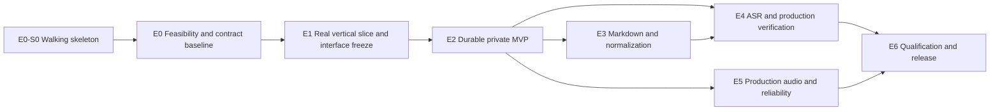

# `study-tts` Delivery Plan — Version 3

- **Status:** Approved implementation backlog, superseding Versions 1 and 2
- **Architecture authority:** `docs/adr/ADR-0001-production-rust-study-guide-tts.md`
- **Delivery model:** One engineer plus a project owner performing content, evidence, and approval work
- **MVP target:** Candidate at end of week 3; committed private preview at end of week 4
- **Version 1.0 target:** Production qualification in weeks 10–12, reforecast after G0

## 1. Purpose and controlling decisions

This plan converts ADR-0001 into an executable, test-first backlog. ADR-0001 remains authoritative for architecture, production invariants, and version 1.0 acceptance. This plan controls sequencing, milestones, ownership, independently schedulable work, and delivery evidence.

The first usable product is a private preview, not a production release. It accepts reviewed canonical lesson JSON with hand-authored `spoken_text`, produces the complete audio package, emits a structured run report, and requires recorded human approval. General Markdown authoring, ASR integration and calibration, frozen loudness references, configurable parallel synthesis, and production publication follow the private MVP.

The private and production workflows must remain mechanically distinct:

- private outputs are written under `previews/` and declare `release_status: private_preview`;
- private preview may use an implicit generated take-zero selection, but the manifest must identify it as non-production;
- `publish` is a production-only operation and must reject missing or failed gates;
- a private preview must never be represented as verified, production approved, or releasable;
- human review is the private-MVP correctness authority;
- ASR is outside the private MVP, but remains part of the production architecture required by ADR-0001;
- ASR becomes a production release control only after ADR-0005 passes every calibration gate;
- shipping version 1.0 with advisory ASR after failed calibration requires an accepted ADR amendment, complete human review of every selected segment, and an explicit statement that automated text-integrity coverage is unqualified.

## 2. Delivery model

### 2.1 Track structure and work-in-progress policy

Interfaces, schemas, fixtures, and fakes make work independently schedulable. They do not create parallel engineering capacity by themselves.

| Track | Scope | Contract boundary |
|---|---|---|
| **T-CORE** | Lesson types, validation, planning, identities, state machine | Versioned schemas and core traits |
| **T-WORKER** | Python worker, Chatterbox adapter, pool, retry, lifecycle | Worker protocol and `TtsExecutor` |
| **T-AUDIO** | Cache media validation, conditioning, PCM assembly, export | Audio fixtures, artifact and package interfaces |
| **T-CLI** | Commands, diagnostics, structured output, run reports | Core and runtime service traits |
| **T-AUTH** | Markdown compilation, normalization, protected terms | Lesson schema and transformation records |
| **T-VERIFY** | ASR, expected-token lattice, adjudication, calibration | Verification schema and cached audio |

Rules:

- A solo engineer normally holds one implementation story at a time.
- A second story is allowed only when the first is waiting on a long-running process or external evidence, belongs to a different track, and shares no file boundary.
- Genuine simultaneous engineering begins only when a second engineer is assigned.
- Provisional seams land with the walking skeleton; the contract baseline lands after the real-model spike; interfaces freeze only at G1 after fake and real contract parity.
- No track changes a frozen interface unilaterally. Amendments are versioned and rerun every affected contract test.
- The walking skeleton remains a required CI check after it lands.

### 2.2 Project-owner concurrent work

The project owner works concurrently on:

- voice sources, consent, and permitted-use evidence;
- source-content provenance, intended use, and distribution-rights classification;
- reviewed qualification and MVP lesson content;
- listener recruitment and review scheduling;
- human adjudication and protected-term pattern approval;
- sign-offs and explicit risk acceptance.

External work does not consume the engineering work-in-progress slot. Missing external evidence must be escalated on its stated deadline rather than discovered at the release gate.

### 2.3 Milestones

| Gate | Target | Outcome | Release status |
|---|---:|---|---|
| **G0a — Skeleton** | Day 2 | Fixture lesson passes through fake synthesis, cached WAV, Rust assembly, real FFmpeg M4A, and a minimal manifest in CI | Engineering only |
| **G0 — Feasibility** | End week 1 | Real Chatterbox smoke render, voice/content classification, reference hardware, WAV compatibility, RTF and determinism evidence, and versioned contract baseline | Evidence only |
| **G1 — Vertical slice** | End week 2 | Reviewed lesson JSON renders three real segments into a complete private-preview package | Engineering preview |
| **M2 candidate** | End week 3 | Feature-complete five-minute private preview enters correction and acceptance | Not accepted |
| **M2 — Private MVP** | End week 4 | Five-minute lesson, full package, cache, resume, retake, run report, and mandatory human approval | Private use only |
| **G3 — Production candidate** | Weeks 8–9 | Markdown authoring, integrated ASR, calibration result or amendment path, frozen loudness references, and production state transitions | Release candidate |
| **M3 — Version 1.0** | Weeks 10–12 | Every ADR acceptance gate, long-form soak, licensing, documentation, recovery, and release record passes | Production release |

Calendar targets are planning ranges, not promises. Reforecast after G0 using measured model performance, environment findings, and resolved voice availability.

### 2.4 Capability matrix

| Capability | G0a | G1 | M2 | G3 | M3 |
|---|:---:|:---:|:---:|:---:|:---:|
| Minimal end-to-end fake pipeline | Required | Superseded | — | — | — |
| Canonical reviewed lesson JSON | Fixture | Required | Required | Required | Required |
| Published schema, scaffold command, validation, example | — | Required | Required | Required | Required |
| General Markdown compilation | — | — | — | Required | Required |
| Real Chatterbox, pool size one | — | Required | Required | Required | Required |
| Configurable parallel pool | — | — | — | Required | Qualified |
| Validated content-addressed cache | Stub | Required | Required | Required | Qualified |
| Atomic resume and recovery | — | Basic | Required | Required | Soak-tested |
| Explicit accepted production takes | — | — | Preview-compatible | Required | Required |
| Master WAV and M4A | Minimal | Required | Required | Required | Required |
| MP3, chapters, transcript, captions, full manifest | — | Required | Required | Required | Required |
| Structured run report | — | Basic | Required | Required | Required |
| ASR integration and advisory triage | — | — | — | Required | Required |
| Calibrated ASR release control | — | — | — | Target | Qualified or amended |
| Human review | — | Required | Required | Required for findings | Required; every segment if ASR unqualified |
| Provisional loudness measurements | — | Required | Required | — | — |
| Frozen voice/style loudness references | — | — | — | Required | Qualified |
| Compatibility and upgrade impact reporting | — | — | — | Required | Required |
| `publish` operation | Refused | Refused | Refused | Candidate only | Enabled after gates |
| 45–60 minute soak | — | — | — | Scheduled | Required |

## 3. Test and evidence policy

### 3.1 TDD boundary

TDD applies to deterministic product code. Each implementation task begins with a failing test that demonstrates the intended behavior, followed by the minimum implementation and refactoring with the suite green.

An item is a test when an executable protocol has fixed inputs, environment controls, and a pass/fail threshold. Characterizations, human judgments, legal determinations, and measurements without an automated threshold are evidence. Both use written protocols and immutable results, but evidence is never presented as a green automated suite.

### 3.2 Test tiers

| Tier | Scope | PR policy | Target budget |
|---|---|---|---:|
| **T1 Unit** | Pure deterministic functions | Every PR | Under 30 seconds total |
| **T2 Property** | Serialization, identity, arithmetic, and parser invariants | Every PR | Under 2 minutes total |
| **T3 Schema/golden** | Schemas, fixtures, compatibility, normalization | Every PR | Under 30 seconds total |
| **T4 Integration** | Filesystem, fake worker, fixture audio, FFmpeg | Every PR | Under 5 minutes total |
| **T5 Qualification** | Real Chatterbox, real ASR, reference hardware | Scheduled or manually gated | Under 30 minutes unless declared |
| **T6 Acceptance** | Full lessons, listening, soak, clean-machine release | Scheduled and release | Hours |

Dependency restoration may use network access. After restoration, PR tests run offline and must not download models or other runtime artifacts. T5 and T6 run on the named self-hosted reference machine and never block ordinary PR feedback.

ASR 5-of-5 transcript stability, segment-order invariance, fixed performance thresholds, and soak thresholds remain executable T5/T6 qualification tests. Their isolation from PR checks prevents slow or environment-specific feedback from blocking ordinary development; failure still blocks the gate it protects.

### 3.3 Cross-cutting requirements

- Every deterministic behavior follows red-green-refactor.
- Every provisional or frozen interface has a fake and a shared contract suite.
- Public schemas and generated Rust types remain synchronized.
- Tests write only beneath their assigned temporary roots.
- CI reports tier duration so a budget regression is visible.
- Every public failure class has at least one direct construction or behavior test recorded in the traceability matrix.

### 3.4 Story completion rules

A story is complete only when:

- its definition of ready was satisfied before implementation;
- every required task and acceptance criterion is complete;
- its named tests or evidence checks pass at the declared tier;
- no test is disabled, ignored, or weakened without an approved deviation;
- golden expectations were changed only through an explicit review operation;
- schemas and fixtures remain synchronized;
- provenance and recovery behavior are documented;
- the walking skeleton remains green;
- any ADR deviation has an approved amendment rather than an undocumented workaround.

## 4. Dependency flow



The arrows define prerequisites, not a requirement to serialize independent tracks. After E2, E3, E4-S0, and the E5 work that does not require verification may be interleaved or assigned to additional engineers. Owner-facing evidence may run ahead whenever it does not require unfinished behavior.

## EPIC E0 — Walking Skeleton, Product Contract, Rights, and Feasibility

**Goal:** establish the end-to-end seam, then eliminate risks capable of invalidating the schedule before substantial implementation.

### Story E0-S0 — Minimal walking skeleton

**Definition of ready:** the existing four-crate workspace builds and FFmpeg is available in WSL2.

**Tasks**

1. Replace placeholder flow with provisional boundaries for lesson load, plan, fake synthesis, cache, PCM assembly, export, and manifest.
2. Implement a deterministic fake worker that returns a generated tone.
3. Process a two-segment fixture through cached WAV, Rust PCM assembly, real FFmpeg M4A, and a minimal manifest.
4. Run the skeleton in CI with no model or network requirement.
5. Record the integration order and keep the skeleton green through every later story.
6. Reject unsafe lesson and segment IDs and verify canonical managed-directory containment before output writes.

**Tests**

- `t4_e0_skeleton_produces_wav_m4a_and_minimal_manifest`
- `t4_e0_skeleton_runs_without_model_artifacts`
- `t4_e0_cache_hit_avoids_synthesis_and_is_byte_identical`
- `t4_e0_cache_identity_proves_hits_and_speech_affecting_misses`
- `t1_e0_valid_lesson_parses`
- `t1_e0_duplicate_segment_id_is_rejected`
- `t1_e0_unapproved_segment_is_rejected`
- `t1_e0_review_context_invariants_have_distinct_errors`
- `t1_e0_synthesis_selection_invariants_have_distinct_errors`
- `t1_e0_non_portable_lesson_and_segment_ids_are_rejected`
- `t1_e0_ffmpeg_arguments_are_pinned_and_explicit`
- `t1_e0_empty_identifiers_are_reported_as_missing_not_malformed`
- `t1_e0_portable_ids_at_the_length_bound_are_accepted`
- `t1_e0_synthesizer_identity_participates_in_the_cache_key`
- `t1_e0_assembled_frame_count_matches_the_plan`
- `t1_e0_declared_frame_count_mismatch_is_rejected_before_persisting`
- `t1_e0_missing_segment_audio_names_the_file`
- `t1_e0_pause_frames_are_exact_for_the_canonical_rate`
- `t1_e0_ffprobe_arguments_are_pinned_and_explicit`
- `t1_e0_entry_dir_is_sharded_by_key_prefix`
- `t1_e0_valid_entry_loads`
- `t1_e0_every_rejection_names_the_entry_directory_and_the_remedy`
- `t1_e0_fresh_synthesis_failures_carry_no_delete_remedy`
- `t1_e0_plan_is_stable_for_identical_inputs`
- `t4_e0_leaf_symlink_escape_is_rejected_before_creating_anything`
- `t3_e0_registered_fixture_checksums_match_test_data_manifest`
- `t4_e0_external_tool_preflight_names_missing_binary`
- `t4_e0_ffprobe_rejects_non_aac_input`
- `t4_e0_lesson_id_cannot_escape_the_workspace`
- `t4_e0_managed_directory_symlink_escape_is_rejected`
- `t4_e0_unapproved_content_fails_before_tools_and_synthesis`
- `t4_e0_cache_metadata_mismatch_is_rejected`
- `t4_e0_private_preview_cannot_enter_production_publication`
- CI check `Run T4 suite without runtime egress`, which executes prebuilt test binaries as the normal runner user in an egress-denied network namespace under a 60-second deadline

**Acceptance:** the real process boundaries execute end to end with fakes. MP3, chapters, captions, full provenance, and hardened conditioning remain G1 work rather than day-two scope.

### Story E0-S1 — MVP contract and governance

**Definition of ready:** ADR-0001 is accepted and the project owner is named.

**Tasks**

1. Define private-preview and production-release profiles and their permitted state transitions.
2. Check in the milestone capability matrix and assign one owner and approver to every gate.
3. Define evidence locations, retention, approval records, and escalation deadlines.
4. Establish definition of ready, definition of done, change control, and ADR-deviation handling.
5. Create the ADR requirement-to-story-to-test/evidence traceability matrix.
6. Record every open question with its decision deadline and owner.
7. Ratify the descope ladder before schedule pressure exists.

**Tests and evidence**

- `evidence_e0_milestone_matrix_has_one_owner_and_gate_per_requirement`
- `evidence_e0_open_questions_have_gate_aligned_deadlines_and_owners`
- `evidence_e0_descope_ladder_is_ratified`
- `t3_e0_private_profile_cannot_report_production_release`
- `t3_e0_production_profile_rejects_missing_gate_evidence`
- `t3_e0_unknown_release_status_is_rejected`

**Acceptance:** no ADR-0001 production requirement lacks a delivering story and a validating test or evidence record.

### Story E0-S2 — Voice, content, model, and legal prerequisites

**Definition of ready:** intended use and distribution scope are documented.

**Tasks**

1. Record the Chatterbox code and model-weight licenses and confirm permitted use.
2. Acquire Nadia and Tom voice references with consent or license records.
3. Pre-authorize an owner-recorded single-instructor fallback if either voice is unavailable by the G0 deadline.
4. Record model, tokenizer, codec, voice, conditional, and license identities.
5. Define access, retention, deletion, and backup rules for voices and ASR corpora.
6. Identify the approver for any use not explicitly covered by the recorded terms.
7. Classify each qualification and release source as owner-authored, licensed, public-domain, permissively licensed, or requiring rights review.
8. Record intended private use separately from any publication or distribution rights.

**Tests and evidence**

- `evidence_e0_model_and_voice_rights_records_complete`
- `evidence_e0_source_provenance_use_and_distribution_classification_complete`
- `t4_e0_missing_voice_consent_blocks_profile_load`
- `t4_e0_unapproved_voice_profile_cannot_enter_preview_or_production`
- `t4_e0_voice_checksum_mismatch_blocks_use`
- `t4_e0_production_release_rejects_unresolved_content_rights_classification`

**Acceptance:** a lawful voice configuration and content source are available for the intended use, or an approved fallback is selected before real lesson rendering. The product records classification and scope; it does not encode a universal legal conclusion about all third-party material.

### Story E0-S3 — Reference environment and real-model spike

**Definition of ready:** reference machine access and a lawful test voice are available.

**Tasks**

1. Record WSL2 version, Ubuntu version, CPU topology, RAM, storage, Python, FFmpeg, ffprobe, GCC, and CMake.
2. Confirm the repository, model, environment, cache, and job roots are on the WSL2 Linux filesystem.
3. Perform a real Chatterbox render through a disposable adapter.
4. Measure model load time, peak RAM, single-worker RTF, output media format, and offline behavior.
5. Render identical fixed-seed input ten times and record byte hashes, duration variance, acoustic-similarity measurements, and listener findings.
6. Record that cache reuse is first-valid-artifact-wins and that byte-identical reconstruction requires the retained artifact or archived segment bundle regardless of measured determinism.
7. Verify `hound` against worker, cache, assembled, and FFmpeg-produced float WAV variants; use the bounded ADR-approved fallback if necessary.
8. Record worker-output and FFmpeg conversion identities.
9. Name a backup reference machine before M3 or record explicit single-machine risk and recovery time.
10. Reforecast M2 and M3 using the measured results.

**Tests and evidence**

- `t5_e0_real_chatterbox_smoke_render_succeeds_offline`
- `evidence_e0_fixed_seed_synthesis_determinism_is_characterized`
- `t5_e0_single_worker_rtf_is_at_or_below_6_0`
- `t5_e0_projected_sixty_minute_runtime_is_at_or_below_six_hours`
- `t4_e0_pipeline_wav_variants_round_trip`
- `t5_e0_reference_environment_report_complete`

**Exit gate:** stop and reopen hardware or backend decisions if no lawful voice path exists, Chatterbox cannot render offline, the supported WAV path fails, or the single-worker RTF exceeds the ADR gate without an approved hardware solution.

### Story E0-S4 — Provisional seams and contract baseline

**Definition of ready:** E0-S0 is green and E0-S3 has produced real-worker observations.

**Tasks**

1. Baseline versioned provisional contracts for `TtsExecutor`, worker frames, cache publication, package writing, and job state.
2. Publish fake implementations and deterministic fixtures for every seam.
3. Assign each track a module or directory boundary and shared contract suite.
4. Define the amendment procedure and affected-test mapping.
5. Defer the interface freeze until G1, after the real worker and real package path pass the same contracts.

**Tests**

- `t4_e0_every_provisional_seam_has_a_fake`
- `t3_e0_contract_change_requires_version_or_explicit_compatible_extension`
- `t4_e0_walking_skeleton_uses_only_published_seams`

**Acceptance:** every track can proceed against a versioned fake without claiming that unproved week-one interfaces are permanent.

## EPIC E1 — Tested Vertical Slice

**Goal:** pass real content through every architectural boundary before expanding features.

### Story E1-S1 — Workspace, CI, and contract baseline

**Depends on:** E0.

**Tasks**

1. Replace the existing four-crate placeholder code with the tested contract baseline and retain the committed `Cargo.lock`.
2. Create the locked Python worker environment and record the lock-generation procedure.
3. Define versioned lesson, plan, job, takes, verification, manifest, and worker-protocol schemas.
4. Publish the lesson schema at a stable path and include its URI in generated lessons through `$schema`.
5. Implement canonical serialization and BLAKE3 synthesis and verification identities.
6. Implement deterministic worker-bundle hashing.
7. Complete fake-worker, deterministic-audio, invalid, and protocol fixtures from E0-S4.
8. Configure fast PR checks and separate reference-machine qualification workflows.

**Tests**

- `t3_e1_generated_schemas_match_checked_in_files`
- `t3_e1_published_lesson_schema_validates_every_example`
- `t3_e1_unknown_major_version_is_rejected`
- `t3_e1_compatible_minor_extension_is_accepted`
- `t2_e1_canonical_serialization_is_byte_stable`
- `t2_e1_every_speech_affecting_field_changes_synthesis_key`
- `t1_e1_worker_bundle_hash_changes_on_owned_runtime_input`
- `t1_e1_worker_bundle_hash_ignores_unrelated_repository_files`
- `t4_e1_fake_worker_passes_shared_protocol_contract`
- `t4_e1_pr_suite_performs_no_model_download`

### Story E1-S2 — Minimal canonical lesson workflow

**Depends on:** E1-S1.

**Tasks**

1. Accept reviewed canonical lesson JSON with hand-authored `spoken_text`.
2. Validate schema version, segment IDs, roles, styles, review state, and voice references.
3. Plan stable segments without general Markdown compilation.
4. Preserve display text separately and send only `spoken_text` to synthesis.
5. Produce diagnostics containing source, segment ID, and field path.

**Tests**

- `t1_e1_each_lesson_invariant_has_a_distinct_error`
- `t1_e1_unreviewed_lesson_fails_before_worker_start`
- `t1_e1_display_text_never_enters_synthesis_request`
- `t2_e1_unicode_and_protected_terms_survive_round_trip`
- `t2_e1_plan_is_stable_for_identical_lesson_input`

### Story E1-S3 — Single-worker synthesis and validated cache

**Depends on:** E1-S1, E1-S2, and E0-S4. **Track:** T-WORKER.

**Tasks**

1. Implement the ADR `TtsExecutor` interface with capacity one.
2. Start one persistent Chatterbox worker and load the model once per worker lifetime.
3. Enforce offline operation, thread limits, request IDs, frame limits, staging containment, and protocol-only stdout.
4. Validate and condition canonical audio before atomic cache publication.
5. Publish cache entries through stage, checksum, rename, and directory synchronization.
6. Quarantine invalid output in collision-free attempt paths.
7. Run the shared contract suite against fake and real workers.
8. Package the worker bundle reproducibly from declared inputs.

**Tests**

- `t4_e1_identical_synthesis_identity_produces_cache_hit`
- `t4_e1_speech_affecting_change_produces_cache_miss`
- `t4_e1_invalid_audio_never_produces_cache_hit`
- `t4_e1_invalid_audio_uses_unique_quarantine_path`
- `t5_e1_worker_output_cannot_escape_staging_root`
- `t5_e1_worker_protocol_stdout_remains_clean`
- `t5_e1_model_load_occurs_once_per_worker_lifetime`
- `t5_e1_worker_bundle_hash_matches_when_all_declared_bundle_inputs_match`

### Story E1-S4 — Minimal package generation

**Depends on:** E0-S4 for fixture development; integrates with E1-S3 before G1 acceptance. **Track:** T-AUDIO.

**Tasks**

1. Build the edit-decision list using checked sample arithmetic and artifact checksums.
2. Assemble canonical PCM and exact silence in Rust.
3. Derive caption and chapter boundaries from written sample counts.
4. Produce master WAV, M4A, MP3, chapters, transcript, captions, checksums, and manifest.
5. Invoke FFmpeg and ffprobe without a shell.
6. Derive both lossy formats independently from the master WAV.
7. Mark the package `private_preview` and place it under `previews/`.

**Tests**

- `t4_e1_master_sample_count_equals_segments_plus_silence`
- `t4_e1_caption_boundaries_equal_written_sample_boundaries`
- `t4_e1_wav_m4a_and_mp3_pass_structural_validation`
- `t4_e1_paths_with_spaces_and_unicode_are_supported`
- `t4_e1_ffmpeg_failure_preserves_master_and_prior_state`
- `t4_e1_manifest_checksums_match_every_output`
- `t4_e1_lossy_output_is_never_source_for_another_export`

### Story E1-S5 — Canonical JSON authoring ergonomics

**Depends on:** E1-S1 and E1-S2. **Track:** T-CLI.

**Tasks**

1. Implement `study-tts lesson new` to scaffold a valid lesson with `$schema`, stable IDs, roles, styles, and review fields.
2. Implement `study-tts lesson validate` with field-path diagnostics and nonzero failure status.
3. Document the scaffold, edit, validate, and preview loop.
4. Add one reviewed worked example.

**Tests**

- `t4_e1_scaffolded_lesson_validates_without_manual_repair`
- `t4_e1_scaffolded_lesson_renders_through_the_walking_skeleton`
- `t1_e1_validation_error_names_the_offending_field_path`

**G1 acceptance:** a reviewed three-segment lesson renders through real Chatterbox, produces a complete private-preview package, and is authorable through the published schema and scaffold. Fake and real implementations pass shared contracts, and the G1 interfaces freeze through a versioned charter.

## EPIC E2 — Durable Private MVP

**Goal:** make the vertical slice safe for repeated personal use.

### Story E2-S1 — Atomic job state and recovery

**Depends on:** E1.

**Tasks**

1. Implement per-job locks with process identity and verified stale-owner handling.
2. Implement canonical temporary write, file synchronization, atomic rename, and directory synchronization.
3. Append events only after the state they describe is durable.
4. Encode the ADR state machine while preserving the separate private-preview completion status.
5. Reconcile state, cache, and output artifacts during resume.
6. Refuse automatic overwrite of corrupt `job.json`.

**Tests**

- `t4_e2_interrupt_before_rename_preserves_prior_state`
- `t4_e2_interrupt_after_cache_publish_reconciles_on_resume`
- `t4_e2_live_lock_is_refused`
- `t4_e2_verified_stale_lock_is_recoverable`
- `t4_e2_resume_regenerates_only_missing_or_invalid_segments`
- `t4_e2_no_op_rebuild_produces_identical_manifest`
- `t4_e2_corrupt_job_state_is_not_overwritten`

### Story E2-S2 — Takes, retakes, and cache retention

**Depends on:** E2-S1.

**Tasks**

1. Implement versioned takes files and synthesis-base-key validation.
2. Permit an automatically generated take-zero selection only for private preview.
3. Require an explicit accepted takes file for production.
4. Propagate selected take, cache key, and checksum into plan and manifest.
5. Increment take for distinct performances and preserve all prior artifacts.
6. Assess loudness and speaking-rate continuity at both replacement joins.
7. Treat accepted takes and manifests as prune roots.

**Tests**

- `t3_e2_takes_file_round_trips_without_selection_loss`
- `t1_e2_stale_synthesis_base_key_is_rejected`
- `t4_e2_retake_changes_only_selected_segment_identity`
- `t4_e2_prior_take_is_never_overwritten`
- `t4_e2_both_retake_joins_are_assessed`
- `t4_e2_selected_artifact_survives_prune`
- `t4_e2_production_rejects_implicit_take_selection`

### Story E2-S3 — Audio validation and preview loudness

**Depends on:** E1-S4.

**Tasks**

1. Analyze leading and trailing audio in 5 ms RMS frames.
2. Add zero padding until each exposed edge has at least 10 ms silence.
3. Apply a raised-cosine transition ramp no longer than 5 ms without entering speech.
4. Validate exact zero endpoints, join discontinuity, finite samples, and `max(abs(sample)) <= 1.0`.
5. Apply two-pass final-package loudness normalization.
6. Record provisional voice/style measurements without treating them as production references.
7. Route excessive gain, dynamic normalization, and discontinuity findings to human review.

**Tests**

- `t1_e2_short_edge_is_padded_to_ten_milliseconds`
- `t1_e2_sufficient_edge_receives_no_extra_padding`
- `t1_e2_ramp_never_extends_into_speech`
- `t1_e2_exposed_endpoints_are_exactly_zero`
- `t1_e2_discontinuity_threshold_is_enforced`
- `t4_e2_loudnorm_requires_linear_result`
- `t3_e2_provisional_measurement_cannot_satisfy_production_calibration`

### Story E2-S4 — Observability and run report

**Depends on:** E2-S1. **Track:** T-CLI.

**Tasks**

1. Emit job-correlated structured events across planning, synthesis, cache, assembly, and export.
2. Record per-segment synthesis duration, audio duration, cache outcome, retry count, and take.
3. Record per-run wall time, aggregate RTF, worker restarts, peak resident memory, and open handles.
4. Define each field's unit, clock or sampling source, measured process, aggregation, missing-value semantics, and whether it is exact, sampled, or approximate under WSL2.
5. Write partial and failure reports under the job directory; atomically finalize successful immutable `run-report.json` and checksum it from the build manifest.
6. Redact source text, spoken text, and voice-reference paths.

**Tests**

- `t4_e2_run_report_records_every_segment_and_cache_outcome`
- `t4_e2_failed_run_preserves_partial_report_in_job_directory`
- `t4_e2_successful_manifest_references_final_run_report_checksum`
- `t4_e2_run_report_excludes_sensitive_fixture_content`
- `t1_e2_run_report_units_and_missing_values_follow_schema`

### Story E2-S5 — MVP CLI and diagnostics

**Depends on:** E2-S1 through E2-S4 and the approval contract defined by E2-S6.

**Tasks**

1. Implement lesson creation and validation, preview build, inspect, resume, retake, takes acceptance, review, report, doctor, and cache verification.
2. Add stable human-readable and structured output.
3. Map failure classes to documented exit codes and safe recovery commands.
4. Redact source text, spoken text, and voice-reference paths by default.
5. Report progress during model loading and synthesis.
6. Make cache prune dry-run by default and require explicit destructive confirmation.
7. Refuse `publish` with a message naming the missing production gates.

**Tests**

- `t4_e2_every_mvp_command_has_stable_structured_output`
- `t4_e2_each_failure_class_has_declared_exit_code`
- `t4_e2_logs_exclude_sensitive_fixture_content`
- `t4_e2_failure_names_safe_recovery_command`
- `t4_e2_doctor_reports_drvfs_tools_checksums_and_core_budget`
- `t4_e2_prune_dry_run_mutates_nothing`
- `t4_e2_publish_is_refused_with_named_missing_gates`

### Story E2-S6 — Immutable human review and approval record

**Depends on:** E2-S3 and E2-S4. **Track:** T-CLI.

**Tasks**

1. Implement a versioned checklist covering content accuracy, protected terms, voice identity, joins, and package integrity.
2. Finalize an immutable build manifest before review.
3. Store an immutable approval record that references the reviewed build-manifest checksum and checklist version.
4. Store a separate release or preview record that references both the build-manifest and approval-record checksums.
5. Never mutate the approved build manifest to attach its approval.
6. Invalidate approval through checksum mismatch when build content changes.
7. Require completed approval before private-preview completion.

**Tests**

- `t3_e2_private_preview_requires_human_approval_record`
- `t3_e2_private_preview_cannot_claim_production_verification`
- `t4_e2_content_change_invalidates_prior_approval`
- `t3_e2_release_record_references_manifest_and_approval_without_cycle`
- `t4_e2_approving_a_manifest_does_not_mutate_it`

**M2 acceptance:** a reviewed five-minute canonical lesson produces the complete package, survives interruption, supports a selected retake, emits a complete run report, records immutable human approval without a checksum cycle, and remains mechanically identified as non-production.

## EPIC E3 — Markdown Authoring and Technical Normalization

**Goal:** replace hand-authored canonical JSON with deterministic, reviewable Markdown compilation without introducing facts.

### Story E3-S1 — Structural Markdown parsing

**Depends on:** M2.

**Tasks**

1. Parse headings, paragraphs, lists, block quotes, links, tables, fenced code, and inline code structurally.
2. Preserve stable source block references through compilation.
3. Linearize tables through an explicit deterministic policy.
4. Extract explicit pronunciation directives.
5. Reject unsupported structures when safe transformation is impossible.

**Tests**

- `t2_e3_arbitrary_unicode_markdown_never_panics`
- `t1_e3_each_supported_block_type_is_classified`
- `t1_e3_fenced_code_is_never_merged_into_prose`
- `t2_e3_source_references_are_stable_across_recompilation`
- `t1_e3_unsupported_structure_is_reported_not_dropped`

### Story E3-S2 — Golden technical-speech normalization

**Depends on:** E3-S1.

**Tasks**

1. Build a golden harness with readable diffs and a separate explicit approval command.
2. Normalize Unicode, whitespace, and punctuation.
3. Implement reviewed rules for numbers, versions, ranges, units, equations, acronyms, and initialisms.
4. Implement identifier casing, dotted namespaces, and literal-versus-conceptual code reading.
5. Implement URL omission, description, and short-domain policies.
6. Add a project lexicon whose exact rules take precedence over generic rules.

**Tests**

- `t2_e3_normalization_is_idempotent`
- `t3_e3_golden_technical_corpus_matches_approved_output`
- `t1_e3_exact_lexicon_rule_wins_over_generic_rule`
- `t1_e3_conflicting_exact_rules_are_rejected`
- `t3_e3_ordinary_test_run_never_rewrites_golden_output`

### Story E3-S3 — Display/spoken transformation audit

**Depends on:** E3-S2.

**Tasks**

1. Emit display and spoken text for every compiled segment.
2. Record every material transformation with source reference, rule identity, and result.
3. Require explicit review of warnings and unresolved transformations.
4. Prohibit compiler-created technical claims.

**Tests**

- `t1_e3_every_material_transform_has_an_audit_record`
- `t1_e3_display_text_never_enters_worker_payload`
- `t1_e3_untransformable_material_emits_review_warning`
- `t3_e3_compiler_adds_no_text_without_rule_or_source_evidence`

### Story E3-S4 — Protected terms and segmentation

**Depends on:** E3-S2.

**Tasks**

1. Create the protected-term and pronunciation registry.
2. Segment at paragraph, sentence, and clause precedence.
3. Prohibit splitting protected terms, identifiers, units, and inline code.
4. Derive stable child IDs and reject unsplittable over-limit segments.
5. Expose the same protected-term identities to ASR lattice construction.

**Tests**

- `t2_e3_chunk_concatenation_preserves_spoken_text`
- `t2_e3_no_chunk_exceeds_backend_limit`
- `t1_e3_protected_term_is_never_split`
- `t2_e3_child_ids_are_unique_and_stable`
- `t1_e3_unsplittable_segment_is_rejected_not_truncated`

### Story E3-S5 — Compatibility and upgrade impact

**Depends on:** E2 and E3-S1. **Track:** T-CORE.

**Tasks**

1. Document major/minor compatibility for every versioned schema.
2. Reject unknown major versions and test every supported minor version through released fixtures.
3. Detect stale takes and approval records when schema, resolved plan, model, voice, or audio identity changes.
4. Implement a dry-run upgrade-impact report naming invalidated cache entries, selections, approvals, and estimated rebuild time from recorded RTF.
5. Document model and bundle upgrades as invalidation and re-approval, not as data migration.
6. Add an actual migrator only when the first incompatible released schema exists, using genuine released fixtures and a separate approved story.

**Tests**

- `t3_e3_unknown_major_version_is_rejected_without_mutation`
- `t3_e3_supported_minor_fixtures_remain_compatible`
- `t4_e3_model_or_voice_change_marks_takes_and_approvals_stale`
- `t4_e3_upgrade_impact_dry_run_mutates_nothing`
- `t4_e3_upgrade_impact_lists_rebuild_and_reapproval_scope`

## EPIC E4 — ASR Integration and Calibrated Production Verification

**Goal:** integrate post-render ASR after M2 and qualify it as a bounded production release control without allowing it to approve content.

### Story E4-S0 — ASR stack integration

**Depends on:** M2. **Track:** T-VERIFY.

**Tasks**

1. Integrate pinned `whisper-rs` and its Cargo-locked native stack.
2. Add the native build requirements and model identity to `doctor`.
3. Convert canonical audio through the fixed 16 kHz mono verification transform.
4. Drain and unload Chatterbox before ASR starts.
5. Store verification evidence separately from synthesis artifacts.
6. Keep ASR advisory until ADR-0005 gates pass.

**Tests**

- `t4_e4_asr_only_change_never_invokes_chatterbox`
- `t4_e4_asr_failure_preserves_cached_audio`
- `t4_e4_asr_runs_only_after_worker_unload`
- `t4_e4_doctor_reports_missing_asr_dependencies`

### Story E4-S1 — Fixed decoder and verification identity

**Depends on:** E4-S0 and E3-S4.

**Tasks**

1. Fix every decoder parameter, thread count, compilation feature, device, model, and conversion input named by ADR-0001.
2. Keep one model context loaded for the verification stage.
3. Use one independent decoder state per segment.
4. Derive the complete verification key and atomically publish results beneath it.
5. Reuse valid evidence and invalidate verification without invalidating synthesis.

**Tests**

- `t5_e4_identical_audio_has_identical_transcript_five_of_five`
- `t5_e4_segment_order_invariance_is_one_hundred_percent`
- `t2_e4_every_verification_input_changes_verification_key`
- `t4_e4_verification_invalidation_never_invokes_worker`
- `t4_e4_verification_result_is_published_atomically`

### Story E4-S2 — Expected-ASR lattice and adjudication

**Depends on:** E4-S1.

**Tasks**

1. Implement deterministic ordinary-word normalization.
2. Map protected terms to one or more human-approved ASR token sequences.
3. Align observed tokens and report omission, insertion, substitution, repetition, and continuation evidence separately.
4. Route uncalibrated protected terms to review.
5. Require listener confirmation before explicit pattern promotion.
6. Prohibit automatic learning from arbitrary model output.

**Tests**

- `t1_e4_approved_http_429_variant_does_not_flag`
- `t1_e4_approved_result_generic_variant_does_not_flag`
- `t1_e4_approved_complexity_and_identifier_variants_do_not_flag`
- `t1_e4_uncalibrated_protected_term_routes_to_review`
- `t1_e4_each_defect_class_has_distinct_evidence`
- `t1_e4_no_automatic_pattern_promotion_path_exists`

### Story E4-S3 — Governed calibration corpus

**Depends on:** E4-S2.

**Tasks**

1. Assemble at least 100 human-verified clean segments, including at least 50 protected-term segments.
2. Generate at least 50 examples per defect class through a deterministic seeding tool.
3. Validate seeded examples so splice artifacts do not make detection artificially easy.
4. Store corpus bytes in an immutable governed artifact location.
5. Record URI, checksum, license, access policy, retention policy, generator revision, and ground truth.
6. Measure and publish the full confusion table.

**Tests and evidence**

- `t4_e4_seeded_corpus_is_reproducible_from_manifest`
- `evidence_e4_seeded_examples_pass_artifact_bias_review`
- `t5_e4_clean_false_positive_rate_at_or_below_five_percent`
- `t5_e4_omission_insertion_and_continuation_detection_at_or_above_ninety_five_percent`
- `t5_e4_substitution_detection_at_or_above_ninety_percent`
- `t5_e4_repetition_detection_at_or_above_eighty_percent`

### Story E4-S4 — Production verification orchestration

**Depends on:** E4-S1 through E4-S3.

**Tasks**

1. Enforce `Rendered → Verifying → Verified` and `Verifying → NeedsReview/Failed`.
2. Preserve findings through restart until accepted or invalidated.
3. Return accepted findings to `Verified`; return content, voice, or take changes to `Planned`.
4. Block assembly and publication while required verification is stale or unresolved.
5. Resume at verification after verifier failure without invoking Chatterbox.

**Tests**

- `t2_e4_full_state_transition_matrix_is_enforced`
- `t4_e4_needs_review_survives_restart`
- `t4_e4_findings_block_production_publication`
- `t4_e4_verifier_failure_resumes_at_verifying`
- `t4_e4_changed_take_returns_job_to_planned`

**G3 verification exit:** ADR-0005 records exact identities, corpus provenance, patterns, thresholds, confusion rates, stability, and order invariance. Failure of any numerical gate keeps human review authoritative and blocks production release-control claims. Version 1.0 may proceed with advisory ASR only after an accepted ADR amendment, complete human review of every selected segment, and explicit disclosure that automated coverage is unqualified.

## EPIC E5 — Production Audio, Pooling, and Reliability

**Goal:** qualify long-form audio behavior, bounded concurrency, security, and recovery for production use.

E5 begins after E2 and may proceed independently of E4 for audio, pooling, lifecycle, containment, and generic recovery. Only verification-specific interruption tests depend on E4.

### Story E5-S1 — Frozen loudness references

**Depends on:** representative accepted calibration audio.

**Tasks**

1. Calculate candidate medians for each voice-profile hash and style.
2. Review and freeze one committed LUFS reference per pair under ADR-0003.
3. Block production use of an uncalibrated voice/style pair.
4. Compute segment gain against the frozen reference and record reference and applied gain.
5. Route correction beyond the allowed bound to review.

**Tests**

- `t4_e5_gain_uses_frozen_reference_not_lesson_median`
- `t4_e5_unrelated_edit_does_not_change_other_segment_gain`
- `t4_e5_retake_does_not_refreeze_reference`
- `t4_e5_uncalibrated_voice_style_is_rejected_for_production`
- `t4_e5_excessive_correction_routes_to_review`

### Story E5-S2 — Configurable resource-governed pool

**Depends on:** E1-S3.

**Tasks**

1. Extend the single-client executor into N individually synchronized leased clients.
2. Detect WSL-visible physical cores with the conservative ADR fallback.
3. Reserve one core when more than one is available.
4. Enforce CPU-thread and aggregate-RAM constraints before startup.
5. Drain and unload all workers before verification.
6. Report single-worker RTF separately from aggregate pool throughput.

**Tests**

- `t4_e5_calls_execute_in_parallel_at_capacity_above_one`
- `t4_e5_oversubscribed_pool_is_rejected_before_startup`
- `t4_e5_default_pool_size_is_one`
- `t4_e5_drain_leaves_zero_worker_processes`
- `t4_e5_pool_throughput_cannot_override_failed_single_worker_gate`

### Story E5-S3 — Retry, timeout, and lifecycle

**Depends on:** E5-S2.

**Tasks**

1. Implement the ADR retry ladder without changing synthesis identity or take.
2. Enforce non-retryable failure classes.
3. Add startup, heartbeat, synthesis, shutdown, and cancellation deadlines.
4. Terminate complete process trees on timeout and cancellation.
5. Preserve valid completed artifacts across worker restarts.

**Tests**

- `t4_e5_transient_failure_follows_bounded_retry_ladder`
- `t4_e5_automatic_retry_preserves_identity_and_take`
- `t4_e5_non_retryable_failure_is_never_retried`
- `t4_e5_timeout_terminates_full_process_tree`
- `t5_e5_no_orphan_process_remains_after_crash_or_cancel`
- `t5_e5_memory_and_handles_remain_bounded`

### Story E5-S4 — Security and recovery fault injection

**Depends on:** E5-S3.

**Tasks**

1. Test traversal, symlink escape, oversized frames, duplicate request IDs, malformed JSON, and hostile metadata.
2. Inject interruption during Rendering, Assembling, and Publishing.
3. Verify cache entries, manifests, and checksums before every reuse.
4. Ensure failed assembly and encoding preserve the canonical master and prior release.
5. Exercise cache verification, dry-run prune, explicit prune, and archive reconstruction.
6. Enforce a configured cache budget with an eviction policy that preserves every prune root.

**Tests**

- `t4_e5_managed_path_escape_is_rejected`
- `t4_e5_oversized_or_malformed_protocol_frame_is_rejected`
- `t4_e5_duplicate_request_id_is_rejected`
- `t4_e5_recovery_succeeds_from_rendering_assembling_and_publishing`
- `t4_e5_checksum_mismatch_aborts_before_consumption`
- `t4_e5_failed_publish_preserves_prior_release`
- `t4_e5_archived_segment_bundle_reconstructs_selected_master`
- `t4_e5_cache_budget_eviction_never_removes_prune_root`

### Story E5-S5 — Verification-state recovery integration

**Depends on:** E4-S4 and E5-S4.

**Tasks**

1. Inject interruption during Verifying and NeedsReview.
2. Confirm stale or missing verification resumes without Chatterbox.
3. Confirm changed text, voice, or take returns to Planned and invalidates approval.
4. Confirm accepted findings return to Verified without mutating synthesis artifacts.

**Tests**

- `t4_e5_interrupt_during_verifying_resumes_without_synthesis`
- `t4_e5_needs_review_survives_restart`
- `t4_e5_changed_selection_invalidates_verification_and_approval`
- `t4_e5_accepted_finding_preserves_cached_audio`

## EPIC E6 — Qualification and Release

**Goal:** turn the production candidate into an auditable version 1.0 release.

### Story E6-S1 — Long-form soak and listening qualification

**Depends on:** E3 through E5, including E2-S4 run-report instrumentation.

**Tasks**

1. Author and review a 45–60 minute lesson containing at least 150 segments.
2. Run scheduled soak builds from the first production candidate onward.
3. Measure segment failure rate, memory, handles, throughput, loudness, and recovery from the versioned run-report fields.
4. Replace a middle take and review both joins.
5. Conduct the ADR dialogue and long-form listening evaluation.

**Tests and evidence**

- `t6_e6_soak_segment_failure_rate_is_below_one_percent`
- `t6_e6_memory_and_handles_show_no_unbounded_growth`
- `t6_e6_mid_lesson_retake_passes_both_join_reviews`
- `t6_e6_interruption_loses_no_completed_valid_segment`
- `evidence_e6_voice_identity_is_consistent_across_deciles`
- `evidence_e6_long_form_listener_gate_passes`

### Story E6-S2 — Supply chain, rights, and release evidence

**Depends on:** E0-S2 and release-candidate dependency locks.

**Tasks**

1. Generate the SBOM and review Rust, Python, model, codec, and FFmpeg terms.
2. Resolve applicable advisories or record explicit accepted risk.
3. Verify voice consent, reference retention, and watermark evidence.
4. Verify source-content provenance and distribution classification for every released lesson.
5. Verify offline rendering with network egress denied.
6. Record hashes for application, worker bundle, model, voices, ASR model, and outputs.

**Tests and evidence**

- `evidence_e6_sbom_and_license_review_complete`
- `evidence_e6_voice_consent_records_complete`
- `evidence_e6_source_content_rights_classification_complete`
- `t6_e6_release_render_succeeds_offline`
- `t6_e6_release_checksums_cover_every_distributed_artifact`
- `evidence_e6_watermark_policy_and_measurement_complete`

### Story E6-S3 — Clean-machine operations and rollback

**Depends on:** E6-S1 and E6-S2.

**Tasks**

1. Document install, model preparation, validation, rendering, inspection, review, recovery, pruning, compatibility impact, archive, and uninstall.
2. Exercise the documentation on clean Ubuntu 24.04 under WSL2.
3. Package binaries and worker bundle with checksums and signatures when distribution requires signing.
4. Rehearse rollback of the application, worker, and model bundle.
5. Confirm rollback can render and verify a known fixture.

**Tests**

- `t6_e6_clean_machine_install_and_render_succeeds_from_runbook`
- `t6_e6_documented_recovery_restores_interrupted_job`
- `t6_e6_rollback_restores_prior_bundle_and_renders_fixture`
- `t6_e6_uninstall_preserves_user_data_unless_explicitly_selected`
- `t6_e6_upgrade_impact_runbook_handles_prior_supported_fixture`

### Story E6-S4 — Decision records and production authorization

**Depends on:** all preceding release evidence.

**Tasks**

1. Complete ADR-0002 from measured model, determinism, hardware, voice, format, and dialogue evidence.
2. Complete ADR-0003 from production audio calibration and watermark evidence.
3. Complete ADR-0004 from voice consent, content classification, retention, and permitted-use decisions.
4. Complete ADR-0005 from exact ASR identities, corpus, patterns, and measured gates; if calibration failed, obtain the separate ADR amendment required to ship advisory ASR.
5. Mechanize the ADR-0001 release checklist.
6. Obtain project-owner production authorization and record any accepted residual risk.
7. Finalize a release record that references immutable build-manifest and approval-record checksums without mutating either object.

**Tests and evidence**

- `t6_e6_every_adr_0001_acceptance_requirement_has_passing_evidence`
- `t6_e6_no_unresolved_needs_review_finding_exists`
- `t6_e6_all_selected_takes_are_explicit_and_current`
- `evidence_e6_required_decision_records_are_accepted`
- `evidence_e6_production_authorization_is_recorded`

**M3 acceptance:** every ADR-0001 version 1.0 criterion and this plan’s production authorization check passes. Missing evidence is a failed release, not a documentation follow-up.

## 5. Required documents and sign-offs

| Artifact | Owner | Approver | Required by |
|---|---|---|---|
| Gate-aligned open-questions register | Engineering owner | Project owner | Deadlines defined before E1 |
| Ratified descope ladder | Engineering owner | Project owner | Before E1 |
| MVP capability and non-production-use matrix | Engineering owner | Project owner | Before E1 |
| ADR traceability matrix | Engineering owner | Project owner | Before E1 |
| Provisional contract baseline and G1 freeze charter | Engineering owner | Engineering owner | Baseline at G0; freeze at G1 |
| Reference environment, determinism, and feasibility report | Engineering owner | Engineering owner | G0 |
| Voice consent and permitted-use records | Project owner | Rights holder/project owner | Before real voice use |
| Source provenance, use, and distribution classification | Project owner | Project owner or qualified reviewer | Before each applicable gate |
| Publication and distribution definition | Project owner | Project owner | Before G3 |
| Test-data manifest and external artifact policy | Engineering owner | Project owner | Before calibration corpus creation |
| Human preview review checklist | Project owner | Project owner | M2 |
| Threat model and dependency/license inventory | Engineering owner | Project owner | Before G3 |
| ADR-0002 model, determinism, hardware, voice, and format evidence | Engineering owner | Engineering owner and project owner | Before G3 |
| ADR-0003 production audio profile | Engineering owner | Engineering owner and listener representative | Before production qualification |
| ADR-0004 voice, content classification, and retention policy | Project owner | Rights holder/project owner | Before M3 |
| ADR-0005 ASR calibration evidence | Engineering owner | Engineering owner and human-review owner | Before ASR becomes a release control |
| Compatibility and upgrade-impact runbook | Engineering owner | Project owner | Before M3 |
| Release checklist, runbook, and rollback record | Engineering owner | Project owner | M3 |

If this is a personal project without separate legal, security, or QA functions, the project owner signs those roles explicitly and records the accepted risk. Approval must not remain implicit.

## 6. Schedule and critical path

| Week | Engineering work | Concurrent owner/evidence work | Gate |
|---:|---|---|---|
| 1, days 1–2 | E0-S0 minimal walking skeleton | Initial G0 decisions | G0a |
| 1 | E0 real-model spike, environment, determinism, WAV qualification, provisional contracts | Voice/content classification, fallback authorization, qualification lesson | G0 |
| 2 | E1 real vertical slice, authoring scaffold, contract parity and freeze | Five-minute MVP lesson and review checklist | G1 |
| 3 | E2 state, takes, audio, run report, CLI, and approval record | Preview listening and human review | M2 candidate |
| 4 | Correction, recovery faults, and acceptance | Retake selection and private-MVP sign-off | M2 |
| 5–9 | E3 authoring, E4 ASR, and E5 production reliability as independently schedulable work | Golden review, corpus labeling, listener scheduling | G3 |
| 10–12 | E6 soak, runbooks, ADRs, rollback, release | Listening, rights, and production authorization | M3 |

The critical path is:

```text
lawful voice/content use and viable Chatterbox
  -> walking skeleton and provisional contracts
  -> real vertical slice and interface freeze
  -> durable private MVP
  -> deterministic authoring, ASR, and production reliability
  -> long-form qualification and release
```

## 7. Risk register

| Risk | Trigger | Response | Owner |
|---|---|---|---|
| Voice rights unresolved | No lawful source at G0 | Select pre-authorized owner-recorded single-instructor fallback | Project owner |
| Source classification unresolved | Intended content use cannot be justified | Use owner-authored content and block unresolved material from the affected gate | Project owner |
| CPU gate fails | Single-worker `RTF > 6.0` | Reopen hardware/backend decision before expanding integration | Engineering owner |
| Model output varies | Fixed-seed characterization is not byte-identical | Preserve first-valid-artifact cache semantics and require retained artifacts for byte reconstruction | Engineering owner |
| Real worker contract differs from assumptions | G0/G1 contract failure | Amend the versioned boundary before downstream expansion | Engineering owner |
| Solo schedule overload | M2 candidate misses week 3 | Use week 4 correction buffer and apply only ratified milestone-local cuts | Project owner |
| ASR false positives | Clean rate exceeds ADR threshold | Improve lattice/normalization; retain human review; do not lower gate | Engineering owner |
| ASR calibration fails | Any ADR-0005 numerical gate fails | Keep ASR advisory; require complete human review and an ADR amendment before version 1.0 | Project owner |
| Seeded ASR corpus is artificial | Defects are detectable from splice artifacts | Reject affected examples and regenerate through a validated method | Human-review owner |
| External corpus cannot be reproduced | Bytes unavailable or provenance incomplete | Block calibration acceptance until governed storage is restored | Project owner |
| Recovery work expands | Fault injection reveals inconsistent state | Protect correctness and move calendar; do not weaken durability tests | Engineering owner |
| Long-form drift appears late | Soak shows voice, memory, or failure trend | Fix before release and rerun the complete affected gate | Engineering owner |

## 8. Assumptions

- One engineer implements the software. The project owner supplies content, voice decisions, human reviews, and external coordination.
- Tracks are independently schedulable, but true parallel engineering requires an additional engineer.
- Ubuntu 24.04 under WSL2 is the development and initial runtime environment.
- Version 1.0 is single-machine, single-user, single-tenant, local-filesystem, and English-only.
- State is not shared across machines and does not reside on DrvFS or a network filesystem.
- The private MVP uses canonical lesson JSON and hand-authored `spoken_text`.
- The private MVP produces master WAV, M4A, MP3, chapters, transcript, captions, checksums, manifest, run report, and separate approval and preview records.
- Pool size one is sufficient for the private MVP. Configurable parallel capacity is production work.
- Human review is the private-MVP correctness authority. ASR begins after M2 and becomes a release control only after ADR-0005 passes.
- Shipping version 1.0 after failed ASR calibration requires complete segment review and an accepted ADR amendment.
- Chatterbox and model weights are pinned. Upstream changes enter only through an explicit upgrade-impact review.
- Expected lesson volume is tens rather than thousands; throughput work beyond bounded pooling requires evidence.
- An owner-recorded fallback voice is a contingency subject to a recorded quality gate, not an assumed capability.
- M2 candidate timing is three weeks and committed acceptance is four weeks. Version 1.0 remains ten to twelve weeks, reforecast after G0.
- Any failed CPU, voice-rights, content-classification, model-compatibility, determinism, or media-compatibility gate can change the schedule or reopen the backend decision.
- A takes file reproduces selection. Byte-identical reconstruction additionally requires the referenced cache artifacts or an archived segment bundle.
- No milestone date authorizes weakening an ADR invariant, concealing incomplete behavior, or representing private-preview evidence as production acceptance.

## 9. Descope ladder

Every cut is classified before use:

- **Milestone-local cut:** changes a preview milestone and requires project-owner approval.
- **Version 1 scope change:** contradicts or defers an accepted ADR requirement and requires an ADR amendment or a different release label.
- **Prohibited cut:** cannot be used to recover schedule.

Apply milestone-local cuts before M2 in this order:

1. Reduce the qualification lesson from five minutes to three minutes while preserving representative segments.
2. Defer human-readable run-report diffing while preserving the versioned report itself.
3. Defer cache pruning while preserving prune-root semantics and refusing destructive behavior.
4. Defer a convenience output only through an explicit milestone amendment; the currently approved M2 package includes WAV, M4A, MP3, chapters, transcript, captions, checksums, and manifest.

Potential version 1 cuts, including advisory-only ASR, reduced pool capability, a shorter soak, or rejected Markdown constructs, require an accepted ADR amendment before scheduling or release claims change.

Never cut TDD, atomic state, checksum validation, path containment, offline rendering, human review, source and voice records, cache correctness, bounded failure behavior, or the private/production distinction.

## 10. Open questions and decision deadlines

### Before G0

1. Which lawful test voice and source content will be used for qualification?
2. Is the intended output private only, distributable, or public?
3. Which reference machine and CPU path define the performance gate?

### Before M2

1. Who owns human review when the project owner is unavailable?
2. What cache budget applies to private preview?
3. Where are private previews written and backed up?
4. Is a second engineer available for any independently schedulable track?

### Before G3

1. What does `publish` write, and who consumes it?
2. Are captions a convenience artifact or an accessibility release requirement?
3. Does distribution require signatures, public checksums, or watermark disclosure?
4. What archive policy retains selected artifacts for byte-identical reconstruction?

### Before M3

1. What backup reference machine or accepted recovery time protects qualification?
2. Which lessons have distribution authorization?
3. What rollback and recovery objectives govern release operations?
