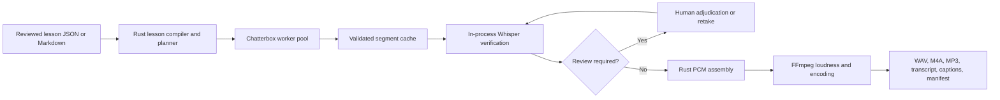

# study-tts

`study-tts` is a local-first Rust application under active development for converting reviewed technical lessons into long-form audio study guides with natural speech, stable voices, resumable generation, and auditable quality controls.

The project targets software-engineering education, technical interview preparation, and repeated listening. It uses Rust for every durable decision, Chatterbox for speech synthesis, an in-process Whisper verifier for post-render text-integrity triage, and FFmpeg for final audio processing.

> [!IMPORTANT]
> This repository contains the tested E0-S0 walking skeleton. It uses a deterministic tone synthesizer, not Chatterbox, to exercise lesson loading, planning, validated WAV caching, Rust PCM assembly, real FFmpeg M4A export, and a minimal private-preview manifest. The Chatterbox worker, production schemas, hardened recovery, and product CLI are not implemented. Planned commands and behavior remain architectural intent rather than completed functionality.

## Goals

- Generate natural long-form narration for technical study material.
- Preserve reviewed technical meaning while converting notation into understandable speech.
- Run locally under Ubuntu 24.04 in WSL2 after model installation.
- Cache valid speech segments and resume without regenerating completed work.
- Replace one segment or select another take without rebuilding unrelated speech.
- Produce a complete listening package with WAV, M4A, MP3, chapters, transcript, captions, checksums, and quality evidence.
- Keep synthesis, verification, and final publication decisions explicit and auditable.

The priority order is technical correctness, comfortable listening, retention value, stable voices, recoverability, local privacy, generation speed, and implementation simplicity.

## Current status

| Area | Status |
|---|---|
| Architecture | Accepted in [ADR-0001](docs/adr/ADR-0001-production-rust-study-guide-tts.md) |
| Delivery backlog | Approved in [DELIVERY-PLAN.md](DELIVERY-PLAN.md) |
| Rust workspace | Four-crate workspace with a tested end-to-end skeleton |
| Chatterbox worker | Not started |
| ASR verifier | Not started |
| CLI | Product commands not implemented |
| Schemas and fixtures | Two-segment skeleton fixture present; production schemas not implemented |
| Production qualification | Not started |

The first delivery target is a private, human-reviewed MVP. It will accept canonical lesson JSON with hand-authored spoken text, use a single persistent Chatterbox worker, produce the complete audio package and run report, and record immutable human approval. It will remain mechanically marked as `private_preview`; ASR integration follows M2, and production publication stays disabled until the production verification, loudness, licensing, recovery, and long-form qualification gates pass.

### What works today

The workspace declares these crates:

- `study-tts-cli`
- `study-tts-core`
- `study-tts-runtime`
- `study-tts-testkit`

The T4 walking skeleton loads reviewed provisional JSON fixtures, derives deterministic cache keys, proves both cache hits and speech-affecting misses, synthesizes deterministic tone WAVs through a fake boundary, assembles exact PCM and silence in Rust, and writes outputs beneath a contained `previews/<lesson-id>/` directory. It validates lesson content before subprocess startup, preflights FFmpeg and ffprobe before synthesis, encodes and validates mono AAC/M4A, records their resolved identities and effective arguments, and writes a checksummed minimal manifest. CI executes prebuilt tests as the normal runner user with runtime network egress denied, and the production publication entry point returns a typed refusal.

The boundary order and deliberate G1 deferrals are recorded in [E0-S0 Walking Skeleton](docs/architecture/WALKING-SKELETON.md).

## Architecture



The architecture has five runtime elements:

1. A Rust application owns lesson validation, planning, identities, caching, job state, recovery, PCM assembly, manifests, and the CLI.
2. A configurable pool of persistent Python processes runs the standard Chatterbox backend. Pool size defaults to one.
3. Atomic JSON documents and checksummed filesystem artifacts store jobs, cache entries, selections, verification evidence, and provenance.
4. Pinned `whisper-rs 0.16.0` performs non-authoritative post-render text-integrity triage after the Chatterbox pool unloads.
5. FFmpeg and ffprobe handle canonical conversion, loudness normalization, inspection, metadata, and final encoding.

Rust owns every durable decision. Model-specific code remains behind a versioned newline-delimited JSON protocol so the inference runtime cannot leak into the lesson domain.

## Production processing model

```text
validate reviewed lesson
  -> plan deterministic segments and pauses
  -> render and cache every valid segment
  -> drain and unload Chatterbox workers
  -> verify selected cached segments with ASR
  -> adjudicate findings or request retakes
  -> assemble verified selections in Rust
  -> normalize and encode from one lossless master
  -> inspect, checksum, and publish the package
```

Synthesis validity and verification status are separate. A structurally valid segment can remain cached while verification is missing, stale, or under review; changing ASR settings must not invoke Chatterbox again.

The private MVP stops before ASR and uses recorded human review as its correctness authority. This removes the native ASR toolchain from the MVP critical path without changing the production architecture.

## Technical lesson model

The planned lesson format separates readable text from exact synthesis input:

- `display_text` preserves the reviewed transcript.
- `spoken_text` contains the deterministic, reviewed TTS rendering.
- transformation records explain material differences between them.
- protected terms prevent unsafe segmentation and define approved ASR alternatives.
- stable segment IDs make cache reuse, review, and retakes precise.

The default teaching format supports two stable roles:

- **Nadia:** instructor, explanation, example, correction, pseudocode, synthesis, and recap.
- **Tom:** learner, question, challenge, plausible mistake, clarification, and recall cue.

The two-speaker format must pass the listening gate. A documented single-instructor fallback is used if separate turns sound like intercut monologues rather than credible instruction.

## Planned output package

Each completed package will contain:

| Artifact | Purpose |
|---|---|
| `lesson.wav` | Normalized lossless master |
| `lesson.m4a` | Default listening file |
| `lesson.mp3` | Compatibility listening file |
| `transcript.txt` | Readable speaker-labelled transcript |
| `transcript.vtt` | Segment-level captions derived from exact PCM boundaries |
| `chapters.ffmetadata` | Chapter source metadata |
| `manifest.json` | Inputs, identities, tools, selections, artifacts, and checksums |
| `quality-report.json` | Automated checks, ASR evidence, and review status |

Both lossy outputs are encoded independently from the lossless master. One lossy format is never used as the source for another.

## Development environment

The initial development and runtime target is Ubuntu 24.04 under WSL2. Keep the repository, Rust build output, Python environment, model files, caches, fixtures, and generated jobs on the WSL2 Linux filesystem rather than under `/mnt/c`.

Required system capabilities include:

- Rust and Cargo;
- GCC and the standard Linux build toolchain;
- CMake;
- Python 3 with `venv` support;
- FFmpeg and ffprobe;
- Git, curl, `pkg-config`, Clang, and OpenSSL development headers.

The baseline environment check is:

```bash
gcc --version
cmake --version
python3 --version
ffmpeg -version
ffprobe -version
```

The exact supported system versions, model installation procedure, and Python worker lockfile will become authoritative during the G0 feasibility work.

## Verify the current implementation

Run these commands from the repository root inside WSL2:

```bash
cargo check --workspace
cargo test --workspace
cargo fmt --all -- --check
cargo clippy --workspace --all-targets --all-features -- -D warnings
cargo test --offline -p study-tts-testkit --test walking_skeleton --locked
```

These commands validate the Rust boundaries and the fake-worker audio path. They do not install Chatterbox, download model weights, or qualify natural speech.

## Planned CLI

The following interface is architectural intent and is not implemented yet:

```bash
study-tts doctor
study-tts lesson compile source.md --out lesson.json
study-tts lesson validate lesson.json
study-tts render lesson.json --format m4a
study-tts resume <job-id>
study-tts inspect <job-id>
study-tts retake <job-id> --segment seg-0042
study-tts takes accept <job-id> --segment seg-0042 --out lesson.takes.json
study-tts invalidate <job-id> --segment seg-0042
study-tts export <job-id> --format wav,m4a,mp3
study-tts cache verify
study-tts cache prune --older-than 90d --dry-run
```

Every command is planned to support human-readable and structured output. Destructive pruning will remain dry-run by default.

## Planned repository structure

```text
technical-tts/
├── Cargo.toml
├── crates/
│   ├── study-tts-cli/
│   ├── study-tts-core/
│   ├── study-tts-runtime/
│   └── study-tts-testkit/
├── worker/
├── schemas/
├── fixtures/
├── docs/
│   ├── adr/
│   └── operations/
└── data/
```

- `study-tts-core` will own lesson types, normalization, planning, and cache identities without depending on Python, FFmpeg, or a model SDK.
- `study-tts-runtime` will own filesystem state, worker processes, ASR, PCM handling, recovery, and FFmpeg adapters.
- `study-tts-testkit` will provide the fake worker, deterministic audio, fixtures, and fault injection.
- `worker` will contain one production Chatterbox adapter and its locked Python environment.
- `data` will contain local runtime artifacts and will not be committed.

## Delivery roadmap

| Gate | Target | Result |
|---|---:|---|
| **G0a — Skeleton** | Day 2 | Minimal fake-worker WAV-to-M4A pipeline and manifest stay green in CI |
| **G0 — Feasibility** | End week 1 | Real Chatterbox smoke render, lawful voice/content path, reference machine, WAV compatibility, performance and determinism evidence, and provisional contracts |
| **G1 — Vertical slice** | End week 2 | Three real segments become a complete private-preview package |
| **M2 candidate** | End week 3 | Feature-complete private preview enters correction and acceptance |
| **M2 — Private MVP** | End week 4 | Five-minute lesson with cache, resume, retake, run report, full outputs, and immutable human approval |
| **G3 — Production candidate** | Weeks 8–9 | Markdown authoring, integrated ASR with calibration result or amendment path, frozen loudness references, and production state transitions |
| **M3 — Version 1.0** | Weeks 10–12 | Long-form qualification, recovery, rights, operations, and every ADR release gate |

The schedule assumes one engineer and one project owner. G0 measurements control the forecast because model performance, voice availability, and media compatibility can reopen a fundamental decision.

## Testing strategy

Deterministic implementation uses test-driven development. Fast unit, property, schema, golden, fake-worker, filesystem, and fixture-audio tests run on every change. Real Chatterbox, ASR calibration, performance, listening, and long-form soak checks run separately on the named reference machine.

The test plan covers:

- schema compatibility and canonical serialization;
- complete synthesis and verification identities;
- cache corruption, atomic publication, and pruning safety;
- cancellation and recovery at every durable state;
- worker protocol faults, containment, timeouts, and process cleanup;
- technical normalization and protected terms;
- exact PCM arithmetic, silence, ramps, joins, loudness, and encoding;
- ASR omissions, insertions, substitutions, repetitions, and continuations;
- explicit take selection and retake continuity;
- offline operation, dependency rights, and clean-machine release rehearsal.

Evidence work uses documented protocols and immutable results. Listening panels, legal review, performance qualification, and human adjudication are not presented as automated tests.

## Privacy, security, and voice policy

- Normal rendering operates offline after installation.
- Source text, spoken text, and voice-reference paths are redacted from logs by default.
- Worker writes are confined to an assigned staging root.
- External processes are invoked with discrete checked arguments, never through constructed shell commands.
- Voice profiles require consent or license records, immutable checksums, and permitted-use scope.
- Public-figure voice cloning is prohibited.
- Valid cache entries, quarantined evidence, jobs, and published output are never deleted implicitly.

## Explicit non-goals for version 1.0

- Multiple production TTS backends
- SQLite or a database-backed queue
- LLM-generated lesson content
- Desktop or web UI
- Remote workers or hosted TTS
- Real-time conversation
- Model training or fine-tuning
- Native Rust reimplementation of Chatterbox
- Mobile inference

These capabilities require measured evidence and a separate decision record. They are not placeholders in the current backlog.

## Documentation

- [Documentation index](docs/INDEX.md) — authoritative routing for governance, testing, operations, evidence, templates, and decision records
- [ADR-0001](docs/adr/ADR-0001-production-rust-study-guide-tts.md) — accepted architecture, scope, invariants, testing strategy, and production acceptance
- [Delivery plan](DELIVERY-PLAN.md) — approved milestone scope, epics, stories, tasks, named tests, evidence, risks, and sign-offs
- [Project execution charter](docs/governance/PROJECT-EXECUTION-CHARTER.md) — release profiles, ownership, work-in-progress, readiness, completion, and approvals
- [Traceability matrix](docs/governance/TRACEABILITY-MATRIX.md) — ADR requirement to story, validation, and gate mapping
- [GitHub Project playbook](docs/governance/GITHUB-PROJECT-PLAYBOOK.md) — backlog operation and story start/close rules
- [Test strategy](docs/testing/TEST-STRATEGY.md) — TDD, test tiers, required suites, and failure policy
- [Development workflow](docs/operations/DEVELOPMENT-WORKFLOW.md) — implementation and pull-request workflow
- [AGENTS.md](AGENTS.md) — repository implementation rules and source-of-truth routing

ADR-0002 through ADR-0005 now exist as proposed evidence records. They remain unaccepted until their required measurements and approvals are complete.

## License status

The Cargo workspace declares `MIT OR Apache-2.0`, although the corresponding license text files are not yet present in the repository. Add them before distributing a release. Chatterbox code, model weights, voice references, Whisper models, FFmpeg, and generated audio may have separate terms; the project will record and validate each applicable license before production release or distribution.
