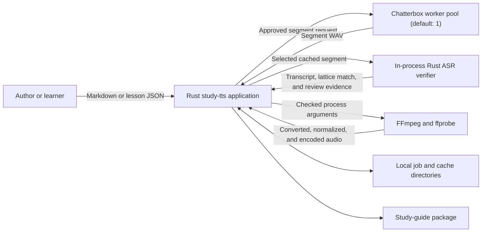
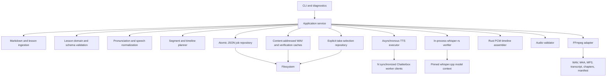
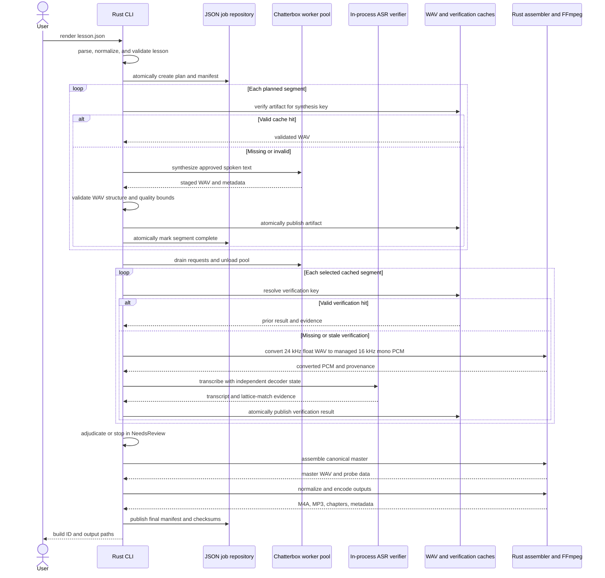
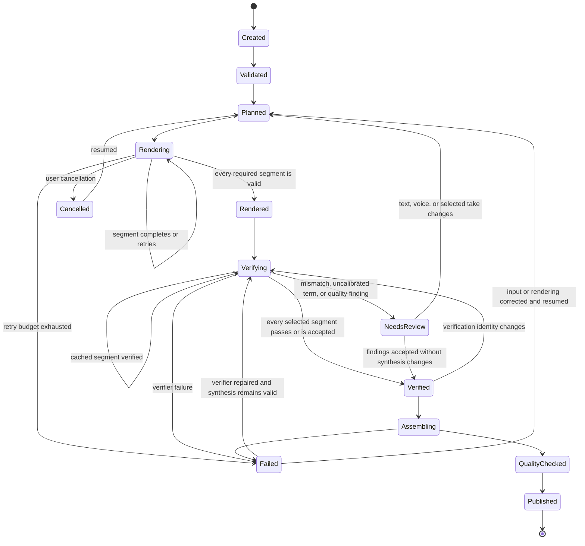
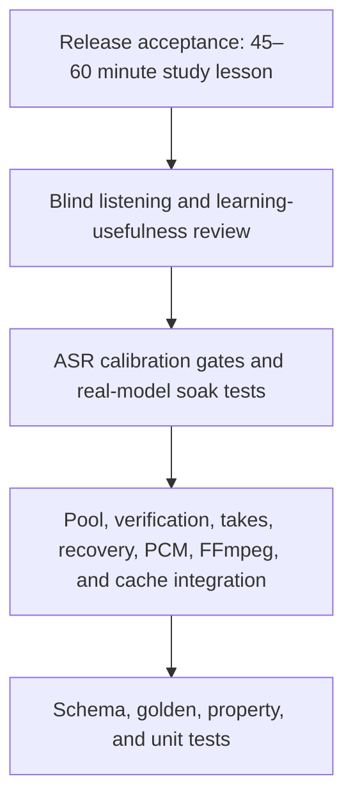

# ADR-0001: Minimal Production Architecture for a Rust Technical Study-Guide TTS Pipeline

- **Status:** Accepted
- **Date:** 2026-08-15
- **Decision owner:** Project maintainer
- **Development environment:** Ubuntu 24.04 under WSL2
- **Initial deployment:** Single-user, local-first WSL2 CLI
- **Review trigger:** Failure of a Phase 0 Chatterbox gate, failure of the 60-minute soak test, or expansion beyond a single local user

## 1. Decision

Build the first production-capable version with five runtime elements:

1. **one Rust application** for ingestion, lesson validation, technical speech normalization, orchestration, caching, recovery, audio validation, and the CLI;
2. **one replaceable Chatterbox worker implementation**, running as a configurable pool of persistent processes with a versioned newline-delimited JSON protocol and a default pool size of one;
3. **the filesystem plus atomic JSON manifests** for job state, content-addressed segment caching, recovery, and provenance;
4. **one pinned in-process Rust ASR verifier**, built with `whisper-rs 0.16.0` and its Cargo-locked `whisper-rs-sys`/`whisper.cpp` stack, for non-authoritative post-render text-integrity triage;
5. **FFmpeg and ffprobe** for canonical audio conversion, loudness normalization, inspection, metadata, and final encoding.

Do not implement SQLite, multiple installed TTS backends, Dia, LLM lesson generation, a desktop interface, remote workers, or a distributed scheduler in the initial release. ASR is included only as a quality-control sensor: it cannot alter approved text, approve a release, or silently reject valid speech.

This is intentionally small. Production quality will come from explicit schemas, atomic writes, deterministic planning, cache correctness, process isolation, bounded retries, rigorous validation, complete manifests, and long-form listening tests rather than from a large toolchain.

## 2. Executive rationale

The product must generate long-form audio study guides that teach technical material accurately and remain comfortable during repeated listening. It does not need four speech models, a database, or an LLM to do that. It does need a bounded local ASR check because omissions, repetitions, insertions, and hallucinated continuations are characteristic TTS failures, while structural audio checks cannot detect them and exclusive reliance on manual review makes the primary correctness gate unnecessarily expensive.

The controlling architecture therefore separates three responsibilities:

- the **lesson layer** decides what should be taught and how it should be spoken;
- the **TTS worker** turns one approved segment into speech;
- the **verification and audio layer** checks text integrity, controls pauses and sequencing, normalizes loudness, encodes outputs, and validates the package.

The Rust application owns every durable decision. The model worker remains replaceable because current high-quality open-source TTS implementations are Python-first, model APIs change quickly, and inference should not contaminate the domain model.

## 3. Context

### 3.1 Product objective

The program converts technical source material into audio study guides for:

- software-engineering concepts;
- programming languages and frameworks;
- algorithms and data structures;
- system design;
- cloud, security, networking, and platform engineering;
- technical interview preparation;
- repeated listening, retrieval practice, and memorization.

The intended result resembles a careful technical tutor. It does not read raw Markdown or source code mechanically, manufacture podcast banter, or optimize expressiveness at the expense of technical precision.

### 3.2 Default teaching format

Two stable speakers are supported at the lesson level even though the TTS worker is a single backend:

- **Nadia:** instructor, definition, explanation, example, correction, pseudocode, and synthesis.
- **Tom:** learner, interruption, challenge, plausible error, clarification, recap, and recall cue.

Each turn is rendered separately with a stable voice profile. The application uses one backend implementation through a configurable persistent worker pool whose default and qualification size is one.

The default study sequence is:

```text
Problem
  -> prerequisite or definition
  -> conceptual explanation
  -> why it works
  -> concrete example
  -> challenge or plausible mistake
  -> correction
  -> spoken pseudocode
  -> concise recap
  -> compressed rule
  -> recall prompt, silence, and answer
```

Not every lesson needs every stage. The program will not add dialogue merely to satisfy a template.

### 3.3 Priority order

1. technical correctness;
2. comfortable long-form listening;
3. retention and retrieval practice;
4. stable voices;
5. reliable regeneration and recovery;
6. local privacy;
7. generation speed;
8. implementation simplicity.

### 3.4 Assumptions

- The first deployment has one user and one active render job.
- Ubuntu 24.04 under WSL2 is the first development and runtime environment.
- The repository lives in the WSL2 Linux filesystem rather than under `/mnt/c` because Rust builds and dependency-heavy worker environments perform better there.
- Native Linux compatibility is retained; native Windows packaging is deferred.
- English is the initial content language.
- Source material and lesson text are available locally.
- Chatterbox must run correctly on CPU at a measured real-time factor no greater than `6.0` on the named reference machine. A slower result makes GPU acceleration a prerequisite or reopens the backend decision before application integration.
- Model weights and worker dependencies may be installed before offline use.
- The user reviews lesson text before producing a final long-form build.

### 3.5 Development environment baseline

The project is developed under Ubuntu 24.04 in WSL2. Rust, Python, FFmpeg, model-worker dependencies, caches, fixtures, and build outputs are installed inside WSL2 rather than shared with Windows installations.

Required system packages:

- GCC and the standard Linux build toolchain;
- CMake;
- Python 3 and `venv` support;
- FFmpeg and ffprobe;
- Git, curl, `pkg-config`, Clang, and OpenSSL development headers.

The baseline environment check is:

```bash
gcc --version
cmake --version
python3 --version
ffmpeg -version
ffprobe -version
```

All five commands must succeed before the Rust workspace or model worker is diagnosed. The exact versions are recorded by `study-tts doctor` and included in diagnostic bundles; release manifests record versions that can affect generated artifacts.

GPU acceleration is not part of bootstrap. The first complete pipeline uses the fake worker, then qualifies Chatterbox on CPU. Any AMD GPU or ROCm proposal must first identify the exact GPU, WSL2 exposure, supported ROCm and PyTorch versions, and a passing Chatterbox smoke render; acceleration is not an assumed fallback.

## 4. Scope

### 4.1 Required capabilities

The first production release shall:

- accept UTF-8 Markdown and canonical lesson JSON;
- preserve source-code blocks, inline code, headings, lists, links, symbols, and identifiers during parsing;
- compile Markdown into a reviewable lesson draft without inventing new facts;
- validate a versioned lesson schema before rendering;
- separate readable transcript text from exact TTS input text;
- apply deterministic pronunciation and technical-normalization rules;
- support Nadia and Tom through stable voice profiles;
- render at the segment or short-paragraph level;
- cache every valid segment by its complete synthesis identity;
- resume after interruption without regenerating valid segments;
- regenerate one selected segment without invalidating unrelated audio;
- request and retain a distinct numbered take without corrupting content-addressed cache semantics;
- verify every selected cached segment locally after rendering, and route material text mismatches or uncalibrated protected terms to review;
- assemble pauses and speech into a canonical master WAV;
- export M4A/AAC and MP3 from that master;
- write chapters, transcript, captions where practical, quality results, and a complete provenance manifest;
- operate offline after installation;
- provide actionable diagnostics for missing models, incompatible devices, missing FFmpeg, invalid lessons, corrupt cache entries, and worker failures.

### 4.2 Quality attributes

- **Correctness:** spoken technical claims match the approved lesson.
- **Recoverability:** interruption loses at most the in-progress segment.
- **Auditability:** every output is traceable to source, lesson, rules, voice, model, worker, parameters, and tool versions.
- **Replaceability:** a different TTS worker can implement the same protocol without changing lesson or audio code.
- **Security:** untrusted input cannot escape managed directories or inject process arguments.
- **Privacy:** rendering uses no network after installation unless a later ADR explicitly changes the default.
- **Maintainability:** domain modules do not import Python, PyTorch, CUDA, FFmpeg bindings, or a specific model SDK.
- **Operability:** a failed build explains what failed, what remains valid, and the exact safe recovery command.

### 4.3 Explicitly deferred

| Capability | Initial decision | Evidence required before addition |
|---|---|---|
| Second production TTS backend | Do not build | Current backend fails a defined quality, hardware, or reliability requirement |
| Dia or dialogue-native generation | Do not build | Independent turns demonstrably fail conversational quality and block-level regeneration is acceptable |
| SQLite | Do not build | Multiple concurrent jobs, queryable history, UI state, or JSON recovery becomes materially unreliable |
| LLM lesson generation | Do not build | Authored/deterministic compilation is stable and review controls can prevent unsupported claims |
| ASR as an authoritative acceptance oracle | Do not build | A calibrated local verifier may route defects to review, but only approved text and human adjudication establish correctness |
| Desktop or web UI | Do not build | CLI workflow and schemas stabilize through real use |
| Remote workers or hosted TTS | Do not build | Local hardware cannot meet measured needs or remote deployment becomes an explicit product requirement |
| Native Rust model reimplementation | Do not build | Worker packaging becomes the dominant problem and a maintained native runtime proves parity |
| Database-backed queue | Do not build | More than one producer or consumer exists |

### 4.4 Non-goals

- public multi-tenant service;
- real-time voice conversation;
- arbitrary voice marketplace;
- automatic web scraping;
- automatic factual research;
- background music or entertainment sound design;
- mobile inference;
- training or fine-tuning TTS models;
- bit-identical model output across GPU models and driver versions;
- support for every technical notation in version 1.0.

## 5. Model-backend decision

Version 1 uses the standard Chatterbox model as its only production TTS backend. Chatterbox Nano and Kokoro-82M ONNX are no longer candidates, benchmark fixtures, fallback installations, or runtime dependencies.

This decision favors Chatterbox voice quality, expressive control, and voice-cloning capability over the smaller installation and faster CPU-oriented path offered by Nano or Kokoro. The cost is higher inference demand and a more substantial Python worker environment. That tradeoff is accepted.

The Rust boundary remains capability-based and replaceable, but replaceability is an architectural safeguard rather than a reason to build unused adapters. A second backend requires evidence that Chatterbox cannot meet a defined hardware, quality, licensing, or reliability requirement.

Relevant primary references:

- [Chatterbox official repository](https://github.com/resemble-ai/chatterbox)
- [Chatterbox standard TTS implementation](https://github.com/resemble-ai/chatterbox/blob/master/src/chatterbox/tts.py)
- [PyTorch reproducibility guidance](https://docs.pytorch.org/docs/stable/notes/randomness.html)
- [Hugging Face offline-mode guidance](https://huggingface.co/docs/transformers/installation#offline-mode)
- [`whisper.cpp` official repository](https://github.com/ggml-org/whisper.cpp)
- [`whisper-rs` 0.16.0 `FullParams` documentation](https://docs.rs/whisper-rs/0.16.0/whisper_rs/struct.FullParams.html)
- [`hound` WAV reader documentation](https://docs.rs/hound/latest/hound/struct.WavReader.html)
- [FFmpeg `loudnorm` filter documentation](https://ffmpeg.org/ffmpeg-filters.html#loudnorm)
- [Microsoft WSL filesystem guidance](https://learn.microsoft.com/windows/wsl/filesystems)

Chatterbox Nano, Kokoro-82M ONNX, Qwen3-TTS, Chatterbox Turbo, and Dia are not version 1 candidates. Dia also changes the unit of retry, correction, cache invalidation, and quality review. None will be integrated without a separate decision record supported by a measured failure of the Chatterbox path.

### 5.1 Chatterbox qualification procedure

Before production integration is accepted, render the reviewed 3–5 minute qualification lesson through a pinned Chatterbox environment on the target WSL2 machine. Use the intended Nadia and Tom voice profiles, normalize playback loudness for review, and record the exact model, tokenizer or codec, worker, dependency, voice-profile, and device identities. Hand-author the fixture's `spoken_text` in the exact normalized form the production normalizer is expected to emit.

The fixture must include:

- ordinary technical prose;
- Nadia and Tom turns;
- acronyms and initialisms;
- camelCase, PascalCase, snake_case, dotted names, and generic types;
- numbers, versions, ranges, units, and equations;
- conceptual code explanation;
- one literal API-name explanation;
- correction and compressed recap;
- recall prompt and intentional silence;
- calm, emphatic, and deliberately slow delivery.

Hard gates:

- no omitted or added technical phrase;
- no persistent voice-identity failure;
- no severe pronunciation defect in a protected term;
- no backend failure across three complete renders;
- CPU real-time factor no greater than `6.0`, measured as synthesis wall time divided by generated-audio duration, excluding one-time installation and model download;
- median dialogue-credibility score of at least `4/5`, with no majority finding that the result sounds like unrelated monologues intercut;
- compatible license and local/offline deployment.

Qualification scorecard:

| Criterion | Release evidence |
|---|---|
| Technical pronunciation and intelligibility | No protected-term defect or loss of meaning in the reviewed fixture |
| Long-listening naturalness and fatigue | Listener scores and defect notes from the qualification and soak tests |
| Voice consistency | Nadia and Tom remain recognizable across repeated independent turns |
| Pacing and instructional prosody | Explanations, corrections, recaps, and recall prompts remain distinct and usable |
| Reliability across repeated segments | Three complete qualification renders without backend failure |
| Target-machine performance | CPU `RTF <= 6.0`, peak RAM, model-load time, thread count, and projected 60-minute completion time |
| Dialogue credibility | Median score at least `4/5` across at least three listeners and no majority intercut-monologue defect |
| Installation and maintenance cost | Reproducible locked environment, offline render, and documented repair path |

Chatterbox must clear every hard gate before the real worker becomes the default backend. `RTF > 6.0` makes supported GPU acceleration a prerequisite or reopens the backend decision. Failure of dialogue credibility changes the version 1 format to single-instructor narration, with learner questions rewritten as instructor-voiced rhetorical prompts; it does not force adoption of a dialogue-native model. Other failures pause production qualification and do not silently substitute Nano, Kokoro, or another model. ADR-0002 records the immutable Chatterbox revision, runtime, voice sources and conditionals, generation parameters, target hardware, and measured qualification results.

### 5.2 Voice-profile prerequisite

Chatterbox includes one packaged default conditioning profile, but one profile cannot provide two distinct, provenance-ready Nadia and Tom voices. Qualification cannot begin until both production profiles have an accepted source:

- the maintainer's own recording with an explicit permitted-use declaration;
- a commissioned recording with a signed release covering local synthesis and distribution; or
- a specifically identified permissively licensed recording whose dataset and speaker terms have been reviewed and retained.

Each voice directory contains the immutable reference WAV, its source and consent record, and a precomputed Chatterbox conditional artifact. The conditional is generated once with a pinned extractor stack, loaded through a weights-only path, checksummed, and used for synthesis without recomputing it at worker startup. The profile identity includes the conditional hash and extractor identity; the reference hash remains provenance rather than the immediate synthesis identity. A generic claim that audio is public, synthetic, or included in a corpus is not sufficient evidence of permission.

## 6. System architecture

The controlling stage order is:

```text
Plan
  -> render and cache every valid segment
  -> drain and unload the Chatterbox worker pool
  -> verify cached segments with ASR
  -> adjudicate or retake flagged segments
  -> assemble verified selections
  -> normalize, encode, and publish
```

### 6.1 System context



Only the Rust application owns job state and final artifacts. Each worker may write one staged WAV beneath a path assigned by the parent. The application validates and publishes canonical segments before verification, drains and unloads the worker pool, and then verifies immutable cache artifacts. FFmpeg receives explicit input and output paths from the application.

### 6.2 Internal components



Dependency direction points toward the lesson and rendering domain. Infrastructure implements domain ports; the domain never imports infrastructure.

### 6.3 End-to-end processing sequence



### 6.4 Job state machine



## 7. Rust architecture

### 7.1 Workspace structure

Begin with a small workspace rather than one crate per conceptual component:

```text
technical-tts/
  Cargo.toml
  crates/
    study-tts-cli/        executable, commands, diagnostics, configuration
    study-tts-core/       lesson types, normalization, planning, cache keys
    study-tts-runtime/    filesystem state, worker pool, ASR, PCM, FFmpeg adapters
    study-tts-testkit/    fixtures, fake worker, audio test helpers
  worker/
    pyproject.toml
    lockfile
    worker.py
  schemas/
    lesson-v1.schema.json
    worker-v1.schema.json
    takes-v1.schema.json
    verification-v1.schema.json
    manifest-v1.schema.json
  fixtures/
    lessons/
    pronunciation/
    audio/
  docs/
    adr/
    operations/
```

Split crates further only when compile times, dependency boundaries, ownership, or reuse justify it.

### 7.2 Candidate Rust dependencies

| Concern | Candidate | Reason |
|---|---|---|
| Async process and I/O | `tokio` | Persistent worker, cancellation, timeouts, bounded task orchestration |
| Object-safe async port | `async-trait` | Stable `TtsExecutor` boundary with concurrent `&self` requests |
| Serialization | `serde`, `serde_json` | Canonical lesson, protocol, job, and manifest formats |
| Schema generation | `schemars` | Keep Rust types and checked-in JSON Schema aligned |
| CLI | `clap` | Stable subcommands and non-interactive use |
| Errors | `thiserror`, `miette` | Typed internal errors and source-aware user diagnostics |
| Hashing | `blake3` | Fast content identities and cache keys |
| Logging | `tracing`, `tracing-subscriber` | Structured events with job and segment context |
| Temporary files | `tempfile` | Safe staged writes |
| WAV and PCM | `hound` or equivalent | Validate and assemble canonical 24 kHz mono 32-bit IEEE-float WAV without a concat subprocess |
| In-process ASR | `whisper-rs 0.16.0` | One pinned model context, explicit decoder controls, and independent per-segment states |
| Markdown parsing | `pulldown-cmark` or equivalent | Structural parsing rather than regular expressions |

Dependency versions are pinned through `Cargo.lock`. A crate is added only when it removes more risk than it introduces.

### 7.3 CLI

```text
study-tts doctor
study-tts lesson compile source.md --out lesson.json
study-tts lesson validate lesson.json
study-tts render lesson.json --format m4a
study-tts resume <job-id>
study-tts inspect <job-id>
study-tts retake <job-id> --segment seg-0042
study-tts takes accept <job-id> --segment seg-0042 --out <lesson>.takes.json
study-tts invalidate <job-id> --segment seg-0042
study-tts export <job-id> --format wav,m4a,mp3
study-tts cache verify
study-tts cache prune --older-than 90d --dry-run
```

Every command supports human-readable output and `--json`. Exit-code classes distinguish invalid input, missing dependency, incompatible environment, worker failure, audio-quality failure, cancellation, and internal error.

### 7.4 Configuration hierarchy

Configuration precedence:

1. command-line option;
2. lesson profile;
3. project configuration;
4. user configuration;
5. compiled safe default.

Configuration files contain no secrets in version 1. Network credentials do not exist because normal rendering is offline.

Resource configuration names the worker-pool size, threads per worker, maximum aggregate worker RAM, ASR threads, job/cache/output roots, and offline mode. `worker_pool_size` defaults to `1`. Preflight rejects a configuration if its measured aggregate memory exceeds the limit or if `worker_pool_size * threads_per_worker` exceeds the available physical-core budget.

## 8. Lesson representation

### 8.1 Canonical format

JSON is the canonical intermediate representation because it is explicit, diffable, schema-validatable, and language-neutral. Markdown is authoring input, not the render contract.

```json
{
  "schema_version": "1.0",
  "lesson_id": "excel-bijective-base-26",
  "title": "Excel Column Labels as Bijective Base Twenty-Six",
  "language": "en-US",
  "learning_objectives": [
    "Explain why the numeral system has no zero digit",
    "Reproduce the conversion recurrence"
  ],
  "source": {
    "content_hash": "...",
    "references": []
  },
  "speakers": {
    "nadia": { "voice_profile": "nadia-v1" },
    "tom": { "voice_profile": "tom-v1" }
  },
  "segments": [
    {
      "id": "seg-0001",
      "speaker": "nadia",
      "role": "explanation",
      "source_refs": ["block-001"],
      "display_text": "Excel column labels use bijective base 26.",
      "spoken_text": "Excel column labels use bijective base twenty-six.",
      "style": "calm_explanatory",
      "pause_after_ms": 550,
      "review_status": "approved"
    }
  ]
}
```

### 8.2 Invariants

- schema major version is supported;
- lesson and segment IDs are unique and stable;
- every segment references source material or is explicitly marked editorial;
- `display_text` and `spoken_text` are both present;
- `spoken_text` remains within the selected backend limit;
- speaker, role, style, and voice profile are declared;
- pause values remain within policy unless an override is annotated;
- recall prompts include a deliberate response interval;
- no segment marked unreviewed can enter a production build;
- canonical serialization produces a stable byte representation for hashing;
- unknown fields follow the declared minor-version compatibility policy.

### 8.3 Display text versus spoken text

`display_text` is the readable, faithful transcript. `spoken_text` is the exact content sent to the TTS worker. Keeping them separate prevents a pronunciation edit from hiding a semantic change.

Each transform can produce an audit record:

```json
{
  "rule": "identifier.conceptual",
  "before": "Number.MAX_SAFE_INTEGER",
  "after": "JavaScript's maximum safely representable integer",
  "source_ref": "block-017",
  "reason": "Conceptual explanation rather than API-name memorization"
}
```

## 9. Source ingestion and lesson compilation

### 9.1 Markdown parsing

Use a structural Markdown parser. Do not strip markup with regular expressions because fenced code, nested lists, inline code, links, and punctuation carry meaning.

The parser emits stable source blocks:

- heading;
- paragraph;
- list item;
- fenced code;
- inline-code span;
- quotation;
- link label and destination;
- table converted to a reviewable linear representation;
- explicit pronunciation directive.

### 9.2 Deterministic compilation only

Version 1 does not use an LLM. Markdown compilation performs only deterministic, reviewable operations:

- retain source order and block references;
- remove markup that should not be spoken;
- convert headings into section metadata rather than reading “heading level two”;
- preserve code separately from conceptual prose;
- split material into reviewable draft segments;
- apply configured learning-stage annotations only when supplied by the author;
- emit warnings for material that cannot be transformed safely.

The application may provide templates and prompts for a human author, but it does not invent explanations, examples, or technical claims.

### 9.3 Technical speech normalization

The normalizer handles:

- Unicode normalization;
- whitespace and punctuation suitable for speech;
- numbers, dates, versions, ranges, units, and symbols;
- acronyms and initialisms;
- camelCase, PascalCase, snake_case, kebab-case, dotted names, and namespaces;
- URLs by policy: omit, describe, or speak a short domain;
- code-specific literal reading versus conceptual explanation;
- exact project lexicon entries;
- protected phrases that must never be split;
- sentence segmentation that preserves abbreviations and technical tokens.

Examples:

| Source | Context | Spoken result |
|---|---|---|
| `charCodeAt(0)` | API memorization | “char code at, with index zero” |
| `charCodeAt(0)` | conceptual explanation | “get the character's numeric code” |
| `O(n log n)` | complexity | “order n log n” |
| `1..=10` | Rust syntax | “the inclusive range from one through ten” |
| `Result<T, E>` | Rust type | “Result of T or E” |
| `HTTP 429` | operations | “H T T P status four twenty-nine” |

The lexicon wins over generic rules. Conflicting exact rules fail validation rather than choosing silently.

## 10. TTS worker

### 10.1 Process boundary

The selected model runs in a configurable pool of `N` persistent child processes. Each Python process has its own locked environment, loads one pinned model revision once per lifetime, and accepts one request at a time. The pool owns `N` individually synchronized clients and leases one client for each synthesis request; its default and qualification size is one.

Before loading the model, every worker calls `torch.set_num_threads(threads_per_worker)` and `torch.set_num_interop_threads(1)`. The launcher sets `OMP_NUM_THREADS`, `MKL_NUM_THREADS`, `OPENBLAS_NUM_THREADS`, and `NUMEXPR_NUM_THREADS` to the same per-worker value.

`study-tts doctor` obtains WSL-visible physical-core topology from `lscpu`. If topology is unavailable, it uses half the visible logical processors, with a minimum of one. It reserves one physical core when more than one is available. Preflight enforces both the RAM limit and `pool_size * threads_per_worker <= available_physical_cores`. ASR starts only after the TTS pool is drained and unloaded, and uses the same available-core budget.

Use newline-delimited JSON over standard input and standard output because a local HTTP server would add port allocation, firewall behavior, service ownership, authentication, and orphaned listeners without solving a current requirement.

Standard output is protocol-only. Structured diagnostics use standard error.

### 10.2 Protocol methods

- `initialize`: load model, voice profiles, device, and immutable revisions;
- `health`: report readiness and resource state;
- `capabilities`: report language, input limits, voice and style support, sample format, seed behavior, and device;
- `synthesize`: render one approved segment to an assigned staged path;
- `cancel`: request cancellation of the active synthesis;
- `shutdown`: unload and exit cleanly.

Example:

```json
{"v":1,"id":"req-42","method":"synthesize","params":{"text":"...","voice":"nadia-v1","style":"calm_explanatory","seed":42,"take":0,"output":"/home/user/.local/share/study-tts/jobs/.../staged.wav"}}
{"v":1,"id":"req-42","event":"progress","progress":0.6}
{"v":1,"id":"req-42","result":{"sample_rate":24000,"channels":1,"frames":187200,"model_revision":"..."}}
```

### 10.3 Protocol constraints

- UTF-8, one JSON object per line;
- maximum message length enforced;
- unique request ID per worker lifetime;
- protocol version required in every request;
- output paths canonicalized and confined to the assigned staging root;
- every success includes model, tokenizer/codec, worker, and voice-profile identities;
- heartbeat and synthesis deadlines detect hangs;
- parent owns process lifetime and terminates the full child process tree;
- one synthesis request at a time per worker process;
- pool size is configurable, defaults to one, and may exceed one only after `doctor` verifies both aggregate RAM and physical-core budgets;
- worker restart after protocol corruption, timeout, GPU error, or repeated invalid audio;
- no network access during rendering;
- no untrusted pickle-style model loading when a safe format is available.

Protocol-only standard output is enforced mechanically rather than by convention. At worker startup, Python duplicates the original standard-output file descriptor for protocol frames, redirects file descriptor `1` and `sys.stdout` to standard error, and writes NDJSON only through the retained descriptor. This contains Python prints, native-library writes, progress bars, and warnings. A contract test imports and exercises the pinned model stack while asserting that every byte on the protocol channel belongs to a valid frame.

Offline rendering uses only verified local model paths and Chatterbox's local loader. The worker sets `HF_HUB_OFFLINE=1`, `TRANSFORMERS_OFFLINE=1`, and `HF_HUB_DISABLE_PROGRESS_BARS=1`; any applicable load call uses `local_files_only=True`. Network egress is denied independently during the offline contract test, so configuration mistakes fail before a release.

### 10.4 Backend abstraction

The Rust domain depends on capabilities rather than a model name:

```rust
#[async_trait]
pub trait TtsExecutor: Send + Sync {
    fn descriptor(&self) -> BackendDescriptor;
    fn capacity(&self) -> usize;
    fn validate(&self, request: &SynthesisRequest) -> Result<(), BackendError>;
    async fn synthesize(
        &self,
        request: SynthesisRequest,
        destination: &Path,
    ) -> Result<SynthesisReport, BackendError>;
}
```

Version 1 has one implementation backed by the worker pool. The object-safe asynchronous interface permits actual parallel dispatch without exposing mutable backend ownership to callers. The trait exists to keep model-specific fields outside the lesson and planning layers, not to justify building unused adapters.

### 10.5 Post-render ASR verifier

Version 1 integrates pinned `whisper-rs 0.16.0` into the Rust runtime. Its exact transitive `whisper-rs-sys` revision, and therefore the bound `whisper.cpp` implementation, is locked through `Cargo.lock`. One pinned English ASR model context remains loaded for the complete verification stage. Synthesis and verification never compete for the resource budget: the application renders and caches every structurally valid segment, drains and unloads the Chatterbox pool, then verifies the selected cache artifacts.

Each cached 24 kHz float WAV is converted to managed 16 kHz mono PCM with fixed FFmpeg arguments before ASR. Verification provenance records the FFmpeg version, effective arguments, input checksum, output format, and conversion-identity hash. Conversion output is transient and never replaces the canonical cache artifact.

The decoder uses fixed settings: greedy decoding with `best_of = 1`; English language; translation disabled; `no_context = true`; no initial prompt; `temperature = 0.0`; `temperature_inc = 0.0`; explicit ASR thread count; and one independent decoder state per segment. ADR-0005 freezes every setting and compilation feature.

Whisper output is compared with an expected-ASR token lattice, not directly with `spoken_text`. Ordinary words use deterministic comparison normalization. Each protected term maps to one or more human-approved ASR token sequences, including approved expansions and stable recognition variants. An uncalibrated protected term routes to review once and remains unapproved until a listener confirms that the source audio pronounced it correctly and explicitly adds its pattern. The application never learns a pattern automatically from arbitrary model output.

Verification reports omissions, insertions, substitutions, repetitions, unexpected continuations, uncalibrated terms, and the selected lattice path. Results are written atomically to `cache/verifications/<verification-key>/result.json`. Missing or stale evidence is regenerated without invoking Chatterbox. A verifier crash leaves synthesis artifacts valid and resumes at `Verifying`; findings that need adjudication stop the job in `NeedsReview` and prevent final publication.

ADR-0005 qualifies the verifier with at least 100 human-verified clean segments, including at least 50 protected-term segments, plus 50 seeded examples for each defect class. The release-control gates are:

| Measurement | Required result |
|---|---:|
| False-positive rate on clean segments | `<= 5%` |
| Omission detection | `>= 95%` |
| Insertion detection | `>= 95%` |
| Unexpected-continuation detection | `>= 95%` |
| Substitution detection | `>= 90%` |
| Repetition detection | `>= 80%` |
| Repeated identical-input transcript | Identical in `5/5` runs |
| Segment-order invariance | `100%` |

Failure of any class prevents acceptance of ASR as a release control. Development may continue with complete human review, but version 1 cannot claim automated text-integrity coverage without an ADR amendment or an improved verifier. ASR remains a triage sensor: it never changes approved text or independently establishes correctness.

## 11. Segmentation and rendering

### 11.1 Semantic chunks

Render one complete thought at a time, normally five to twenty seconds. Apply the selected backend's measured hard and recommended limits after semantic segmentation.

Rules:

- never split inside protected phrases, numbers with units, inline code, or an identifier;
- prefer paragraph, sentence, then clause boundaries;
- do not send an entire lesson or chapter as one request;
- render Nadia and Tom turns independently;
- derive stable child IDs when a segment must be subdivided;
- reject a segment that cannot be split safely;
- retain source and parent-segment references for every child;
- avoid crossfades across ordinary speech turns because they can smear consonants;
- analyze each edge in 5 ms RMS frames using the audio-profile silence threshold, add zero samples until each edge has at least 10 ms of silence, and smooth each silence-to-signal transition with a raised-cosine ramp no longer than 5 ms;
- record head/tail padding and ramp sample counts, require exposed endpoints to be zero, and verify every join against the audio-profile discontinuity threshold;
- add silence explicitly through the timeline.

### 11.2 Voice stability

- Nadia and Tom use fixed voice-profile files;
- reference audio and its consent or license evidence are immutable and checksum-pinned;
- precomputed conditioning artifacts are generated once by a pinned extractor, checksum-pinned, and loaded directly for synthesis;
- model revision, seed, style, and decoding parameters are recorded;
- random voice selection is forbidden;
- periodic long-form review compares early, middle, and late segments;
- changing a voice profile invalidates every segment rendered with it.

The worker validates the conditioning artifact against the profile before initialization. An identical reference WAV processed by a different extractor stack is a different profile revision, while reformatting provenance metadata without changing the approved conditional does not invalidate speech.

### 11.3 Retry policy

Default per segment:

1. first synthesis attempt;
2. one retry in the same worker for a transient failure;
3. restart the worker and make one final retry;
4. fail the job while preserving every valid segment.

Invalid input, unsupported capabilities, checksum failure, unsafe path, and schema failure never retry. A fallback model does not exist in version 1, so the system cannot conceal a backend failure through an unreviewed voice change.

Automatic retries preserve the same synthesis identity and `take`. A requested alternate performance increments the segment's `take` integer, produces a new cache key, and retains the prior artifact. After a mid-lesson retake, automated loudness and speaking-rate comparisons plus a listening check evaluate both joins. If no candidate take matches its neighbors, the target and immediate neighbors are regenerated as a reviewable continuity group with new take values; version 1 does not silently time-stretch speech.

## 12. Filesystem state, cache, and recovery

### 12.1 Directory layout

```text
data/
  config.json
  voices/
    nadia-v1/
      profile.json
      reference.wav
      conditionals.pt
      consent.json
    tom-v1/
      profile.json
      reference.wav
      conditionals.pt
      consent.json
  models/
    <backend>/<immutable-revision>/
    whisper/<immutable-revision>/
  cache/
    segments/<key-prefix>/<cache-key>/
      audio.wav
      artifact.json
    verifications/<verification-key>/
      result.json
  quarantine/
    <job-id>/<segment-id>/take-<take>/attempt-<attempt>-<request-id>/
      rejected.wav
      evidence.json
  jobs/
    <job-id>/
      job.json
      lesson.json
      plan.json
      events.ndjson
      staging/
      output/
        lesson.wav
        lesson.m4a
        lesson.mp3
        transcript.txt
        transcript.vtt
        chapters.ffmetadata
        manifest.json
        quality-report.json
```

Each authored lesson has a versioned `<lesson-stem>.takes.json` sibling. Accepted takes files and published manifests are durable cache-prune roots.

### 12.2 Explicit take selection

Take zero is the synthesis default, but a production release requires an explicit versioned takes file even when every selection remains zero. Each selected segment records:

```json
{
  "segment_id": "seg-0042",
  "synthesis_base_key": "...",
  "selected_take": 2,
  "selected_cache_key": "...",
  "audio_blake3": "..."
}
```

The application rejects a selection whose synthesis base key no longer matches the current plan. `study-tts takes accept <job-id> --segment <id> --out <lesson>.takes.json` records an accepted cache artifact without changing it. `plan.json` and the published `manifest.json` repeat the selected take, selected cache key, and audio checksum for every segment.

The takes file reproduces the human selection decision. Byte-identical reconstruction additionally requires the referenced cached artifact or an archived segment bundle; rerunning a nondeterministic model from the same synthesis request is not a byte-reconstruction guarantee. Cache pruning treats every artifact referenced by an accepted takes file or published manifest as live.

### 12.3 Atomic state writes

For every JSON state change:

1. serialize canonical JSON to a sibling temporary file;
2. flush file contents;
3. atomically rename the temporary file over the destination on the qualified WSL2 Linux filesystem;
4. flush the containing directory;
5. append a diagnostic event after the authoritative state is durable.

Only one Rust process may own a job. A per-job lock file contains process identity and creation metadata; stale-lock recovery verifies that the owner is gone before taking ownership. The owner may have multiple in-flight segments, but it serializes authoritative job-document replacement and cache publication. Recovery guarantees apply only to the qualified WSL2 Linux filesystem, not DrvFS mounts.

### 12.4 Job document

`job.json` contains:

- job and build identity;
- state and last successful stage;
- lesson and plan hashes;
- selected worker and model identities;
- segment statuses, attempts, synthesis base keys, selected takes, cache keys, and artifact hashes;
- ASR verification keys, token-diff results, and adjudications;
- final output identities;
- timestamps and application version;
- failure classification and safe recovery action.

### 12.5 Synthesis and verification identities

The cache key is BLAKE3 over canonical serialization of every speech-affecting input:

```text
cache schema version
worker bundle hash
model repository and immutable revision
tokenizer or codec revision
voice-conditioning artifact hash
language
exact spoken text
style and generation parameters
seed and determinism class
take integer
target intermediate sample format
```

`worker_bundle_hash` is computed deterministically from production worker source and imported project-owned modules, the production Python lockfile, the worker protocol schema, launcher configuration that affects inference, and Python runtime and platform ABI identity. Any change to executable project code, locked dependencies, protocol interpretation, inference-affecting launch settings, or runtime ABI invalidates synthesis without relying on a maintainer-controlled revision marker.

It excludes display-only fields such as lesson title and source formatting. It also excludes normalizer, lexicon, compiler, and render-planner versions because their speech-affecting results are already represented by exact `spoken_text`, segment boundaries, and parameters. Those upstream versions remain in the job and artifact manifests for provenance. A planner or rule change therefore invalidates only segments whose resolved synthesis inputs change.

The key identifies a requested synthesis take, not reproducible audio bytes. The cached WAV and its checksum memoize the accepted result. Seed, thread count, PyTorch version, numerical libraries, device, and determinism settings are recorded because identical seeds do not guarantee identical output across dependency, platform, or execution changes.

ASR evidence has a separate verification key over:

- cached audio checksum and exact `spoken_text`;
- `whisper-rs`, `whisper-rs-sys`, bound `whisper.cpp`, and ASR-model identities;
- compilation features and execution device;
- every decoder parameter and ASR thread count;
- ASR input-conversion identity, including FFmpeg version and effective arguments;
- expected-pattern profile hash;
- comparison-normalizer hash and threshold-profile hash.

Changing any verification input reruns verification without regenerating speech or invoking Chatterbox. A cached segment with missing or stale verification evidence remains reusable audio but cannot satisfy the current release gate until reverified and, where required, adjudicated.

### 12.6 Cache acceptance

A cache entry is used only when:

- artifact manifest parses and matches its directory key;
- stored audio checksum matches;
- WAV container and sample data validate;
- sample rate and channel count match the plan;
- duration, silence, edge, `max(abs(sample)) <= 1.0`, and finite-sample checks pass;
- model and worker identities match the request.

Invalid entries move to a collision-free `quarantine/<job-id>/<segment-id>/take-<take>/attempt-<attempt>-<request-id>/` directory. They are not overwritten or deleted automatically.

### 12.7 Recovery

On `resume`:

1. acquire the job lock;
2. parse and validate all authoritative JSON;
3. inspect staged files and published cache artifacts;
4. reconcile an artifact that was atomically published before `job.json` was updated;
5. mark an interrupted attempt abandoned;
6. verify every completed segment rather than trusting state alone;
7. continue rendering from the first missing or invalid artifact, or resume directly at verification when rendering is complete;
8. reuse valid verification evidence and regenerate only missing or stale results;
9. preserve `NeedsReview` findings until accepted or invalidated by a text, voice, or take change;
10. rebuild final outputs if any selected segment or timeline identity changed.

The absence of SQLite is deliberate. Atomic documents are sufficient because one process owns one local job and job history does not require queries.

## 13. Audio architecture

### 13.1 Canonical intermediate

All worker output becomes:

- WAV container;
- mono, 24 kHz, 32-bit IEEE-float PCM, matching standard Chatterbox's native 24 kHz synthesis rate;
- no lossy intermediate encoding.

The rate, channel count, sample format, and bit depth above are mirrored by `CANONICAL_SAMPLE_RATE`, `CANONICAL_CHANNELS`, `CANONICAL_SAMPLE_FORMAT`, and `CANONICAL_BITS_PER_SAMPLE` in `crates/study-tts-core/src/plan.rs`. The two must agree, and changing either requires an ADR amendment rather than an edit.

If the worker already emits the canonical format, no conversion occurs. Otherwise, FFmpeg converts once before cache publication.

`hound` remains the initial Rust WAV implementation because its public API supports 32-bit IEEE-float samples. Phase 1 fixtures must nevertheless round-trip the exact worker, cache, assembled-master, and FFmpeg-produced WAV variants; an unsupported header or extensible-format variant triggers a bounded switch to `symphonia` or an equivalent decoder.

### 13.2 Timeline plan

Rust produces an explicit edit-decision list containing:

- ordered cache artifact paths;
- expected artifact checksums;
- synthesis base keys, selected takes, and selected cache keys;
- start and end calculations;
- pauses after segments;
- frozen voice/style loudness references and measured per-segment gain corrections;
- chapter boundaries;
- transcript and caption timing;
- complete plan hash.

Default pause ranges:

| Boundary | Default range |
|---|---:|
| Within thought | 100–250 ms |
| Sentence boundary | 250–500 ms |
| Speaker transition | 300–700 ms |
| New concept | 500–900 ms |
| Recall question | 1.5–4 seconds |
| Section boundary | 1–2 seconds |

Only the recall-question row is enforced, because §8.2 makes a recall prompt's response interval an invariant rather than a default: `MIN_RECALL_RESPONSE_MS` and `MAX_RECALL_RESPONSE_MS` in `crates/study-tts-core/src/lesson.rs` carry its 1,500 ms and 4,000 ms bounds, refuse any segment whose role is `SegmentRole::RecallPrompt` and whose pause falls outside them, and are pinned to this row by `t3_e1_recall_response_interval_matches_adr`. Those two constants and this row must agree, and changing either requires an ADR amendment rather than an edit. The other five rows are defaults that no code enforces; a segment may declare any pause up to the separate provisional ceiling that module owns, which this section does not set.

Production builds use explicit selected values, not runtime randomness.

Rust assembles canonical segments and generated silence directly into the master WAV. It verifies each checksum before reading, performs checked sample-count arithmetic, applies the edit-decision list without path-string manifests, and derives every segment boundary from the exact written sample count.

The assembly requirements in the paragraph above are enforced by `crates/study-tts-runtime/src/assembly.rs`, which names this section in return: `assembly::verify_recorded_audio` re-hashes each cache entry against its recorded digest before a sample of it is read, `assembly::pause_frames` and `assembly::expected_frames` perform the checked sample-count arithmetic, and `assembly::assemble` reports each boundary as the frame count its write loop actually wrote rather than as a duration recomputed from the declared pause. The two must agree, and changing either requires an ADR amendment rather than an edit. Verifying before reading is satisfied and atomicity between the two is not claimed: the entry is hashed and then reopened to decode, and holding one handle across both needs the directory-relative operations E5-S4 owns.

### 13.3 FFmpeg responsibilities

- convert backend WAV into the canonical intermediate when required;
- run measured loudness normalization;
- encode M4A/AAC and MP3 from the normalized master WAV;
- embed chapters and metadata where supported;
- provide probe results for structural validation.

FFmpeg is invoked without a shell. Every argument is a separate process argument, paths are canonicalized, and the exact executable version and effective arguments enter the build manifest.

### 13.4 Loudness

Begin evaluation around a podcast-oriented integrated target near `-16 LUFS`, with true peak no higher than `-1.5 dBTP`. ADR-0003 owns the final target, silence threshold, transition-discontinuity threshold, and frozen loudness profile.

The first accepted calibration build computes candidate medians and freezes one LUFS reference for each voice-profile hash and style in the committed quality profile. A new voice or style cannot enter production until calibrated. Later builds measure each segment against that frozen reference, apply gain only when deviation exceeds `2 LU`, cap correction at `+/-6 dB`, and route cases that would violate the true-peak ceiling or require a larger correction to review. The plan and manifest record the frozen reference and applied gain for each segment.

A retake can change its own required gain and the final-master normalization measurement, but it cannot change gain decisions for unrelated segments. Do not apply per-segment compression, limiting, or automatic time stretching. This removes accidental level jumps without allowing lesson composition to redefine a voice's target.

Use two-pass EBU R128 normalization on the assembled master. Parse the second-pass JSON and require `normalization_type` to be `linear`; a dynamic fallback is a quality event that fails automatic publication pending review or a revised audio profile.

Do not crossfade adjacent speech. Rust measures 5 ms edge frames, inserts any missing zero padding, and applies raised-cosine transition ramps no longer than 5 ms. It records the padding and ramp sample counts, requires exposed endpoints to be zero, and verifies joins against the ADR-0003 discontinuity threshold.

### 13.5 Output package

- `lesson.wav`: normalized lossless master;
- `lesson.m4a`: default listening file;
- `lesson.mp3`: compatibility output;
- `transcript.txt`: readable speaker-labelled transcript;
- `transcript.vtt`: sample-exact segment-level captions derived from the assembled timeline;
- `chapters.ffmetadata`: chapter source metadata;
- `manifest.json`: provenance, inputs, tools, artifacts, and checksums;
- `quality-report.json`: automated checks and review status.

Never derive one lossy format from another.

The qualification pipeline tests Chatterbox's PerTh watermark on the canonical cached segment, normalized master, M4A, and MP3 outputs. If detection does not survive the selected gain, two-pass normalization, and encode path, the release must state that preservation is unverified and reopen the processing profile; postprocessing never intentionally removes or bypasses watermarking.

### 13.6 FFmpeg licensing

FFmpeg build options determine distribution obligations. The first release should discover an external FFmpeg installation and document the supported version range. Bundling requires a separate license review and an intentionally selected build configuration.

## 14. Observability and diagnostics

Every event includes, where applicable:

- `job_id`;
- `stage`;
- `segment_id`;
- `attempt`;
- `worker_version`;
- `model_revision`;
- `voice_profile`;
- `duration_ms`;
- `error_class`.

Human terminal output remains concise. `events.ndjson` stores structured detail for inspection.

Required measurements:

- source, lesson, plan, and build hashes;
- model load duration;
- synthesis wall time and generated-audio duration;
- real-time factor;
- cache hits and misses;
- retry and restart counts;
- segment duration, maximum absolute sample, silence ratio, edge padding, transition ramps, and join-discontinuity checks;
- assembly and encoding durations;
- output sizes and checksums;
- peak RAM and VRAM where the operating environment exposes them reliably.

`study-tts doctor` verifies:

- WSL2 and supported Ubuntu version;
- supported OS and architecture;
- writable job, cache, model, and output directories;
- job, cache, staging, and output directories reside on the WSL2 Linux filesystem and are not DrvFS mounts such as `/mnt/c`;
- free disk space;
- successful execution and parsed versions for `gcc`, `cmake`, and `python3`;
- FFmpeg and ffprobe presence and versions;
- worker runtime and locked dependencies;
- model and voice-profile checksums;
- pinned `whisper-rs`, `whisper-rs-sys`/`whisper.cpp`, compilation-feature, and ASR-model identities;
- visible physical-core topology, reserved-core policy, pool size, per-worker threads, ASR threads, and oversubscription result;
- GPU or CPU device compatibility;
- offline mode;
- short end-to-end smoke render.

Logs do not contain full source text, spoken text, or raw voice-reference paths by default.

## 15. Security, privacy, and voice policy

### 15.1 Threats

- malicious Markdown or JSON;
- path traversal, symlink escape, and unintended access through mounted Windows filesystems;
- command injection through file names or metadata;
- hostile or corrupted worker messages;
- executable or tampered model artifacts;
- denial of service through extreme input or output;
- source or voice leakage through logs;
- unauthorized voice cloning;
- orphaned child processes;
- unexpected worker network access.

### 15.2 Controls

- parse Markdown and JSON with bounded, maintained parsers;
- enforce file-size, segment-count, message-size, duration, retry, and disk limits;
- canonicalize managed paths and verify containment after resolution;
- reject symlink or reparse-point escapes;
- invoke worker and FFmpeg without a shell;
- treat worker responses as untrusted input;
- pin model and dependency revisions and verify checksums;
- prefer safe tensor formats where available;
- load models from verified local paths, set the named Hugging Face offline variables, disable progress bars, deny worker egress during the offline test, and fail on any attempted download;
- restrict voice-reference permissions;
- redact content from routine logs;
- terminate the complete worker process tree on shutdown or timeout;
- create an SBOM and run dependency, advisory, and license checks for releases.

### 15.3 Voice consent

A cloned voice profile requires:

- a declaration of ownership or documented subject consent;
- permitted-use scope;
- reference-audio checksum;
- creation date and consent status;
- an audit event for each build that uses it.

The record fields above — declaration, permitted-use scope, reference-audio checksum, creation date, and consent status — are mirrored by `VoiceConsent` in `crates/study-tts-core/src/voice.rs`, which reads them from the profile directory's `consent.json` alongside a schema version and the identifier of the backing rights record. The two must agree, and changing either requires an ADR amendment rather than an edit. The audit event is not a record field: it is an obligation on each build that uses the profile, and it is satisfied by the component that renders with it rather than by `consent.json`.

Nadia and Tom must use the approved sources and precomputed conditionals defined in Section 5.2. The packaged Chatterbox default may be used only as a single voice if its model terms and conditioning provenance satisfy the release review; it cannot be relabeled as two distinct speakers. Public-figure cloning is prohibited. PerTh watermark detection is tested across the complete output pipeline, and postprocessing must not intentionally remove it.

### 15.4 Data retention

- source, voices, segments, and outputs remain local;
- cache retention is explicit and visible;
- prune operations are dry-run by default;
- published outputs are never pruned by a cache command;
- quarantined data requires explicit deletion;
- voice references never enter exported packages;
- secure deletion is described as best effort because filesystems and SSDs may retain blocks.

## 16. Failure handling

| Failure | Class | Behavior |
|---|---|---|
| Invalid lesson schema | Permanent input | Stop before worker startup and show field/source location |
| Missing model or checksum mismatch | Environment | Stop and provide repair instruction |
| Unsupported voice, style, or text length | Permanent request | Stop affected segment without retry |
| Worker timeout or exit | Transient/systemic | Retry, restart once, then fail while preserving valid cache |
| GPU out of memory | Resource | Restart once; fail with measured requirement rather than silently changing model |
| Empty, truncated, non-finite, over-range float PCM, or invalid edge conditioning | Invalid output | Move to a unique quarantine path and retry within budget |
| Pronunciation or take-quality defect | Quality | Keep the existing artifact, increment `take`, and render a distinct cache identity for review |
| ASR text mismatch or uncalibrated protected term | Quality signal | Preserve cached audio, route lattice evidence to review, and do not publish until adjudicated |
| ASR verifier crash | Verification failure | Preserve cached audio, enter `Failed`, and resume directly at verification after repair |
| FFmpeg failure | Environment/output | Preserve master inputs and exact process diagnostic |
| Disk full | Resource | Stop new writes and preserve last durable job state |
| User cancellation | Expected | Terminate safely and leave job resumable |
| Corrupt job JSON | Integrity | Refuse automatic overwrite; recover from validated backup or event evidence |

Retries never continue indefinitely. Failure must remain visible.

## 17. Testing plan

The tests distinguish six questions:

1. Is the lesson technically correct?
2. Did deterministic normalization preserve meaning?
3. Does the synthesized speech preserve the approved `spoken_text`?
4. Did orchestration produce the requested segments and recover correctly?
5. Is the audio structurally valid?
6. Is the finished lesson natural and useful after extended listening?

No single metric answers all six.

### 17.1 Test layers



### 17.2 Unit tests

Test pure domain behavior:

- Markdown block classification;
- Unicode and whitespace normalization;
- acronym, number, unit, range, version, and identifier pronunciation;
- exact lexicon precedence and conflict rejection;
- protected-phrase handling;
- semantic chunk boundaries;
- pause-policy selection;
- stable segment IDs;
- canonical serialization;
- cache-key inclusion and exclusion rules;
- state-transition legality;
- retry classification;
- timeline arithmetic;
- output-name sanitation;
- manifest checksum generation;
- expected-ASR lattice construction and comparison;
- frozen loudness-reference lookup and gain calculation;
- raised-cosine ramp and edge-padding calculations;
- path containment.

### 17.3 Property-based tests

Use `proptest` or an equivalent framework:

- arbitrary valid Unicode never panics and remains valid UTF-8;
- normalization is idempotent;
- lesson serialization round-trips;
- chunk concatenation preserves normalized spoken text modulo declared boundary whitespace;
- chunks never exceed backend limits;
- IDs remain unique;
- changing any speech-affecting field changes the cache key;
- changing display-only metadata does not change the cache key;
- changing a provenance-only rule or planner version without changing resolved synthesis inputs does not change the cache key;
- incrementing `take` always changes the cache key;
- timeline starts are monotonic and non-overlapping;
- durations and pause sums do not overflow;
- managed artifact paths never escape their root;
- every legal state sequence preserves terminal-state invariants.

### 17.4 Schema and compatibility tests

- validate every lesson, worker, takes file, verification result, job, and manifest fixture against JSON Schema;
- reject unknown major versions;
- enforce the minor-version compatibility rule;
- preserve fixtures for every released schema;
- verify generated schemas match checked-in files;
- round-trip Rust structures through protocol fixtures;
- require a migration and ADR for a breaking change.

### 17.5 Golden normalization corpus

Maintain reviewed fixtures for:

- Rust lifetimes, traits, generics, macros, `Result<T, E>`, and ranges;
- JavaScript methods, promises, event-loop terms, and dotted properties;
- algorithms, recurrences, Big O, matrices, and equations;
- HTTP, TLS, DNS, IP addresses, status codes, URLs, and ports;
- AWS/Azure identifiers and region names;
- SQL, transactions, isolation levels, and query syntax;
- semantic versioning and package names;
- mixed prose and code;
- ambiguous acronyms requiring explicit lexicon entries.

Golden updates use an explicit review command and readable diff. Ordinary tests never rewrite expected output.

### 17.6 Fake worker

Create a deterministic test worker that:

- implements the complete protocol;
- produces short fixture WAVs or deterministic tones;
- can delay, fail, hang, corrupt JSON, truncate audio, emit stderr, and exit on command;
- records requests for assertions;
- requires no model download or GPU.

Most CI runs use the fake worker because orchestration correctness should not depend on stochastic inference.

### 17.7 Worker contract tests

Run the same black-box suite against the fake worker and selected real backend:

- initialization and capability report meet deadlines;
- unsupported requests fail deterministically;
- standard output contains protocol messages only;
- native and Python writes to file descriptor `1` are redirected away from the retained protocol descriptor;
- worker cannot write outside staging;
- immutable model and worker revisions are reported;
- valid requests produce valid WAV and matching metadata;
- multiple sequential requests do not corrupt state;
- configured parallel workers return independently correlated request IDs while Rust serializes durable job updates;
- concurrent calls through the `&self` executor produce actual parallel synthesis at capacity greater than one;
- oversubscribed pool/thread configurations are rejected before worker startup;
- worker-bundle identity changes after worker source, lockfile, protocol, launcher, or Python-runtime identity changes;
- cancellation and shutdown work;
- timeout causes process-tree termination;
- restart restores service;
- worker operates without network access;
- memory use does not grow without bound across a representative sequence.

### 17.8 Filesystem and recovery tests

- interruption before state-temp write;
- interruption after temp write but before atomic replacement;
- interruption after cache publication but before job update;
- stale lock with live owner and dead owner;
- malformed, truncated, or missing `job.json`;
- valid cache with missing job record;
- job record pointing to missing or corrupt cache;
- checksum mismatch;
- quarantine behavior;
- read-only directories;
- full disk and insufficient preflight space;
- Linux paths with spaces, Unicode, long components, and unusual but valid bytes;
- symlink and mounted-filesystem escape attempts;
- simultaneous attempts to own one job;
- refusal to place durable job, cache, staging, or output roots on DrvFS;
- cancellation followed by resume;
- one-segment invalidation followed by selective rebuild.
- interruption and recovery during `Rendering`, `Verifying`, `NeedsReview`, and `Assembling`;
- synthesis-cache publication succeeds while verification is pending or unavailable;

### 17.9 Cache tests

- identical input produces a hit;
- one spoken-text character change produces a miss;
- voice conditional, style, seed, take, model, worker bundle, tokenizer, or sample-format changes produce misses;
- normalizer, lexicon, compiler, and planner version changes remain hits when resolved synthesis inputs are identical;
- decoder, ASR thread, expected-pattern, comparison-normalizer, or threshold-profile changes preserve the audio hit and invalidate only verification evidence;
- ASR recalibration and reverification never invoke Chatterbox;
- takes-file round trips preserve every selection, reject stale synthesis base keys, propagate selections into plan and manifest, and protect referenced artifacts from pruning;
- lesson title and non-spoken notes do not invalidate segments;
- a corrupt WAV never produces a hit;
- a valid artifact not referenced by a job remains reusable;
- prune dry-run reports exact candidates without mutation;
- prune never touches job outputs or active artifacts;
- cache verification is repeatable.

### 17.10 FFmpeg integration tests

- detect supported and unsupported FFmpeg versions;
- invoke paths containing spaces and Unicode safely;
- convert worker output to canonical WAV;
- convert canonical 24 kHz float WAV to fixed 16 kHz mono PCM for ASR and record the conversion identity;
- normalize using measured two-pass parameters;
- reject or route a second pass whose reported `normalization_type` is not `linear`;
- encode M4A and MP3 from the master;
- embed ordered chapters;
- probe and verify every output;
- fail safely when FFmpeg is absent, killed, or returns a nonzero code;
- never interpret metadata or paths through a shell.

### 17.11 ASR text-integrity tests

- pin `whisper-rs 0.16.0`, the exact Cargo-locked `whisper-rs-sys`/`whisper.cpp` stack, compilation features, and ASR-model checksum;
- assert every fixed decoder setting and one independent decoder state per segment;
- exercise approved alternatives and pronunciation expansions for `HTTP 429`, `Result<T, E>`, `O(n log n)`, identifiers, and other protected terms;
- route an uncalibrated term to review and require explicit human-confirmed pattern promotion;
- prove that no path learns expected patterns automatically from model output;
- calibrate with at least 100 human-verified clean segments, including at least 50 protected-term segments, and 50 seeded examples for each defect class;
- meet `<= 5%` false positives on clean segments, `>= 95%` omission detection, `>= 95%` insertion detection, `>= 95%` unexpected-continuation detection, `>= 90%` substitution detection, and `>= 80%` repetition detection;
- produce identical transcripts in `5/5` repeated identical-input runs and `100%` identical results across segment-order permutations;
- report aligned lattice-path and defect evidence with segment, dependency, model, conversion, pattern, normalizer, threshold, device, thread, and decoder identities;
- route threshold failures to review without altering `spoken_text` or deleting an otherwise valid cache artifact;
- verify ASR-only invalidation and direct verification-stage recovery;
- verify that denial of ASR network access does not change behavior;
- keep ASR time materially below synthesis time on the named CPU.

### 17.12 Automated audio checks

Per segment:

- decodable WAV;
- expected sample rate, channel count, and sample type;
- finite samples only;
- nonzero duration;
- voiced content above a conservative energy threshold;
- 5 ms RMS edge analysis uses the selected silence threshold;
- short edges receive enough zero samples to provide at least 10 ms of silence;
- silence-to-signal transitions use recorded raised-cosine ramps no longer than 5 ms;
- exposed endpoints are zero and joins remain below the discontinuity threshold;
- `max(abs(sample)) <= 1.0` for float PCM;
- Rust inserts exact silence sample counts and concatenates segments without missing or duplicated samples;
- DC offset below threshold;
- broad duration expectation relative to text length;
- no unexpected multi-channel output.

Final package:

- expected codecs and containers;
- duration equals timeline within tolerance;
- chapter timestamps are ordered and within duration;
- transcript/caption timestamps are monotonic;
- segment-level caption boundaries equal the assembled sample boundaries;
- integrated loudness and true peak meet the selected profile;
- per-segment gain corrections follow the `2 LU` threshold and `+/-6 dB` cap;
- each gain uses the committed frozen reference for its voice-profile hash and style;
- unrelated edits and retakes do not alter other segments' frozen references or gain decisions;
- the second loudness pass reports linear normalization;
- no discontinuity or click at joins above the selected detection threshold;
- PerTh watermark detection passes on the selected qualification artifacts and exports;
- checksums match the manifest;
- each lossy output traces to the master WAV;
- quarantine paths remain unique across repeated attempts and request IDs.

These checks detect broken audio. They do not establish naturalness.

### 17.13 Human Chatterbox qualification

At least three listeners score anonymized, loudness-matched samples from 1–5 on:

- technical pronunciation;
- intelligibility;
- naturalness;
- voice identity;
- pacing;
- emphasis and prosody;
- dialogue credibility;
- listening fatigue;
- study usefulness.

Record every defect against its lesson segment. Evaluate at least three complete Chatterbox renders because stochastic systems can hide instability in a single favorable sample.

Dialogue credibility is a Phase 0 hard gate: median score must be at least `4/5`, and a majority may not classify the result as unrelated monologues intercut. Failure selects the single-instructor fallback defined in Section 5.1 before orchestration phases proceed.

### 17.14 Long-form soak test

Before release, render and review a 45–60 minute lesson with at least 150 segments.

Measure:

- completion and retry rates;
- cache correctness after intentional interruption;
- voice identity in the first, middle, and final deciles;
- speaking-rate and loudness drift;
- repeated, omitted, or inserted speech;
- model and worker memory growth;
- process, file-handle, RAM, and VRAM use;
- total render time and real-time factor;
- no-op rebuild time;
- one-segment rebuild time;
- continuity after deliberately replacing a middle segment with a new take, including both joins;
- listener fatigue at 10, 30, and 60 minutes.

No unbounded resource growth is acceptable. If the worker leaks materially but otherwise passes, controlled recycling may be added and documented without adding a second model.

### 17.15 Learning-usefulness pilot

After audio quality stabilizes:

1. select two similarly difficult, unfamiliar topics;
2. create ordinary narration and structured Nadia/Tom versions;
3. balance topic and format order across participants;
4. test immediate explanation and algorithm recall;
5. test delayed recall after 24–72 hours;
6. record listening effort separately from correctness;
7. treat small-sample results as directional.

The purpose is to remove pedagogical features that sound attractive but do not improve recall.

### 17.16 Performance tests

Track on named hardware:

- cold and warm worker startup;
- model load time;
- time to first completed segment;
- single-worker real-time factor at pool size one, with physical-core budget and thread counts recorded;
- peak RAM and VRAM;
- pool throughput, defined as end-to-end pool wall time divided by total generated-audio duration, and peak aggregate RAM at pool sizes `1`, `2`, and the largest safe configured value;
- output size per audio hour;
- cache lookup and verification time;
- assembly and encoding time for 10, 30, and 60 minutes;
- no-op and one-segment rebuild time.

Initial budgets, subject to calibration:

- CPU synthesis real-time factor: no greater than `6.0` in the single-worker, pool-size-one qualification run on the named reference machine;
- projected cold synthesis time for 60 minutes of generated speech: no greater than 6 hours based only on that single-worker measurement, excluding installation, review, and optional alternate takes;
- local ASR verification time: less than `0.5` times real time and less than 20 percent of measured synthesis wall time;
- no-op rebuild of a cached 60-minute lesson: under 5 seconds;
- unexpected segment failure in the soak corpus: below 1 percent;
- cache and recovery correctness under fault injection: 100 percent;
- final assembly and encoding: under 0.25 times real time on the reference workstation;
- worker startup diagnostic: enough progress reporting that a user never sees unexplained silence beyond 10 seconds.

Pool throughput is a separate capacity measurement. Parallel execution cannot retroactively satisfy a failed single-worker RTF or six-hour projection gate.

### 17.17 Security tests

- path traversal, absolute-path, UNC, symlink, and reparse-point attacks;
- command-injection characters in paths and metadata;
- oversized and deeply nested Markdown/JSON;
- excessive segment counts and text lengths;
- malformed, oversized, or hostile worker messages;
- tampered model, voice, and cache checksums;
- executable model formats rejected by policy;
- secret and source-content scanning in logs;
- offline test that denies worker egress;
- child-process cleanup after crash and cancellation;
- dependency advisory, license, and SBOM checks;
- scheduled parser and protocol fuzzing.

### 17.18 CI and release gates

Pull-request CI:

- format and lint;
- compile with warnings denied for project code;
- unit, property, schema, golden, fake-worker, recovery, Rust PCM assembly, and FFmpeg tests;
- Ubuntu 24.04 native and WSL2-compatible test environment;
- checked-in schema consistency;
- dependency advisory and license policy checks;
- no model download and no GPU requirement.

Scheduled CI:

- fuzz smoke tests;
- long fake-worker recovery scenarios;
- real-backend contract and short render on named hardware;
- pinned ASR contract and corruption-detection fixtures;
- performance trend capture;
- dependency and model revision review.

Release gate:

- every pull-request gate;
- clean Ubuntu 24.04 installation under WSL2;
- `doctor` passes;
- pinned model and worker install verifies checksums;
- pinned ASR dependency stack, compilation features, model, decoder settings, input conversion, expected-pattern profile, normalizer, and thresholds verify their identities;
- Phase 0 CPU and selected-format dialogue gates remain satisfied on the named release configuration;
- 45–60 minute soak test passes;
- post-render ASR triage runs for every selected cached segment and records its verification identity, lattice evidence, findings, and adjudication. ADR-0005's calibration gates qualify ASR as a release control; failing them keeps human review authoritative and requires the release record to state that ASR is advisory, but does not block release (ADR-0001-D001);
- ASR triage completes for every selected cache artifact and human adjudication finds no surviving technical omission, insertion, substitution, repetition, continuation, or protected-term error;
- an explicit current takes file covers every production segment and all selected artifacts are prune-protected;
- every production voice/style pair has a committed frozen loudness reference;
- loudness, watermark, chapters, transcripts, containers, and checksums pass;
- cancellation, crash recovery, and one-segment rebuild are demonstrated;
- SBOM, licenses, model terms, voice consent, and FFmpeg policy are complete;
- signed application binaries and published checksums;
- rollback to the previous application/worker/model bundle is rehearsed.

## 18. Acceptance criteria

Version 1.0 is ready when:

- a reviewed 60-minute technical lesson builds on the reference WSL2 system;
- interruption loses no completed valid segment;
- the same build reuses every valid segment;
- editing one segment regenerates only that segment and final assembled outputs;
- requesting a retake creates a distinct cache identity and preserves the prior take;
- no raw Markdown syntax is spoken accidentally;
- no unapproved claim enters the lesson through compilation;
- no omitted, duplicated, inserted, or materially mispronounced technical content survives review;
- post-render ASR triage runs for every selected cached segment and records its verification identity, lattice evidence, findings, and adjudication;
- the Chatterbox pool is unloaded before verification and is not invoked by ASR-only invalidation or recalibration;
- production selection is explicit in a current takes file, and the plan and manifest record each selected take, cache key, and audio checksum;
- each production voice/style pair uses a calibrated frozen loudness reference;
- Nadia and Tom remain recognizable throughout the lesson;
- the selected two-speaker format passes the Phase 0 dialogue gate, or the build uses the approved single-instructor fallback;
- automated audio checks pass for every segment and export;
- output packages contain valid manifests and checksums;
- offline rendering is verified;
- the selected model, dependencies, voices, and FFmpeg use have complete license and consent records;
- installation, rendering, inspection, recovery, pruning, and uninstall documentation pass on a clean machine.

## 19. Implementation plan

### Phase 0: Chatterbox and audio evidence

- verify the WSL2 Ubuntu environment and target CPU hardware;
- run `gcc --version`, `cmake --version`, `python3 --version`, `ffmpeg -version`, and `ffprobe -version`;
- create the reviewed Chatterbox qualification lesson;
- hand-author its `spoken_text` in expected normalizer-output form;
- resolve source, consent or license, and immutable conditionals for Nadia and Tom before rendering;
- install a pinned Chatterbox environment and test it on CPU;
- enforce the CPU `RTF <= 6.0` gate and record projected 60-minute synthesis time;
- if the CPU gate fails and AMD acceleration is proposed, verify the exact GPU, WSL2 device exposure, ROCm/PyTorch support matrix, and Chatterbox render before treating acceleration as available;
- select two stable Chatterbox voice profiles for Nadia and Tom;
- pin `whisper-rs 0.16.0`, its Cargo-locked native stack, compilation features, and an English ASR model; define fixed decoder and 16 kHz conversion identities;
- build the expected-ASR lattice corpus and run ADR-0005's clean, protected-term, seeded-defect, repeated-run, and order-invariance gates;
- score dialogue credibility and select the single-instructor fallback if the two-speaker hard gate fails;
- verify licenses, immutable revisions, offline operation, and hardware requirements;
- confirm the 24 kHz canonical format and choose listening formats.

**Exit:** the pinned Chatterbox and voice configuration pass every hard gate. Record the evidence in ADR-0002.

### Phase 1: Deterministic walking skeleton

- create the Rust workspace and CLI;
- implement lesson schema and canonical serialization;
- implement job directories, locks, atomic JSON state, event log, and manifests;
- implement the fake worker protocol;
- implement deterministic segment planning, synthesis identities, and `take`-aware cache keys;
- implement versioned explicit takes files, stale-selection rejection, manifest propagation, and prune roots;
- assemble canonical fixture WAVs and exact silence in Rust;
- emit a complete output package.

**Exit:** a fake-worker lesson builds, fails, cancels, resumes, invalidates one segment, and rebuilds correctly.

### Phase 2: Technical lesson pipeline

- parse Markdown structurally;
- implement technical normalization and pronunciation lexicon;
- implement display/spoken text audit records;
- add Nadia/Tom roles, pause policy, progressive recap, and recall-prompt representation;
- create the golden technical corpus.

**Exit:** reviewed Markdown compiles into a valid, predictable lesson without an LLM.

### Phase 3: Selected model worker

- create the locked worker environment;
- implement initialization, capabilities, synthesis, cancellation, health, and shutdown;
- add model, voice, and device verification;
- enforce offline rendering and staging containment;
- implement the object-safe asynchronous worker pool with a default size of one, physical-core budgeting, explicit library thread limits, and aggregate-memory preflight;
- compute the deterministic worker-bundle hash from source, lockfile, protocol, launcher, and Python runtime/platform ABI;
- integrate post-render in-process ASR verification, the separate verification cache, and review routing after pool unload;
- pass the shared worker contract suite.

**Exit:** a complete short study guide renders through the selected backend.

### Phase 4: Audio and recovery hardening

- implement WAV validation and collision-free quarantine;
- implement 5 ms edge analysis, missing zero padding, bounded raised-cosine transition ramps, over-range float detection, and join validation;
- implement canonical conversion, frozen-reference segment gain, Rust PCM timeline assembly and silence, linear two-pass loudness normalization, chapters, M4A, and MP3;
- verify PerTh watermark survival through the selected output pipeline;
- complete atomic recovery and fault-injection tests;
- add `doctor`, inspection, cache verification, and pruning.

**Exit:** forced crashes and corrupt artifacts recover without losing valid work.

### Phase 5: Production qualification

- run the long-form soak test;
- tune segment size, pauses, loudness, voices, and model parameters;
- conduct blind listening and learning-usefulness review;
- complete SBOM, licenses, consent records, signing, installation, rollback, and operations documentation.

**Exit:** every version 1.0 acceptance criterion passes.

### Phase 6: Evidence-based extensions

Consider one change at a time:

- second backend;
- SQLite;
- a different or additional ASR engine only if the pinned verifier misses material defects;
- LLM lesson drafting;
- UI;
- remote execution;
- Dia dialogue blocks;
- native Rust inference.

Each requires a separate ADR that identifies the observed limitation, measures the proposed improvement, and accounts for added operational cost.

## 20. Options considered

### 20.1 Full multi-backend architecture at launch

**Rejected.** It multiplies worker environments, model storage, device cases, voice differences, cache identities, test matrices, and fallback behavior before one backend has proved inadequate.

### 20.2 SQLite job database at launch

**Rejected.** One process owns one local job, and the application does not need concurrent writers or queries across job history. Atomic JSON is easier to inspect, repair, test, and back up.

### 20.3 Pure Rust inference

**Deferred.** It could simplify packaging for an ONNX-compatible model, but tokenization, phonemization, codecs, model parity, hardware execution, and runtime distribution remain part of the problem. A bounded spike is justified only after worker packaging becomes a measured bottleneck.

### 20.4 Python-only application

**Rejected.** It is the fastest model prototype, but it does not satisfy the Rust-program objective and places durable orchestration inside the least stable dependency environment. Python remains appropriate inside one isolated worker if the selected model requires it.

### 20.5 FFmpeg-based concatenation or complete FFmpeg replacement

**Partially rejected.** Once segments are canonical mono 24 kHz PCM, Rust can assemble samples and silence with exact arithmetic, avoiding concat-list escaping and making caption boundaries exact. FFmpeg remains responsible for conversion when needed, EBU R128 normalization, AAC/M4A and MP3 encoding, chapters, metadata, and probing because replacing those capabilities would enlarge the version 1 codec and container surface.

### 20.6 LLM-generated lesson scripts

**Deferred.** An LLM can improve drafting speed and dialogue structure, but it introduces unsupported claims, source-alignment problems, nondeterminism, another model runtime, and a separate review workflow. It should not obscure whether the TTS product itself works.

### 20.7 Hosted TTS

**Rejected as default.** It reduces local setup but adds cost, quotas, network dependency, privacy exposure, and vendor lock-in. It conflicts with the free, open, local-first objective.

### 20.8 Entire chapter per TTS request

**Rejected.** Long requests increase drift and retry cost, prevent targeted pronunciation fixes, and make one failure invalidate too much work.

## 21. Consequences

### Positive

- the initial system has few runtime dependencies;
- the selected model receives focused integration and testing;
- all durable state is inspectable without database tooling;
- segment caching makes long-form iteration and recovery practical;
- a model can be replaced without changing lesson or audio formats;
- the test matrix remains small enough to run consistently;
- technical correctness remains separate from stochastic speech generation;
- later complexity requires evidence.

### Negative

- no automatic fallback exists when the model fails;
- one model may not provide the best voice for every lesson role;
- JSON job history becomes awkward if concurrency or a UI appears;
- Python packaging may remain necessary;
- FFmpeg installation is an external prerequisite;
- ASR reduces but does not eliminate manual listening and adjudication;
- lesson creation is authored or deterministic rather than automatically generated.

### Accepted risks

- upstream model packages may change; immutable pins and contract tests limit impact;
- AMD GPU acceleration under WSL2 may remain difficult and is not required for version 1;
- stochastic speech may vary with PyTorch, numerical libraries, thread count, kernels, platform, or hardware even with a fixed seed;
- an isolated retake may not match neighboring prosody; seam review and continuity-group regeneration limit but do not eliminate this risk;
- filesystem recovery code requires the same rigor normally expected from a database;
- FFmpeg distribution and model/voice licensing require explicit review.

## 22. Extension thresholds

Add SQLite only if at least one becomes true:

- multiple concurrent jobs or writers;
- job-history queries become a primary workflow;
- a UI requires indexed state;
- atomic JSON recovery produces repeated real defects;
- remote execution requires leasing or coordination.

Add a second backend only if the selected model:

- cannot run on required hardware;
- fails an agreed voice or pronunciation requirement;
- exceeds an agreed render-time budget;
- becomes unavailable or incompatible;
- cannot support a required language;
- loses a necessary license or distribution property.

Add an LLM only if:

- manual lesson drafting is the dominant measured cost;
- a source-alignment schema and human review gate exist;
- the system can prove that no unapproved claim reaches production;
- local versus hosted privacy and licensing are decided separately.

Replace or augment the ASR verifier only if:

- the pinned verifier's false-negative rate misses material seeded defects;
- false-positive review time becomes a measured bottleneck;
- the proposed verifier improves the protected-term and insertion/omission test corpus enough to justify another model or runtime.

## 23. Follow-up decisions

1. **ADR-0002:** pinned Chatterbox revision, runtime, target hardware, voice sources and conditionals, generation parameters, CPU and dialogue gate results, and selected one- or two-speaker format.
2. **ADR-0003:** loudness target, silence threshold, transition-discontinuity threshold, frozen voice/style loudness references, codecs, supported FFmpeg versions, and PerTh preservation results; the canonical sample rate is already fixed at 24 kHz.
3. **ADR-0004:** voice consent, reference storage, watermark, and permitted-use policy.
4. **ADR-0005:** exact `whisper-rs`, `whisper-rs-sys`, `whisper.cpp`, compilation-feature, device, and model identities; decoder and conversion parameters; approved expected-term patterns; calibration corpus; per-class confusion rates; stability; and order-invariance evidence.
5. **ADR-0006:** first evidence-based extension, only when an extension threshold is met.

## 24. Implementation rules

- Build one backend, not a backend collection.
- Keep model-specific fields outside the lesson schema.
- Do not start the worker until lesson validation passes.
- Do not cache output until audio validation passes.
- Publish structurally valid canonical audio before ASR and keep synthesis validity independent from verification status.
- Include every speech-affecting field in the cache key.
- Derive the worker-bundle hash mechanically; do not depend on a human-managed revision marker.
- Keep provenance-only compiler and planner versions out of the cache key when resolved synthesis inputs are unchanged.
- Increment `take` for a distinct performance; never delete or overwrite an existing take to force stochastic regeneration.
- Require an explicit current takes file for production and protect its referenced artifacts from pruning.
- Never claim byte-identical reconstruction from a takes file unless the selected artifacts or an archived segment bundle are retained.
- Never use a cache entry without checksum and media validation.
- Never construct process commands through a shell string.
- Never permit worker writes outside the assigned staging root.
- Never send raw Markdown directly to TTS.
- Never read source code mechanically when the lesson requires a conceptual explanation.
- Never use a voice clone without a consent record.
- Never derive one lossy export from another.
- Never run ASR concurrently with a loaded Chatterbox pool.
- Never promote an ASR recognition pattern without listener confirmation of correct source pronunciation.
- Never publish while verification findings remain in `NeedsReview`.
- Never retry indefinitely or hide a failure.
- Never promote an unreviewed lesson to a production build.
- Never add a deferred tool without measured evidence and a decision record.
- Never release without the long-form listening test.

## 25. Final recommendation

Resolve voice provenance and qualify standard Chatterbox against the single-worker CPU and dialogue gates before building beyond the deterministic Rust walking skeleton. Then integrate the resource-governed Chatterbox worker pool and post-render in-process Rust ASR verifier under WSL2. The first meaningful milestone is one reviewed technical lesson that the system can render and cache, unload synthesis, verify independently, adjudicate, assemble, interrupt, resume, retake at one segment, rebuild without unnecessary inference, and sustain for an hour without technical or acoustic failure.

That establishes the product. Everything else is an extension.
