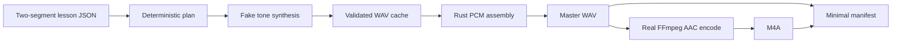

# E0-S0 Walking Skeleton

## Status and purpose

The walking skeleton is the first executable integration contract. It proves that reviewed canonical lesson JSON can cross the provisional Rust boundaries, produce deterministic cached segment WAVs through a fake synthesizer, assemble exact PCM in Rust, invoke real FFmpeg without a shell, and publish a minimal private-preview manifest.

This path is deliberately smaller than G1. It does not claim a production lesson schema, worker protocol, hardened cache publication, audio conditioning, full provenance, or a complete output package.

## Integration order

The required order is fixed because each stage consumes a validated artifact from the preceding stage:

1. Load and validate the two-segment lesson fixture.
2. Derive a deterministic render plan and provisional synthesis cache keys.
3. Resolve each key from the cache or invoke the deterministic tone synthesizer.
4. Validate each canonical 24 kHz mono float WAV before cache reuse.
5. Concatenate cached PCM and declared silence in Rust into `lesson.wav`.
6. Invoke FFmpeg with discrete arguments to encode `lesson.m4a` from the master WAV.
7. Checksum both outputs and atomically write `manifest.json` with `release_status: private_preview`.



## Provisional boundary ownership

| Boundary | Current owner | Stabilization point |
|---|---|---|
| Lesson parsing and validation | `study-tts-core::Lesson` | E1-S1 and E1-S2 schemas |
| Render planning and synthesis identity | `study-tts-core::RenderPlan` | E1-S1 identity contracts |
| Synthesis port | `study-tts-runtime::SegmentSynthesizer` | Replaced by the E0-S4 asynchronous contract |
| Deterministic tone implementation | `study-tts-testkit::DeterministicToneWorker` | Extended by E0-S4 shared fakes |
| Cache validation and publication | `study-tts-runtime` | Hardened in E1-S3 and E2-S1 |
| PCM concatenation and silence | `study-tts-runtime` | Extended in E1-S4 and E2-S3 |
| FFmpeg invocation | `study-tts-runtime` | Extended in E1-S4 without changing the no-shell rule |
| Minimal manifest | `study-tts-runtime` | Replaced by the E1-S1 versioned manifest schema |

The word provisional is material. Later stories may version or replace these contracts, but they must preserve this test path or update it in the same change so the end-to-end integration order remains executable.

## Permanent check

Run the named T4 suite after restoring locked dependencies:

```bash
cargo test --offline -p study-tts-testkit --test walking_skeleton --locked
```

CI restores toolchain and package dependencies before the offline phase. The test phase does not download models, access model artifacts, require a GPU, or call a network service. Its five-minute budget is the T4 ceiling, not a performance target; local execution should complete in seconds.

The `walking-skeleton` CI job is required to remain green through every later story. A contract change that breaks the integration order is incomplete until the fake, fixture, implementation, and this record agree again.

## Deferred from E0-S0

MP3, chapters, transcripts, captions, full provenance, job recovery, take selection, post-render ASR, loudness normalization, edge conditioning, quarantine, and the production Chatterbox worker remain in their assigned G1 or later stories. The minimal manifest is mechanically marked as a private preview and cannot establish production approval.
