# E0-S0 Walking Skeleton

## Status and purpose

The walking skeleton is the first executable integration contract. It proves that reviewed canonical lesson JSON can cross the provisional Rust boundaries, produce deterministic cached segment WAVs through a fake synthesizer, assemble exact PCM in Rust, invoke real FFmpeg without a shell, validate the encoded result with ffprobe, and write a minimal private-preview manifest beneath `previews/<lesson-id>/`.

This path is deliberately smaller than G1. It does not claim a production lesson schema, worker protocol, hardened cache publication, audio conditioning, full provenance, or a complete output package.

## Integration order

The required order is fixed because each stage consumes a validated artifact from the preceding stage:

1. Load and validate the provisional two-segment lesson fixture before any subprocess starts.
2. Derive a deterministic render plan and provisional synthesis cache keys.
3. Resolve and preflight FFmpeg and ffprobe, recording each resolved executable and version.
4. Canonicalize the workspace, create managed cache and preview directories, and verify containment.
5. Resolve each key from the cache or invoke the deterministic tone synthesizer.
6. Validate each canonical 24 kHz mono float WAV before cache publication or reuse.
7. Concatenate cached PCM and declared silence in Rust into `lesson.wav`.
8. Invoke FFmpeg with a pinned discrete argument vector to encode `lesson.m4a` from the master WAV.
9. Invoke ffprobe with discrete arguments and require one mono AAC stream.
10. Checksum both outputs and atomically write `manifest.json` with tool provenance and `release_status: private_preview`.

```mermaid
flowchart LR
    Lesson["Two-segment lesson JSON"] --> Validate["Validate reviewed input"]
    Validate --> Plan["Deterministic plan"]
    Plan --> Preflight["Preflight tools and managed paths"]
    Preflight --> Fake["Fake tone synthesis"]
    Fake --> Cache["Validated WAV cache"]
    Cache --> PCM["Rust PCM assembly"]
    PCM --> WAV["Master WAV"]
    WAV --> FFmpeg["Real FFmpeg AAC encode"]
    FFmpeg --> M4A["M4A"]
    M4A --> Probe["Real ffprobe validation"]
    WAV --> Manifest["Minimal manifest"]
    Probe --> Manifest
```



## Provisional boundary ownership

| Boundary | Current owner | Stabilization point |
|---|---|---|
| Lesson parsing and validation | `study-tts-core::Lesson` | E1-S1 and E1-S2 schemas |
| Render planning and synthesis identity | `study-tts-core::RenderPlan` | E1-S1 identity contracts |
| Synthesis port | `study-tts-runtime::SegmentSynthesizer` | Replaced by the E0-S4 asynchronous contract |
| Deterministic tone implementation | `study-tts-testkit::DeterministicToneWorker` | Extended by E0-S4 shared fakes |
| Cache validation and publication | `study-tts-runtime` | Hardened in E1-S3 and E2-S1 |
| PCM concatenation and silence | `study-tts-runtime` | Extended in E1-S4 and E2-S3 |
| FFmpeg and ffprobe invocation | `study-tts-runtime` | Extended in E1-S4 without changing pinned arguments, preflight, provenance, or the no-shell rule |
| Minimal manifest | `study-tts-runtime` | Replaced by the E1-S1 versioned manifest schema |
| Build refusal API | `study-tts-runtime::BuildError` and public category enums | Frozen with the other public Rust interfaces at G1 |

## Provisional resource ceilings

E0-S0 refuses unbounded authored input and FFmpeg-family execution within the
fixed envelope below. These values are security ceilings, not measured
performance budgets or backend segmentation limits. They remain fixed until a
configuration milestone owns them; this does not move or redefine the
configurable worker supervision assigned to E5.

| Resource | Provisional ceiling |
| --- | ---: |
| Canonical lesson JSON | 16 MiB UTF-8 bytes |
| Segments per lesson | 4,096 |
| `display_text` per segment | 64 KiB UTF-8 bytes |
| `spoken_text` per segment | 64 KiB UTF-8 bytes |
| Source references per segment | 256 |
| One source reference | 4 KiB UTF-8 bytes |
| Aggregate title and segment string/reference fields | 16 MiB UTF-8 bytes |
| Version probe deadline | 5 seconds |
| ffprobe deadline | 30 seconds |
| FFmpeg encode deadline | 30 minutes |
| Captured stdout per tool execution | 1 MiB |
| Captured stderr per tool execution | 1 MiB |

The lesson values mirror the constants in
`crates/study-tts-core/src/lesson.rs`; its public
`MAX_LESSON_JSON_BYTES` is also imported by
`crates/study-tts-runtime/src/pipeline.rs::read_lesson`. That reader performs a
nonblocking Unix open, requires the opened descriptor to be a regular file,
performs a metadata preflight, and then reads at most
`MAX_LESSON_JSON_BYTES + 1`. A FIFO therefore cannot block the open, and a
file that grows after preflight remains bounded. Oversized input returns
`LessonError::LessonJsonTooLarge`; a special file returns
`IoError::LessonNotRegularFile`. Both refusals precede planning, tool
inspection, workspace creation, and synthesis.

The tool values mirror `TOOL_OUTPUT_LIMIT_BYTES`, `VERSION_PROBE_POLICY`,
`FFPROBE_POLICY`, and `FFMPEG_ENCODE_POLICY` in
`crates/study-tts-runtime/src/process.rs`. The shared runner drains stdout and
stderr concurrently through nonblocking, cancellable capture workers. On Unix
it creates a dedicated process group. On Linux it also records both capture
pipe identities and terminates any process outside that group that retains a
pipe, so a descendant cannot escape cleanup with `setsid` and strand capture.
Direct-child exit observation precedes the otherwise blocking `Child::wait`,
and capture joins are attempted only after `JoinHandle::is_finished`. Either
kind of cleanup that exceeds its one-second observation window transfers the
owned handle to a dedicated background reaper before returning a typed
failure. Other targets retain a bounded direct-child fallback. Existing
nonzero-exit categories remain the owner of bounded stderr diagnostics.

The ceiling-to-test traceability is mechanized by the following exact test
names:

- Lesson JSON boundary and parse ordering:
  `t1_e0_lesson_json_byte_limit_accepts_the_boundary_and_precedes_parsing`.
- Segment-count boundary:
  `t1_e0_segment_count_limit_accepts_the_boundary_and_rejects_one_more`.
- Per-field UTF-8 byte boundaries:
  `t1_e0_spoken_text_limit_counts_utf8_bytes`,
  `t1_e0_display_text_limit_counts_utf8_bytes`, and
  `t1_e0_source_reference_limits_accept_boundaries_and_count_utf8_bytes`.
- Aggregate authored-text boundary:
  `t1_e0_programmatic_authored_text_limit_accepts_the_boundary`.
- Metadata-preflight growth protection:
  `t1_e0_bounded_lesson_reader_refuses_growth_after_metadata_preflight`.
- Pre-work runtime ordering:
  `t4_e0_oversized_lesson_fails_before_tools_workspace_and_synthesis` and
  `t4_e0_lesson_fifo_fails_before_tools_workspace_and_synthesis`.
- Independent pipe overflow:
  `t4_e0_bounded_command_reports_the_stream_that_overflows`.
- Deadline enforcement:
  `t4_e0_bounded_command_times_out_with_an_injected_policy` and
  `t4_e0_deadline_includes_capture_setup_and_precedes_success`.
- Monitoring failure cleanup:
  `t4_e0_capture_thread_start_failure_terminates_and_reaps_child`.
- Non-reaping process-group observation:
  `t4_e0_exit_observation_keeps_process_group_leader_waitable`.
- Descendant cleanup:
  `t4_e0_timeout_terminates_and_reaps_the_process_group` and
  `t4_e0_successful_child_terminates_and_reaps_lingering_descendants`.
- Escaped pipe-holder containment:
  `t4_e0_timeout_terminates_escaped_descendant_retaining_capture_pipes`.

The process-executing T4 tests are intentionally colocated in
`crates/study-tts-runtime/src/process.rs` because their injected short policy
and capture-start failure seams are private implementation details. Moving
them to `study-tts-testkit` would widen production visibility solely for the
test harness; the tests still exercise real filesystem and `/bin/sh` process
boundaries and retain their T4 names and budget.

The word provisional is material. The fixture uses `schema_version: 0.1-skeleton` so it cannot be mistaken for the complete lesson `1.0` contract accepted in ADR-0001. Later stories may version or replace these contracts, but they must preserve this test path or update it in the same change so the end-to-end integration order remains executable.

Before G1, the provisional flat `BuildError` was intentionally replaced by
transparent category variants with exact leaf refusals beneath them. This was a
source-breaking Rust pattern change, accepted while workspace consumers were
still migrated together: it preserved each failure distinction, message,
source chain, and operator remedy while making the category boundary explicit
before interface freeze. On the supported `x86_64-unknown-linux-gnu` target,
`size_of::<BuildError>()` measured 80 bytes before and 80 bytes after the
refactor, so the existing boxed cache fault remained the only boxed payload. The
baseline is enforced by
`error::tests::t1_e0_build_error_does_not_grow_during_category_refactor` in
`crates/study-tts-runtime/src/error/mod.rs`, using
`PRE_REFACTOR_BUILD_ERROR_SIZE_BYTES`; update this record and that constant
together. Structured remedy advice supplements the actionable messages. Rich
`miette` reports remain deferred until the product CLI diagnostics and
JSON-output contract exist.

## Permanent check

Run the T4 suite locally after restoring locked dependencies:

```bash
cargo test --offline -p study-tts-testkit --test walking_skeleton --locked
```

`cargo --offline` controls dependency resolution but does not prevent runtime network access. CI therefore compiles the test binaries as the normal runner user, enters a new Linux network namespace containing only loopback, verifies that no egress-capable interface exists, drops back to the runner user, and executes the prebuilt workspace binaries under a 60-second deadline. The deadline measures test execution rather than compilation. The test phase does not download models, access model artifacts, require a GPU, or reach a network service.

The `walking-skeleton` CI job is required to remain green through every later story. A contract change that breaks the integration order is incomplete until the fake, fixture, implementation, and this record agree again.

## Deferred from E0-S0

MP3, chapters, transcripts, captions, authoritative non-UTF-8 path representation and full provenance beyond the executed FFmpeg and ffprobe identities, job recovery, take selection, post-render ASR, loudness normalization, edge conditioning, quarantine, and the production Chatterbox worker remain in their assigned G1 or later stories. The minimal manifest is mechanically marked as a private preview, the production manifest loader rejects its schema version, and the publication entry point returns a typed refusal.
