# E0-S0 Walking Skeleton through the E0-S4 Contracts

## Status and purpose

The walking skeleton is the first executable integration contract. E0-S4 now routes it exclusively through the public `TtsExecutor`, cache-publication, package-writer, and job-repository seams recorded in [`PROVISIONAL-CONTRACT-BASELINE.md`](PROVISIONAL-CONTRACT-BASELINE.md). It proves that reviewed canonical lesson JSON can cross those provisional Rust boundaries, publish deterministic cached segment WAVs as atomic directory transactions, assemble exact PCM in Rust, invoke real FFmpeg without a shell, validate the encoded result with ffprobe, and atomically select an immutable private-preview package beneath `previews/<lesson-id>/packages/<manifest-blake3>/` through `previews/<lesson-id>/current.json`.

This path is deliberately smaller than G1. It pulls forward the ADR-0001 §12.3 durability primitives, provisional lesson-scoped ownership, cache-key serialization, and package publication journal needed to keep E0 artifacts transaction-safe. It does not claim the complete E2 job state machine, resume CLI, production schemas, approval records, audio conditioning, full provenance, or a complete output package. The validated `lesson_id` is the provisional E0 job and publication identity until the approved versioned job ID lands.

## Integration order

The required order is fixed because each stage consumes a validated artifact from the preceding stage:

1. Load and validate the provisional two-segment lesson fixture before any subprocess starts.
2. Derive a deterministic render plan and provisional synthesis cache keys.
3. Construct and validate every backend request, including contract version and capacity, before any tool or durable work.
4. Resolve and preflight FFmpeg and ffprobe through the package adapter, recording each resolved executable and version in a prepared package writer.
5. Canonicalize the workspace, create managed cache, job, quarantine, and preview roots, and verify containment.
6. Acquire `jobs/<lesson-id>/build.lock`, whose strict provisional record carries PID, Linux process-start identity, and creation metadata; refuse a live owner before reconciliation or output work.
7. Atomically write the minimal strict `jobs/<lesson-id>/job.json`, then reconcile the strict provisional `publication.json` journal and validate any authoritative `current.json` without overwriting corrupt state.
8. Resolve each cache key under its bounded cross-process key lock. A miss writes and validates `audio.wav` plus `artifact.json` in one sibling staging directory, flushes both files and the directory, renames the directory without replacement, and flushes the shard directory. Abandoned attempts move to collision-free quarantine.
9. Recheck an immutable current package for the same plan, tool identities, and path-normalized FFmpeg and ffprobe argument-profile identities; a no-op rebuild returns it without assembly or encoding.
10. Refuse cached artifacts that do not match the plan order or resolve beneath the managed cache, then concatenate cached PCM and declared silence in Rust into a transaction-local `lesson.wav` beneath `jobs/<lesson-id>/staging/<transaction>/`.
11. Invoke FFmpeg with a pinned discrete argument vector to encode transaction-local `lesson.m4a` from the master WAV.
12. Invoke ffprobe with discrete arguments and require one mono AAC stream.
13. Checksum both outputs and atomically write the transaction-local `manifest.json` with executable, version, executed-argument, normalized argument-profile provenance, and `release_status: private_preview`.

```mermaid
flowchart LR
    Lesson["Two-segment lesson JSON"] --> Validate["Validate reviewed input"]
    Validate --> Plan["Deterministic plan"]
    Plan --> ExecutorGate["Validate executor requests"]
    ExecutorGate --> Preflight["Preflight package tools"]
    Preflight --> Fake["Fake tone synthesis"]
    Fake --> Cache["Validated WAV cache"]
    Cache --> PCM["Rust PCM assembly"]
    PCM --> WAV["Master WAV"]
    WAV --> FFmpeg["Real FFmpeg AAC encode"]
    FFmpeg --> M4A["M4A"]
    M4A --> Probe["Real ffprobe validation"]
    WAV --> Manifest["Minimal manifest"]
    Probe --> Manifest
    Manifest --> Package["Immutable package generation"]
    Package --> Current["Atomic current.json selection"]
```

14. Flush every package file and the package directory, rename the complete directory to `previews/<lesson-id>/packages/<manifest-blake3>/` without replacement, then atomically replace and directory-sync `current.json`. The journal makes a crash after package durability but before selection finishable by the next build.



## Provisional boundary ownership

| Boundary | Current owner | Stabilization point |
|---|---|---|
| Lesson parsing and validation | `study-tts-core::{AuthoredLesson, ValidatedLesson, LessonDiagnostic}` | Stabilized by E1-S2: lesson `3.1` declares voices, carries ADR-0001 §8.1's objectives and source record, closes the role and style vocabularies, and names every refusal's document, segment, and field path |
| Render planning and synthesis identity | `study-tts-core::RenderPlan` | E1-S1 identity contracts, extended by E1-S2's resolved voice-conditioning input |
| Synthesis port | `study-tts-runtime::TtsExecutor` | E1-S3 real worker parity, then G1 freeze |
| Deterministic tone implementation | `study-tts-testkit::FakeTtsExecutor` (`DeterministicToneWorker` test alias) | Shared with the real-worker contract suite at E1-S3 |
| Durable filesystem primitives | `study-tts-runtime::durable` | Extended, not replaced, by E2-S1 job state and E5 containment |
| Provisional lesson and cache-key locks | `study-tts-runtime::locking` | Replaced by approved job identity and integrated executor ownership in E2-S1/E5 |
| Cache validation and atomic directory publication | `study-tts-runtime` | Extended with production worker artifacts and verification in E1-S3/E2-S1 |
| Minimal job snapshot and repository | `study-tts-core::ProvisionalJobSnapshot`; `study-tts-runtime::JobRepository` | Replaced by the complete E2-S1 state machine and recovery semantics |
| Package writing and immutable selection | `study-tts-runtime::PackageWriter` | Extended in E1-S4/E2-S3; real-path parity required before G1 |
| PCM concatenation and silence | `study-tts-runtime` | Extended in E1-S4 and E2-S3 |
| FFmpeg and ffprobe invocation | `study-tts-runtime` | Extended in E1-S4 without changing pinned arguments, preflight, provenance, or the no-shell rule |
| Immutable preview generations and `current.json` | `study-tts-runtime::preview` | Extended into the complete package and approval flow in E1-S4/E2 |
| Minimal manifest | `study-tts-runtime` | Replaced by the E1-S1 versioned manifest schema |
| Build refusal API | `study-tts-runtime::BuildError` and public category enums | Frozen with the other public Rust interfaces at G1 |

## Provisional resource ceilings

E0-S0 refuses unbounded authored input and FFmpeg-family execution within the
fixed envelope below, and E1-S1 extended it to the inputs its own boundaries
read. These values are security ceilings, not measured performance budgets or
backend segmentation limits. They remain fixed until a configuration milestone
owns them; this does not move or redefine the configurable worker supervision
assigned to E5.

| Resource | Provisional ceiling |
| --- | ---: |
| Canonical lesson JSON | 16 MiB UTF-8 bytes |
| Segments per lesson | 4,096 |
| Learning objectives per lesson | 64 |
| One learning objective | 4 KiB UTF-8 bytes |
| References per lesson source record | 256 |
| One lesson source reference | 4 KiB UTF-8 bytes |
| `display_text` per segment | 64 KiB UTF-8 bytes |
| `spoken_text` per segment | 64 KiB UTF-8 bytes |
| Source references per segment | 256 |
| One source reference | 4 KiB UTF-8 bytes |
| Aggregate title and segment string/reference fields | 16 MiB UTF-8 bytes |
| Version probe deadline | 5 seconds |
| Worker-environment integrity probe deadline | 2 minutes |
| ffprobe deadline | 30 seconds |
| FFmpeg encode deadline | 30 minutes |
| Captured stdout per tool execution | 1 MiB |
| Captured stderr per tool execution | 1 MiB |
| Canonical takes JSON | 8 MiB UTF-8 bytes |
| Selections per takes document | 4,096 |
| One language tag | 64 UTF-8 bytes |
| One declared worker-bundle input | 8 MiB |
| Worker frame JSON nesting | 32 levels |
| One numeric literal in a worker frame | 32 characters |

The lesson values mirror the constants in
`crates/study-tts-core/src/lesson.rs`. Neither `speakers` nor `editorial` adds a ceiling: only the
speakers a segment actually names are resolved, and speaker names and voice-profile identities are
counted into the aggregate authored-text total the table already bounds. The lesson `3.1` records
above are counted into that total as well. Neither `role` nor `style` is, since lesson `3.0` closed
both to fixed vocabularies whose spellings a document cannot grow. Its public
`MAX_LESSON_JSON_BYTES` is also imported by
`crates/study-tts-runtime/src/pipeline.rs::read_lesson`. That reader performs a
nonblocking Unix open, requires the opened descriptor to be a regular file,
performs a metadata preflight, and then reads at most
`MAX_LESSON_JSON_BYTES + 1`. A FIFO therefore cannot block the open, and a
file that grows after preflight remains bounded. Oversized input returns
`LessonError::LessonJsonTooLarge`; a special file returns
`IoError::LessonNotRegularFile`. Both refusals precede planning, tool
inspection, workspace creation, and synthesis.

The two worker-frame values mirror `MAX_JSON_NESTING_DEPTH` and
`MAX_JSON_NUMBER_DIGITS` in `worker/study_tts_worker/protocol.py`, which name
this section in return. Both bound what one frame can do to the *Python*
process, which the frame byte ceiling above does not: `MAX_WORKER_FRAME_BYTES`
bounds a frame's breadth, and neither depth nor numeric length is breadth. A few
kilobytes of `[[[[` exhausts the C stack `json` recurses on, and a five-thousand
digit integer inside a five-kilobyte frame reaches CPython's quadratic
decimal-to-`int` conversion. Before these ceilings each of those left the parse
by a path the worker's refusal handler does not catch, so a bounded frame ended
the process instead of drawing a failure frame — and took every queued request
with it. The deepest shape the protocol defines is four levels, and every number
in it is a thread count, a seed, or a take.

The three other E1-S1 values mirror `MAX_TAKES_JSON_BYTES` in
`crates/study-tts-core/src/takes.rs`, `MAX_LANGUAGE_TAG_BYTES` in
`crates/study-tts-core/src/language.rs`, and `MAX_BUNDLE_INPUT_BYTES` in
`crates/study-tts-runtime/src/worker_bundle.rs`; each constant names this
section in return. The takes and bundle readers refuse on length before
handing any bytes to a parser, in the shape `MAX_LESSON_JSON_BYTES` established
above. The language ceiling is not a parser bound but a stacking bound: RFC
5646's grammar already limits each subtag to eight characters and leaves the
number of variant subtags open, so this is what stops an authored tag carrying
arbitrary bytes into every cache key in the lesson.

The tool values mirror `TOOL_OUTPUT_LIMIT_BYTES`, `VERSION_PROBE_POLICY`,
`WORKER_ENVIRONMENT_PROBE_POLICY`, `FFPROBE_POLICY`, and
`FFMPEG_ENCODE_POLICY` in `crates/study-tts-runtime/src/process.rs`. Version
inspection keeps its five-second deadline; the worker-environment probe has a
separate two-minute ceiling because it hashes the locked distributions' files.
The shared runner drains stdout and stderr concurrently through nonblocking,
cancellable capture workers. On Unix it creates a dedicated process group. On
Linux it also records both capture pipe identities and terminates any process
outside that group that retains a pipe, so a descendant cannot escape cleanup
with `setsid` and strand capture. Direct-child exit observation precedes the
otherwise blocking `Child::wait`, and capture joins are attempted only after
`JoinHandle::is_finished`. Either kind of cleanup that exceeds its one-second
observation window transfers the owned handle to a dedicated background reaper
before returning a typed failure. Other targets retain a bounded direct-child
fallback. Existing nonzero-exit categories remain the owner of bounded stderr
diagnostics.

The ceiling-to-test traceability is mechanized by the following exact test
names:

- External-tool deadlines and output ceilings:
  `t1_e0_external_tool_supervision_policies_are_pinned`.
- Lesson JSON boundary and parse ordering:
  `t1_e0_lesson_json_byte_limit_accepts_the_boundary_and_precedes_parsing`.
- Segment-count boundary:
  `t1_e0_segment_count_limit_accepts_the_boundary_and_rejects_one_more`.
- Per-field UTF-8 byte boundaries:
  `t1_e0_spoken_text_limit_counts_utf8_bytes`,
  `t1_e0_display_text_limit_counts_utf8_bytes`, and
  `t1_e0_source_reference_limits_accept_boundaries_and_count_utf8_bytes`.
- Aggregate authored-text boundary:
  `t1_e0_programmatic_authored_text_limit_accepts_the_boundary`.
- Metadata-preflight growth protection:
  `t1_e0_bounded_lesson_reader_refuses_growth_after_metadata_preflight`.
- Pre-work runtime ordering:
  `t4_e0_oversized_lesson_fails_before_tools_workspace_and_synthesis` and
  `t4_e0_lesson_fifo_fails_before_tools_workspace_and_synthesis`.
- Independent pipe overflow:
  `t4_e0_bounded_command_reports_the_stream_that_overflows`.
- Deadline enforcement:
  `t4_e0_bounded_command_times_out_with_an_injected_policy` and
  `t4_e0_deadline_includes_capture_setup_and_precedes_success`.
- Monitoring failure cleanup:
  `t4_e0_capture_thread_start_failure_terminates_and_reaps_child`.
- Non-reaping process-group observation:
  `t4_e0_exit_observation_keeps_process_group_leader_waitable`.
- Descendant cleanup:
  `t4_e0_timeout_terminates_and_reaps_the_process_group` and
  `t4_e0_successful_child_terminates_and_reaps_lingering_descendants`.
- Escaped pipe-holder containment:
  `t4_e0_timeout_terminates_escaped_descendant_retaining_capture_pipes`.
- Takes JSON boundary and parse ordering:
  `t1_e1_takes_json_byte_limit_accepts_the_boundary_and_precedes_parsing`.
- Language-tag byte boundary:
  `t1_e1_tags_outside_the_accepted_grammar_are_refused`.
- Declared worker-bundle input boundary:
  `t1_e1_a_declared_bundle_input_past_the_byte_ceiling_is_refused`.
- Worker-frame nesting and numeric-literal boundaries, and that the process
  survives both to answer the next frame:
  `HostileFrameTests.test_the_worker_answers_the_frame_after_a_hostile_one` in
  `worker/tests/test_worker.py`, run by `.github/workflows/ci.yml` as
  `python3 -m unittest discover --start-directory worker/tests`.

The process-executing T4 tests are intentionally colocated in
`crates/study-tts-runtime/src/process.rs` because their injected short policy
and capture-start failure seams are private implementation details. Moving
them to `study-tts-testkit` would widen production visibility solely for the
test harness; the tests still exercise real filesystem and `/bin/sh` process
boundaries and retain their T4 names and budget.

The word provisional is material. Lock, journal, and selection records use distinct internal `0.1-skeleton-*` versions with unknown-field rejection, and none can be mistaken for the complete job, manifest, or publication schemas accepted in ADR-0001. Later stories may version or replace these contracts, but they must preserve this test path or update it in the same change so the end-to-end integration order remains executable.

The lesson fixture is no longer among them. E1-S1 published the lesson schema and moved the fixture to `1.1`, so `0.1-skeleton` is now refused as a malformed version rather than accepted as an old one; [`E1-S1-INTERFACE-CHANGE-001.md`](E1-S1-INTERFACE-CHANGE-001.md) records why the increment was a major followed by a minor. E1-S2 repeated that shape twice. First to `2.x`, where `2.0` made `speakers` required and `2.1` added the optional `editorial` flag; [`E1-S2-INTERFACE-CHANGE-001.md`](E1-S2-INTERFACE-CHANGE-001.md) records that increment, the `SYNTHESIS_IDENTITY_VERSION` move to `e1-s2-v1` that resolving voice references forced, and the required `voice_conditioning_hash` on `SynthesisRequest` that came with it. Then to `3.x`, published at `schemas/lesson-v3.schema.json`, where `3.0` closed the `role` and `style` vocabularies, bounded a recall prompt's pause to ADR-0001 §13.2's range, and refuses a `speakers` object binding one name twice, and `3.1` added the optional `learning_objectives` and `source` records; [`E1-S2-INTERFACE-CHANGE-002.md`](E1-S2-INTERFACE-CHANGE-002.md) records that increment, and is `Accepted`, signed 2026-08-30. Every `1.x` and `2.x` document is now refused as a different major.

New minimal preview manifests use `0.2-skeleton`, which requires normalized tool argument-profile identities. Reconciliation still accepts strict legacy `0.1-skeleton` manifests without those fields, but cannot reuse them as a matching tool-profile generation.

Both layouts are `LEGACY_MANIFEST_LAYOUT_VERSION` and `CURRENT_MANIFEST_LAYOUT_VERSION` in `crates/study-tts-runtime/src/manifest.rs`, which names this paragraph in return; `parse_stored_manifest` dispatches on them and refuses every other string. Only `0.2-skeleton` is published as `schemas/manifest-v0.schema.json`: that schema is generated from the current stored shape, and the legacy layout carries a different `tools` shape it would describe wrongly. The omission is deliberate rather than incidental, and `t3_e1_the_published_manifest_schema_names_every_layout_it_describes` is what keeps it so — a third accepted layout fails that test until somebody decides whether the published schema describes it.

Before G1, the provisional flat `BuildError` was intentionally replaced by
transparent category variants with exact leaf refusals beneath them. This was a
source-breaking Rust pattern change, accepted while workspace consumers were
still migrated together: it preserved each failure distinction, message,
source chain, and operator remedy while making the category boundary explicit
before interface freeze. On the supported `x86_64-unknown-linux-gnu` target,
`size_of::<BuildError>()` measured 80 bytes before and 80 bytes after the
refactor. E0-S4 keeps that bound by boxing the richer typed `BackendError` only
at the `BuildError::Synthesis` category boundary; the exact backend variant and
source chain remain available. The baseline is enforced by
`error::tests::t1_e0_build_error_does_not_grow_during_category_refactor` in
`crates/study-tts-runtime/src/error/mod.rs`, using
`PRE_REFACTOR_BUILD_ERROR_SIZE_BYTES`; update this record and that constant
together. Structured remedy advice supplements the actionable messages. Rich
`miette` reports remain deferred until the product CLI diagnostics and
JSON-output contract exist.

## Permanent check

Run the T4 suite locally after restoring locked dependencies:

```bash
cargo test --offline -p study-tts-testkit --test walking_skeleton --locked
```

`cargo --offline` controls dependency resolution but does not prevent runtime network access. CI therefore compiles the test binaries as the normal runner user, enters a new Linux network namespace containing only loopback, verifies that no egress-capable interface exists, drops back to the runner user, and executes the prebuilt workspace binaries under a 60-second deadline. The deadline measures test execution rather than compilation. The test phase does not download models, access model artifacts, require a GPU, or reach a network service.

The `walking-skeleton` CI job is required to remain green through every later story. A contract change that breaks the integration order is incomplete until the fake, fixture, implementation, and this record agree again.

## Deferred from E0-S0

MP3, chapters, transcripts, captions, authoritative non-UTF-8 path representation and full provenance beyond the executed FFmpeg and ffprobe identities and normalized argument profiles, the complete job state machine and resume CLI, take selection, post-render ASR, loudness normalization, edge conditioning, cache pruning, and the production Chatterbox worker remain in their assigned G1 or later stories. E0 quarantine retains abandoned cache and package attempts but exposes no deletion workflow. Existing flat E0 preview files are legacy artifacts: new builds leave them intact and select only immutable packages through `current.json`. The minimal manifest is mechanically marked as a private preview, the production manifest loader rejects its schema version, and the publication entry point returns a typed refusal.
