# Threat Model

- **Status:** Baseline; update when G1 interfaces freeze and before release candidate
- **Initial deployment:** single user, single WSL2 machine, local filesystem, offline rendering
- **Out of scope until a new ADR:** remote workers, hosted service, untrusted multi-user access, network rendering

## Assets

- voice references and consent records;
- private lesson content and spoken text;
- model, tokenizer, codec, and ASR artifacts;
- synthesis cache and selected takes;
- job state, manifests, verification and review evidence;
- generated audio and release signing material;
- local machine availability and filesystem integrity.

## Trust boundaries

```mermaid
flowchart LR
    U["User-controlled lesson and paths"] --> R["Rust validation and planning"]
    R --> P["Bounded child-process protocol"]
    P --> W["Python Chatterbox worker"]
    W --> S["Managed staging root"]
    S --> C["Validated synthesis cache"]
    C --> A["Rust assembly and in-process ASR"]
    A --> F["FFmpeg/ffprobe process boundary"]
    F --> O["Preview or approved publish root"]
```

## Threats and controls

| Threat | Boundary | Control | Validation |
|---|---|---|---|
| Path traversal or absolute-path escape | Inputs/runtime roots | Canonicalization, containment, symlink rejection | E1-S3/E5-S4 hostile-path tests |
| Shell or argument injection | Worker/FFmpeg launch | No shell construction; discrete arguments | Injection fixtures |
| Oversized/nested input or protocol frame | Lesson/worker | Size, depth, count, frame, duration limits | Boundary tests |
| Malicious or corrupted worker output | Worker/staging | Assigned root, checksum, WAV validation, quarantine | Contract and audio-invalid tests |
| Model artifact code execution | Model load | Pinned trusted sources, checksum, safe formats where available | Supply-chain review |
| Network exfiltration | Worker/runtime | Offline operation and qualification observation | G0/T5 offline test |
| Sensitive logging or metadata | Diagnostics/package | Redaction defaults and metadata validation | E2-S4/E2-S5 tests |
| Cache poisoning or stale evidence | Cache/verification | Separate identities, checksums, structural validation | Identity and invalidation tests |
| Race, partial write, or lock theft | Filesystem state | Per-job lock, atomic publish, reconciliation | E2-S1 fault injection |
| Resource exhaustion | Worker pool/ASR | RAM/core budgets, bounded queues, timeouts, disk limits | E5-S2/E5-S3 tests |
| Orphaned worker process | Process tree | Parent ownership, cancellation, forced cleanup | Lifecycle tests |
| Unauthorized voice or content use | Profile/publication | Consent/right records and fail-closed gates | E0-S2/E6-S2 tests |
| Release substitution | Publish root | Manifest checksums, signatures, independent verification | E6-S3/E6-S4 |

## Residual risks

Local administrators and the host operating system can access WSL2 data. Model behavior can produce incorrect or harmful audio despite deterministic inputs. Human review and strict release scope remain required because technical controls cannot eliminate those risks.

